# Rootly 
## Prototype 3 - Quality Attributes, Part 1

## Team 2F
- Carlos Santiago Sandoval Casallas
- Cristian Santiago Tovar Bejarano
- Danny Marcelo Yaluzan Acosta
- Esteban Rodriguez Muñoz
- Santiago Restrepo Rojas
- Gabriela Guzmán Rivera
- Gabriela Gallegos Rubio
- Andrés Camilo Orduz Lunar

## Table of Contents

- [Software System](#software-system)
- [Architectural Structures](#architectural-structures)
  - [Components and Connector Structure](#components-and-connector-view)
  - [Deployment Structure](#deployment-view)
  - [Layered Structure](#layered-view)
  - [Decomposition Structure](#decomposition-view)
- [Quality Attributes](#quality-attributes)
  - [Security](#security)
    - [Network Segmentation](#network-segmentation)
    - [Secure Channel](#secure-channel)
    - [Reverse Proxy](#reverse-proxy)
    - [Web Application Firewall](#web-application-firewall)
  - [Performance and Scalability](#performance-and-scalability)
    - [Load Balancers](#load-balancers)
    - [Caching](#caching)
- [Prototype – Deployment Instructions](#deployment-instructions)
  
---

## Software System
- **Name:** Rootly  
- **Logo:**  


**Description:**
  
**ROOTLY** is an agricultural monitoring system designed to support significant decision-making in the agricultural environment. It leverages a microservices-based architecture to integrate field devices, process data, and deliver real-time analytics to users through a web and mobile application.

The system operates by capturing environmental and soil data—such as humidity and temperature—directly from the field using microcontroller devices. This information is then sent to a central platform where it is processed, validated, and analyzed. The platform's architecture combines robust databases for storing both transactional information (like user profiles and configurations) and large volumes of time-series sensor data.

Finally, users can access all this information through an intuitive interface, available on both web and mobile. They can view real-time metrics, explore historical data, manage their crops, and receive analytical insights to optimize their agricultural practices.

---

# Architectural Structures
## Components and Connector Structure
### Components and Connector view
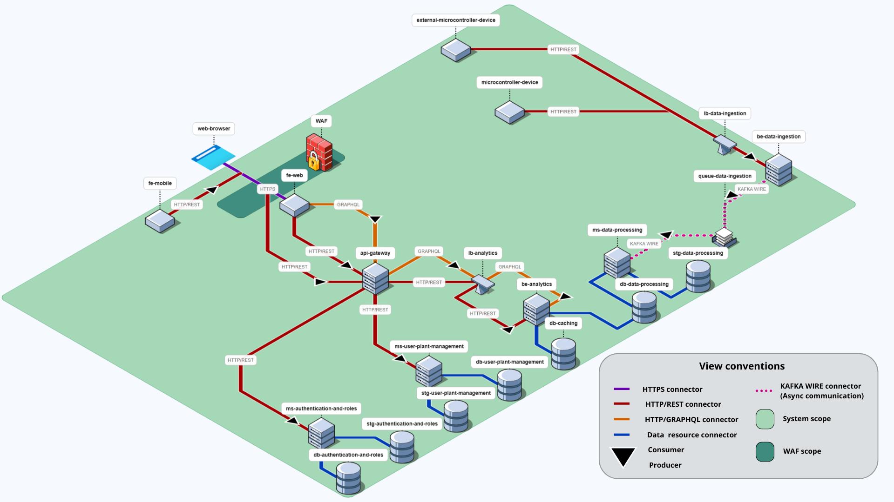

---

### External Components (Out of System Scope)

- **Web Browser**
  - Type: External client
  - Responsibility: User interface for web applications
  - Protocols: **HTTPS**
  - Relations: Consumes `fe-web` via HTTPS

- **External Microcontroller Device**
  - Type: External IoT/embedded device
  - Responsibility: Collects and sends sensor and plant data
  - Protocols: **HTTP/REST**
  - Relations: Consumes `lb-data-ingestion` via HTTP/REST

---

### Internal Components 

- **Microcontroller Device**
  - Type: External IoT/embedded device
  - Responsibility: Collects and sends sensor and plant data
  - Protocols: **HTTP/REST**
  - Relations: Consumes `lb-data-ingestion` via HTTP/REST

- **WAF**
  - Type: Security Firewall / Edge Service
  - Responsibility: Protects web applications from common attacks and filters malicious traffic before it reaches the reverse proxy.
  - Protocols: **HTTPS**
  - Relations:
    - Receives requests from `web-browser` and `fe-mobile`.
    - Routes traffic to `api-gateway` and `fe-web` .

- **lb-data-ingestion**
  - Type: Load Balancer
  - Responsibility: Distributes incoming data ingestion requests from microcontroller devices across multiple instances of the `be-data-ingestion` service.
  - Protocols: **HTTP/REST**
  - Relations:
    - Receives data from `microcontroller-device` and `external-microcontroller-device`.
    - Routes traffic to `be-data-ingestion`.

- **Frontend Mobile (fe-mobile)**
  - Type: Mobile client application
  - Responsibility: Provides a mobile-optimized interface consuming backend APIs directly via REST.
  - Protocols: **HTTP/REST**
  - Relations: Consumes `reverse-proxy` via HTTP/REST

- **fe-web**
  - Type: Web client application
  - Responsibility: Provides the user interface for the web platform; handles presentation logic, user interactions, and requests to backend services.
  - Role in connections: Consumer
  - Relations:
    - Serves the "web-browser" (HTTPS).
    - Consumes `WAF` (HTTPS).

- **api-gateway**
  - Type: Gateway / API Orchestrator
  - Responsibility: Central entry point for all clients. Routes, aggregates, and authenticates API requests to backend microservices.
  - Protocols: **HTTP/GraphQL/REST**
  - Relations:
    - Receives requests from `reverse-proxy`.
    - Consumes services from backend modules (`lb-analytics`, `ms-user-plant-management`, `ms-authentication-and-roles`).

- **lb-analytics**
  - Type: Load Balancer
  - Responsibility: Distributes incoming requests from `api-gateway` across multiple instances of the `be-analytics` service.
  - Protocols: **HTTP/GraphQL**
  - Relations:
    - Receives requests from `api-gateway`.
    - Routes traffic to `be-analytics`.

- **ms-authentication-and-roles**
  - Type: Backend Microservice
  - Responsibility: Authentication and authorization service.
  - Relations:
    - Serves the `api-gateway` (HTTP/REST).
    - Connects to `db-authentication-and-roles` (data resource protocol).
    - Connects to `stg-authentication-and-roles` (data resource protocol).

- **ms-user-plant-management**
  - Type: Backend Microservice
  - Responsibility: Plant and user management service.
  - Relations:
    - Serves the `api-gateway` (HTTP/REST).
    - Connects to `db-user-plant-management` (data resource protocol).
    - Connects to `stg-user-plant-management` (data resource protocol).

- **be-analytics**
  - Type: Backend service
  - Responsibility: Analytics and reporting service.
  - Protocols: **HTTP/GraphQL** for flexible queries.
  - Relations:
    - Served by `lb-analytics`.
    - Consumes `db-caching` (data resource protocol).
    - Consumes `db-data-processing` (data resource protocol).

- **be-data-ingestion**
  - Type: Backend service
  - Responsibility: Receives and ingests sensor data from devices, validating and forwarding to the processing pipeline.
  - Relations:
    - Served by `lb-data-ingestion`.
    - Produces asynchronous messages to `queue-data-ingestion` (Kafka WIRE).

- **ms-data-processing**
  - Type: Backend Microservice
  - Responsibility: Transforms, aggregates, and stores data received from ingestion queues.
  - Relations:
    - Consumes data from `queue-data-ingestion` (Kafka WIRE).
    - Connects to `db-caching` (data resource protocol).
    - Produces processed results stored in `stg-data-processing` (data resource protocol).
    - Produces processed results stored in `db-data-processing` (data resource protocol).

### Internal Components (Data & Asynchronous)

- **queue-data-ingestion**
  - Type: Message Broker (Kafka)
  - Responsibility: Asynchronous event queue for decoupling ingestion and processing services.
  - Protocols: **Kafka WIRE**.
  - Relations:
    - Producer: `be-data-ingestion`.
    - Consumer: `ms-data-processing`.

- **db-caching**
  - Type: Caching Database
  - Responsibility: High-speed, volatile storage for frequently accessed data to improve read performance.
  - Protocols: **data resource protocol**
  - Relations:
    - Consumed by `be-analytics`.

- **Databases (DB)**
  - Protocols: **data resource protocol**
  - `db-authentication-and-roles`: Transactional storage for users and permissions. Consumed by `ms-authentication-and-roles`.
  - `db-user-plant-management`: Transactional storage for plants and relationships. Consumed by `ms-user-plant-management`.
  - `db-data-processing`: Storage for processed and analytical data. Consumed by `be-analytics` and `ms-data-processing`.

- **Storage (STG)**
  - Protocols: **data resource protocol**
  - `stg-authentication-and-roles`: Reference data for authentication. Consumed by `ms-authentication-and-roles`.
  - `stg-user-plant-management`: Master data and plant configurations. Consumed by `ms-user-plant-management`.
  - `stg-data-processing`: Temporary or raw storage for device data. Consumed by `ms-data-processing`.

---

### Architectural Styles
1. **Client–Server**  
   The browser (client) requests resources from the frontend (server) via HTTP. This ensures separation between presentation and business logic.  

2. **Microservices Architecture**  
   The backend is decomposed into a set of fine-grained, independently deployable services. Each service is responsible for a specific business capability (e.g., authentication, user management, analytics). This approach promotes scalability, resilience, and technological flexibility, as each service can be developed, deployed, and scaled independently. Communication between services is handled via well-defined APIs (REST/GraphQL) and asynchronous messaging (Kafka).

### Architectural Patterns

1.  **API Gateway Pattern**
    This pattern provides a single, unified entry point for all client requests. The `api-gateway` component acts as a reverse proxy, routing requests from the frontend clients to the appropriate backend microservice. This simplifies the client application, offloads responsibilities like authentication and SSL termination, and provides an additional layer of security.

2.  **Broker Pattern**
    This pattern decouples producers and consumers through a message broker that handles routing, delivery guarantees, retries, and dead-letter queues. It enables asynchronous communication, smooths traffic spikes with backpressure, and allows services to evolve independently without tight coupling.
In Rootly, Kafka acts as the broker: rootly-data-ingestion publishes sensor events to the queue, and rootly-data-processing consumes them for validation, transformation, and storage. The queue between these services (Kafka topics under the “queue-data-ingestion” namespace) provides at-least-once delivery and horizontal scalability.

2.  **Tiers Architecture**
    The level architecture improves communication between components by separating responsibilities into tiers (physical) and layers (logical). It also has a hierarchy, since the upper layers depend on the lower ones.The levels establish clear boundaries and responsibilities for components to collaborate with each other, facilitating communication between components. The logical layers represent the internal structure of the components and internal dependencies.
The result is predictable interactions, easier evolution, and independent scaling of responsibilities.

### Architectural Elements & Relations  

#### **External Clients & Edge Services**

- **Web Browser**
  - External actor that runs the frontend (SSR in React).
  - Consumes APIs via the security and network layers.
  - **Relation:** Connects to **WAF**.

- **Mobile App (fe-mobile)**
  - Native mobile application for on-the-go monitoring and management.
  - **Relation:** Connects to **WAF**.

- **WAF (Web Application Firewall)**
  - Security boundary protecting the application from common web exploits (SQLi, XSS, CSRF).
  - Filters and routes incoming HTTP requests to internal network components.
  - **Relation:** Forwards traffic to the **api-gateway** through the secure network path.

---

#### **Frontend Services**

- **Frontend Web (fe-web)**
  - User interface built with React + TypeScript; displays dashboards, device states, and analytics.
  - **Relation:** Consumes services via the **WAF → API Gateway** path.

---

#### **Gateway & Core Logic Services**

- **API Gateway (api-gateway)**
  - Central entry point for all external clients (web and mobile). Handles **authentication**, **rate limiting**, **request routing**, and **aggregation**.
  - **Relation:** Receives traffic from **WAF** and routes requests to **ms-authentication-and-roles**, **ms-user-plant-management**, **lb-analytics**.

- **Authentication and Roles (ms-authentication-and-roles)**
  - Handles user authentication, role-based access control, and JWT token validation.
  - **Relation:** Connects to **db-authentication-and-roles** and **stg-authentication-and-roles**.

- **User and Plant Management (ms-user-plant-management)**
  - Manages user profiles, plant configurations, and device associations.
  - **Relation:** Accesses **db-user-plant-management** and **stg-user-plant-management**; requests routed via **API Gateway**.

- **Load Balancer - Analytics (lb-analytics)**
  - Distributes incoming analytics requests among multiple **be-analytics** instances to improve throughput.
  - **Relation:** Served by **API Gateway**; forwards requests to **be-analytics**.

- **Analytics (be-analytics)**
  - Performs computation of key metrics, aggregates processed data, and provides dashboards.
  - **Relation:** Served by **lb-analytics**; consumes **db-caching** and **db-data-processing** for faster query response.

- **Load Balancer - Data Ingestion (lb-data-ingestion)**
  - Distributes high-volume IoT data streams across **be-data-ingestion** instances.
  - **Relation:** Receives data from **microcontroller-device**; forwards to **be-data-ingestion**.

- **Data Ingestion (be-data-ingestion)**
  - Receives and validates raw IoT sensor data; transforms payloads and publishes them to **queue-data-ingestion**.
  - **Relation:** Served by **lb-data-ingestion**; produces messages for asynchronous processing.

- **Data Processing (ms-data-processing)**
  - Consumes messages from the queue, performs data transformation, aggregation, and persistence.
  - **Relation:** Consumes **queue-data-ingestion**; interacts with **db-caching**, **stg-data-processing**, and **db-data-processing**.

- **Load Balancer - Data Processing (lb-data-processing)**
  - Balances workloads between **ms-data-processing** instances to handle peak data transformation demand.
  - **Relation:** Balances requests and ensures stable processing throughput.

---

#### **Data, Messaging & IoT**

- **Message Queue (queue-data-ingestion)**
  - Kafka-based broker enabling asynchronous communication between ingestion and processing microservices.
  - **Relation:** Produced by **be-data-ingestion**; consumed by **ms-data-processing**.

- **Microcontroller Device (microcontroller-device)**
  - External IoT sensor (e.g., ESP8266/ESP32) that sends telemetry data.
  - **Relation:** Sends POST requests to **lb-data-ingestion**.

- **Databases and Storage (STG/DB)**
  - **db-authentication-and-roles (PostgreSQL):** Manages users, credentials, and permissions.
  - **stg-authentication-and-roles:** Temporary storage for authentication sessions.
  - **db-user-plant-management (PostgreSQL):** Stores plant configuration, device mappings, and user ownership.
  - **stg-user-plant-management:** Staging area for plant and device updates.
  - **db-data-processing (PostgreSQL/TimescaleDB):** Stores aggregated sensor data and processed metrics.
  - **stg-data-processing (MinIO/S3):** Holds raw sensor data and backups.
  - **db-caching (Redis):** High-speed cache database for accelerating analytical queries and reducing database load.


## Components description

| **Component / Service** | **Responsibilities** | **Boundaries** | **Interfaces** |
|---|---|---|---|
| **WAF (Web Application Firewall)** | Protects frontend and backend services from common web exploits and malicious traffic, filtering HTTP requests before reaching the application layer. | Positioned between the internet and the load balancer; operates independently from business logic. | Intercepts HTTP/S traffic; forwards allowed requests to load balancers. |
| **Load Balancer** | Distributes incoming client and IoT requests across multiple backend service instances to ensure availability and scalability. | Logical boundary between clients (IoT devices) and backend services. | Uses HTTP/S and REST protocols to route traffic to the API gateway or ingestion endpoints. |
| **Frontend** | Provides the main user interface for real-time visualization of sensor data, dashboards, and management of plants and devices. | Executed as a SPA in the user’s browser; depends on the `api-gateway`. | Communicates with the `api-gateway` using REST/GraphQL. |
| **api-gateway** | Central entry point for all client interactions. Routes, aggregates, and authenticates API requests to backend microservices. | Coordinates backend communication; does not contain domain logic. | REST/GraphQL to clients; REST/GraphQL to backend services. |
| **ms-authentication-and-roles** | Handles user authentication and authorization, managing JWT tokens, sessions, and role-based access control (RBAC). | Operates independently with its own database; does not directly interact with sensor or plant data. | REST APIs for authentication and role management. |
| **ms-user-plant-management** | Manages user–plant–device relationships, device registration, and plant configurations. | Specialized in domain entities (plants, devices); consumes user info from the authentication service. | REST APIs for CRUD operations on plants and devices. |
| **be-analytics** | Processes and analyzes historical sensor data, providing performance metrics, trend analyses, and reports. | Has read-only access to processed data; operates without modifying primary datasets. | REST/GraphQL APIs for analytics and reports. |
| **be-data-ingestion** | Receives sensor data from IoT microcontrollers, validates input, and forwards it to the data processing pipeline. | Dedicated entry point for IoT device communication; ensures integrity and structure of incoming data. | HTTP endpoints for ingestion; interacts with Kafka for event publishing. |
| **ms-data-processing** | Aggregates, transforms, and stores data from ingestion streams into the analytical databases. | Consumes messages from Kafka and persists structured data. | Kafka consumer; REST endpoints for service-to-service data delivery. |
| **Microcontroller** | Collect environmental sensor data (e.g., temperature, humidity, soil metrics) and send it periodically to the backend. | Operate at the network edge; limited resources; communicate only with the ingestion endpoint. | HTTP requests or MQTT to the ingestion service. |
| **queue-data-ingestion** | Kafka message broker enabling asynchronous communication between ingestion and processing services. | Shared middleware for decoupled data flow; ensures reliable message delivery. | Kafka topics and consumer APIs. |
| **db-authentication-and-roles** | PostgreSQL database storing user credentials, roles, and session tokens. | Private data store for authentication service. | SQL queries via ORM; internal REST connections. |
| **db-user-plant-management** | PostgreSQL database managing associations between users, plants, and devices. | Dedicated data store for plant and device domain logic. | SQL/ORM access; REST-based synchronization. |
| **db-data-processing** | InfluxDB database storing time-series agricultural data and computed metrics. | Optimized for analytical queries and visualization. | InfluxQL/Flux queries; service-to-service API. |
| **db-caching** | Redis in-memory database for caching user sessions, authentication tokens, and frequently accessed queries. | Shared fast-access layer to reduce latency across backend services. | Redis key-value operations via SDK. |
| **stg-authentication-and-roles** | MinIO storage for user profile photos and access logs. | Attached to authentication service; persistent object storage. | S3-compatible API. |
| **stg-data-processing** | MinIO storage for analytical data files, backups, and unstructured content. | Used by analytics and processing services. | S3-compatible API. |
| **stg-user-plant-management** | MinIO storage for plant images and related documents. | Attached to user-plant management domain. | S3-compatible API. |
---

## Deployment Structure
### Deployment view

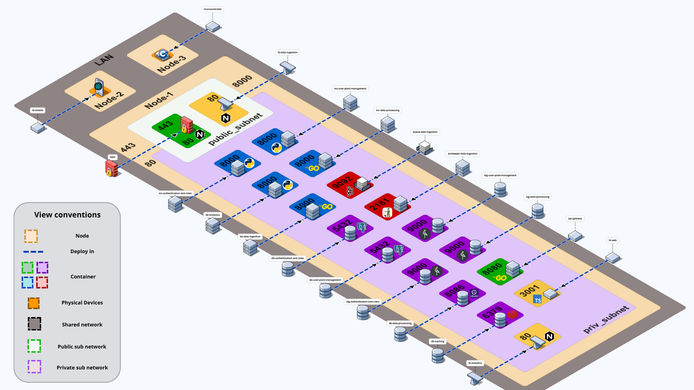

### Description of Architectural Elements and Relations

Based on the deployment view, the system's elements are allocated as follows:

*   **Software Elements:** The core of the system resides in `Node 1`, where all services are deployed as Docker containers within two network zones (public and private subnets). This includes:
    
    *   **WAF:** The `WAF` provides the first line of defense with deep packet inspection, SQL injection prevention, and DDoS mitigation.
    
    *   **Client Applications:** The `fe-ssr-web` (Next.js/TypeScript) provides server-side rendering for web clients, deployed in the public subnet.
    
    *   **API Gateway:** The `api-gateway` (Go) acts as the central orchestration layer, implementing authentication (JWT), rate limiting, and routing to backend microservices.
    
    *   **Backend Microservices:** Deployed in the private subnet with dedicated persistence:
        *   `be-authentication-and-roles` (FastAPI/Python): Manages authentication and RBAC, connected to `db-authentication-and-roles` (PostgreSQL) and `stg-authentication-and-roles` (MiniIO).
        *   `be-user-plant-manager` (FastAPI/Python): Handles user/plant CRUD operations, connected to `db-user-plant-management` (PostgreSQL).
        *   `be-analytics` (FastAPI/Python with Pandas, multiple instances): Performs statistical analysis and aggregations, connected to `db-analytics` (PostgreSQL with TimescaleDB extension) and `stg-analytics` (MiniIO) for query caching, load-balanced by `lb-analytics`.
        *   `be-data-ingestion` (Go, multiple instances): Receives IoT sensor data and publishes to Kafka, load-balanced by `lb-data-ingestion`.
        *   `be-data-processing` (Python with Kafka Consumer, multiple instances): Consumes from Kafka, transforms and validates data, writes to `db-data-processing` (InfluxDB).
    
    *   **Asynchronous Communication Services:**
        *   `queue-data-ingestion` (Apache Kafka with Zookeeper): Provides asynchronous event streaming backbone with persistent storage in `stg-queue-data-ingestion`.

*   **Environmental Elements:**
    
    *   **LAN (Shared Network):** A Local Area Network infrastructure that interconnects all three nodes, providing the foundational communication layer for the entire system. The LAN enables seamless connectivity between physical devices (Node 3), mobile clients (Node 2), and the server cluster (Node 1).
    
    *   **Node 1 (Server Cluster):** A physical or virtual server hosting the Docker environment with two network segments:
        *   **Public Subnet (DMZ):** Contains WAF, reverse proxy, `fe-ssr-web`, and `api-gateway`, exposing controlled access to external clients.
        *   **Private Subnet:** Contains all backend microservices, databases, message queue, and load balancers, isolated from direct external access. Services communicate via the internal Docker bridge network (`rootly-private-network`).
    
    *   **Node 2 (Mobile Client):** A physical device (smartphone/tablet running iOS/Android) executing the `fe-mobile` application (React Native), which communicates with Node 1 over the LAN via HTTPS.
    
    *   **Node 3 (IoT Device):** A physical microcontroller (ESP32-based), equipped with environmental sensors (temperature, humidity, soil moisture, light, pH), transmitting telemetry data in JSON format over the LAN to Node 1.

*   **Relations (Network Communication):**
    
    *   **LAN Connectivity:** All three nodes are connected through the same LAN infrastructure, enabling both external client access and IoT device communication with the centralized backend.
    
    *   **External Communication (User Traffic):**
        *   `fe-mobile` (Node 2) → WAF  → `api-gateway` → Backend microservices
        *   External web browsers → WAF  → `fe-ssr-web`
        *   All external traffic passes through the WAF security layer before reaching internal services.
    
    *   **External Communication (IoT Traffic):**
        *   `microcontroller` (Node 3) → `lb-data-ingestion` → `be-data-ingestion` (multiple instances) → `queue-data-ingestion`
        *   IoT traffic bypasses the WAF for low-latency direct communication with the data ingestion pipeline.
    
    *   **Internal Communication (Private Subnet):**
        *   All containers within Node 1 communicate over the private Docker bridge network (`rootly-private-network`) using internal DNS resolution.
        *   `api-gateway` routes requests to backend services based on endpoint mappings:
            *   Authentication endpoints → `be-authentication-and-roles`
            *   User/plant management → `be-user-plant-manager`
            *   Analytics queries → `lb-analytics` → `be-analytics` instances
        *   Backend services connect to their dedicated databases and storage layers using internal container names.
        *   Load balancers (`lb-analytics`, `lb-data-ingestion`) distribute traffic across multiple service instances with health checks and failover.
    
    *   **Asynchronous Data Flow:**
        *   `be-data-ingestion` → `queue-data-ingestion` (Kafka) → `be-data-processing` → `db-data-processing` → `db-analytics`
        *   Kafka provides temporal decoupling, message persistence, and replay capabilities for high-throughput sensor data streams.

### Description of Architectural Patterns Used

The deployment structure reveals several key architectural patterns:

*   **Event-Driven (Message Broker):** The `queue-data-ingestion` container decouples the data ingestion and processing pipelines. This allows the system to handle high volumes of sensor data asynchronously and reliably, enabling temporal decoupling and independent scaling of producers and consumers.

*   **Database per Service:** Each microservice has its own dedicated persistence container (e.g., `be-authentication-and-roles` has `db-authentication-and-roles` and `stg-authentication-and-roles`). This ensures data isolation, schema autonomy, and allows each service to evolve independently. The only exception is `be-analytics`

*   **Containerization:** Every software component in Node 1 is deployed as a container. This standardizes the deployment, simplifies dependency management, and ensures consistency across environments.


## Layered Structure
  
### Layered view

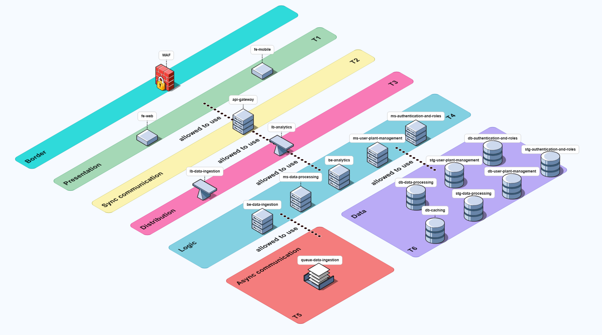

- **Layered view  - Layers** The structure of the logic layer is shown below to avoid redundancy in the main view.
- The **Border element (WAF)** is not considered part of the tiers but acts as a **security perimeter** protecting inbound traffic before it reaches the presentation tier.

### **Border Element**

- **Component:** Web Application Firewall (WAF)
- **Responsibility:** It protects the system's entry point by filtering and inspecting incoming HTTP traffic, and having been implemented as a type of reverse proxy, it acts as the access control point for frontend traffic.
- **Capabilities:** Layer 6 inspection, IP reputation filtering, rate limiting, DoS mitigation, and it functions as a reverse proxy that routes to the presentation layer, performs request validation, routing, authentication, and applies access rules.
- **Communication flow:** Directs validated requests exclusively to Tier 1 (Presentation).
- **Communication style:** HTTP/HTTPS

### **Layer Specifications**

#### **Tier 1 – Presentation Layer**
- **Responsibility:** Provides user interfaces and manages client-side logic.
- **Components:** `fe-web`, `fe-mobile`
- **Communication style:** Synchronous HTTP/REST
- **Constraint:** Cannot access deeper tiers directly.


#### **Tier 2 – Synchronous Communication Layer**
- **Responsibility:** Manages synchronous request routing and API orchestration.
- **Components:** `api-gateway`
- **Capabilities:** Request aggregation, throttling, authentication, and routing.
- **Communication style:** Synchronous HTTP/gRPC


#### **Tier 3 – Logic Layer**
- **Responsibility:** Implements the system’s business logic and processing workflows.
- **Components:**
  - `be-authentication-and-roles`
  - `be-user-plant-management`
  - `be-analytics`
- **Capabilities:** Core computation, orchestration, and validation.
- **Communication style:** HTTP and message-based (Kafka, queues).

#### **Tier 4 – Distribution Layer**
- **Responsibility:** Balances and distributes requests between backend services to optimize performance and redundancy.
- **Components:** `lb-analytics`, `lb-data-ingestion`
- **Capabilities:** Load balancing, health checks, and failover.

#### **Tier 5 – Asynchronous Communication Layer**
- **Responsibility:** Handles event-driven communication and background processing.
- **Components:**
  - `be-data-ingestion` (producer)
  - `be-data-processing` (consumer)
- **Capabilities:** Asynchronous data ingestion, queue management, and event propagation.
- **Communication style:** Kafka/Event Streaming

#### **Tier 6 – Data Layer**
- **Responsibility:** Manages data persistence and storage across all domains.
- **Datastores:**
  - `db-authentication-and-roles`, `stg-authentication-and-roles`
  - `db-user-plant-management`, `stg-user-plant-management`
  - `db-data-processing`, `stg-data-processing`
  - `db-caching`
- **Capabilities:** Data durability, query optimization, and caching for improved performance.


**Logic Layer Structure (Internal)**
The diagram below illustrates the internal architecture of each microservice within the Logic Layer. To maintain a clear separation of concerns and promote modularity, each service adopts a 4-layer architecture.

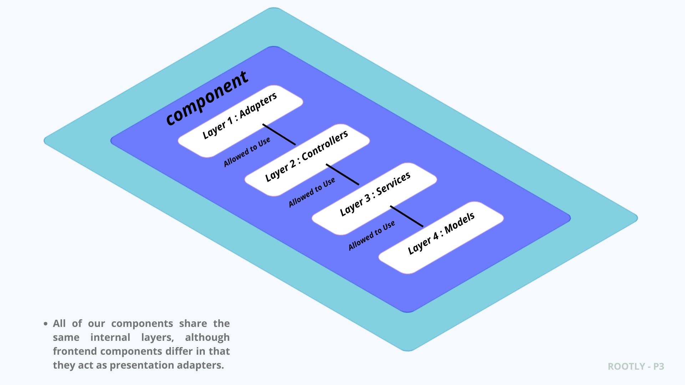

1. **Layered Architecture**
   Each microservice is internally structured into four distinct layers. This pattern ensures that responsibilities are clearly segregated, making the service easier to develop, test, and maintain. The dependencies flow in one direction, from the outer layers to the inner layers.
    -   **Layer 1: Adapters:** This outermost layer is responsible for protocol-specific communication. It adapts incoming requests (e.g., from Kafka consumers or other services) and translates them into a format that the application's core can understand.
    -   **Layer 2: Controllers:** This layer acts as the entry point for API requests (e.g., HTTP REST/GraphQL). It handles request validation, parsing, and calls the appropriate business logic in the Services layer.
    -   **Layer 3: Services:** This is the core of the microservice, containing the main business logic and orchestrating application operations. It is completely independent of the delivery mechanism (e.g., HTTP).
    -   **Layer 4: Models:** This innermost layer represents the application's data structures and domain entities. It is responsible for data access and persistence logic, interacting directly with the database.

### Architectural patterns

- **6-Tier Architecture Pattern:**  
  The system is logically divided into seven layers, each serving a distinct function — from presentation and routing to computation, distribution, asynchronous messaging, and data management.
  
- **Security Perimeter (Border):**  
  The WAF acts as the first line of defense, inspecting and controlling traffic before it reaches the presentation layer.

## Decomposition Structure
### Decomposition View

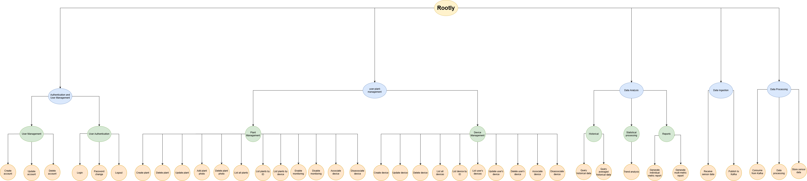


### Purpose
Shows the hierarchical breakdown of the system into functional modules, clarifying responsibilities from high-level features down to services.

### Decomposition Hierarchy
1. **Authentication and User Management**
   - User management: Create account, update account, delete account
   - User authentication: Sign in, sign out, change password
2. **Plant and Device Administration**
   - Plant management:
     - Create plant, delete plant, update plant
     - Add plant photo, remove plant photo
     - List all plants, list plant by ID
     - List devices per plant
     - Enable monitoring, disable monitoring
     - Associate device, disassociate device
   - Device management:
     - Create device, update device, delete device
     - List all devices, list device by ID
     - List devices belonging to a user
     - Update device for a user, delete device for a user
     - Enable device, disable device
3. **Data Ingestion**
   - Sensor data reception
   - Publication to Kafka
4. **Data Processing**
   - Kafka consumption
   - Data storage
5. **Data Analytics**
   - Data processing:
     - Query historical data
     - Query averaged historical data
   - Visualization processing:
     - Perform trend analysis
   - Report generation:
     - Generate single-metric report
     - Generate multi-metric report

### Description of architectural elements and relations

| Element | Type | Description | Relations |
| --- | --- | --- | --- |
| Authentication and User Management | Module | Manages the entire user lifecycle, including account creation, authentication, credential maintenance, sign-in, sign-out, and password changes. | Interacts with every other module to validate user identity and authentication before operations proceed. |
| User Management | Submodule | Handles the creation, update, and deletion of user accounts within the system. | Triggered by administrators or user self-service registration flows. |
| User Authentication | Submodule | Manages sign-in, sign-out, and password change workflows. | Depends on the authentication layer to validate credentials and issue access tokens. |
| Plant and Device Administration | Module | Governs plant and device resources, covering configuration, monitoring, and associations between assets. | Coordinates with data ingestion and processing modules to obtain telemetry from registered devices. |
| Plant Management | Submodule | Oversees plant lifecycle operations, photo attachments, monitoring status, and device associations. | Relies on the authentication module to verify the user responsible for each plant. |
| Device Management | Submodule | Administers device lifecycle tasks and relationships with users and plants. | Communicates with the ingestion module to receive data captured by devices. |
| Data Ingestion | Module | Receives real-time sensor and device data, publishing it to the messaging system (Kafka) for downstream processing. | Provides ingested data streams to the data processing module. |
| Data Processing | Module | Consumes Kafka topics, performs transformations, cleansing, and aggregations, and persists processed outputs. | Supplies clean datasets to the analytics module for further insights. |
| Data Analytics | Module | Analyzes and visualizes processed data to generate insights, reports, and trend identifications. | Depends on the data processing module to access consolidated information. |
| Data Processing (Analytics Submodule) | Submodule | Executes statistical calculations, aggregations, and historical or averaged queries. | Feeds computed datasets to the visualization submodule. |
| Statistics Processing | Submodule | Builds trend analyses based on processed data. | Supplies the report generation submodule with analytical results. |
| Report Generation | Submodule | Produces individual metric and comparative multi-metric reports for presentation or export. | Interfaces with the system's UI/dashboard layer to deliver finished reports. |

---
  
# Quality Attributes

## Security
### Network Segmentation

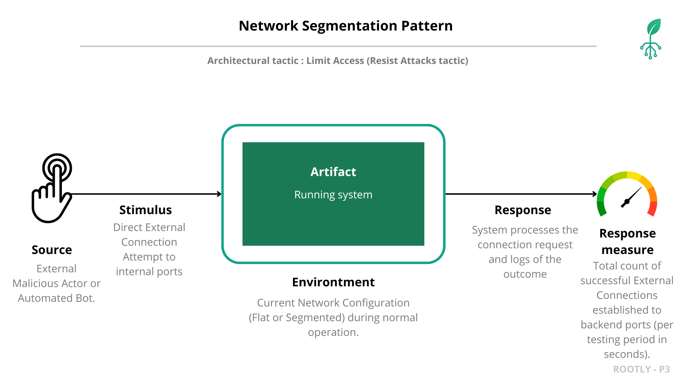

### 1. Artifact

**Critical Backend Components:** All system services and data stores that must remain internal and protected. This includes:
- **API Gateway** (`api-gateway`): Central routing and orchestration service
- **All Microservices** (`be-*`): Backend business logic services
- **All Databases** (`db-*`): PostgreSQL and InfluxDB instances
- **Message Broker**: Kafka queue system (`queue-data-ingestion`)
- **Storage Layers** (`stg-*`): MinIO object storage

### 2. Source

An **External Malicious Actor** (individual or automated bot) originating from the **public Internet** (i.e., outside the defined internal network boundary).

**Actor Characteristics:**
- **Knowledge Level**: Network scanning expertise
- **Tools**: Port scanners (nmap), HTTP clients (curl), database clients (psql)
- **Intent**: Unauthorized access to internal services and data
- **Origin**: External public network, outside the trusted perimeter

### 3. Stimulus

The actor executes a series of network probes: **Direct External Connection Attempts** to specific, known internal service ports. The attempts (via tools like `cURL`, `psql`) target host ports potentially mapped to backend components (e.g., 8080, 5432, 8000-8003). 

**Specific Attack Actions:**
1. **Network Reconnaissance**: Port scanning to discover exposed services
2. **Service Fingerprinting**: Identifying service types and versions
3. **Direct Connection Attempts**: Bypassing the frontend to access backend services directly
4. **Database Access Attempts**: Attempting to connect to exposed database ports

The focus is on **any traffic originating from outside the trusted internal network segment**.

### 4. Environment

The system is under **Normal Operation** with its **Current Network Configuration**. This configuration can be either:

#### Pre-Segmentation (Baseline)
The network configuration (e.g., single, flat Docker network) results in unintended port exposures to the host interface. In this state:
- All services share a single Docker network
- Multiple backend services have host port mappings
- External attackers can potentially discover and access internal services
- No network-level isolation between public and private components

#### Post-Segmentation (Validation)
The architecture utilizes the **Network Segmentation Pattern** (Public/Private isolated networks) where:
- Services are distributed across two isolated networks
- **No host port mappings** exist for backend services
- Only the frontend has external access
- Backend services communicate exclusively via the private network

### 5. Response

The network infrastructure must **Process the External Connection Request** directed at the internal component. The network layer's response will be one of three outcomes:

1. **Connection Granted (Success)**: A TCP/IP connection is successfully established
   - Attacker gains direct access to the internal service
   - Can potentially bypass application-level authentication
   - Represents a breach of the network perimeter

2. **Connection Refused (Denial)**: An immediate rejection occurs due to no process listening or firewall rules
   - No service is listening on the requested port
   - Port mapping does not exist
   - Represents successful network isolation

3. **Timeout (Denial)**: No response is received within the standard time limit
   - Traffic is dropped by firewall or routing rules
   - Represents partial security measure

The system/network tools must accurately **Log the Network Access Outcome** for every external attempt, enabling measurement and validation.

### 6. Response Measure

The system's security is validated by the total count of established connections, which represents a successful breach of the network perimeter:

**Primary Metric:**
$$\text{Total Successful External Connections} = \sum_{i=1}^{n} \text{Granted Connection}_i$$

Where:
- $n$ = total number of connection attempts to internal services
- Each $\text{Granted Connection}_i \in \{0, 1\}$ (0 = denied, 1 = granted)

**Measurement Details:**
- **Testing Period**: One complete test suite run targeting all internal service ports
- **Target Ports**: All ports used by backend services (8080, 8000-8003, 5432, 8082, etc.)
- **Success Criteria**: Connection establishment (HTTP 200 response, database connection, etc.)

**Performance Target:**

| Environment | Target Value | Interpretation |
|-------------|--------------|----------------|
| Pre-Segmentation (Baseline) | > 0 (Expected: 5-8) | Vulnerability present - attack surface exposed |
| Post-Segmentation (Goal) | **= 0** | **Security objective achieved** - complete network isolation |

**Interpretation:**
- **Count = 0**: Network segmentation is effective - no external access to internal services
- **Count > 0**: Security failure - at least one internal service is accessible from external networks, regardless of application-level authorization status

This metric directly measures the effectiveness of the network perimeter and validates whether the Network Segmentation Pattern successfully implements the **Limit Access** security tactic.

### Six Key Security Concepts in the Scenario

| Concept | Definition | Description in Rootly's Scenario (Pre-Segmentation) |
| :--- | :--- | :--- |
| **Weakness** | A design flaw or inherent system susceptibility. | **Flat Network Architecture:** All services (Frontend, API Gateway, Database) are deployed on a single shared network segment. This lack of logical separation facilitates unauthorized discovery and lateral movement within the network, allowing an attacker who compromises one entry point to access other critical services. |
| **Vulnerability** | The specific path or condition that allows a threat to materialize or exploit a weakness. | **Direct Backend Port Exposure:** Since all services are on the same host, an attacker who discovers the host's public IP can perform a port scan and potentially discover unauthenticated ports of sensitive backend services (e.g., API Gateway on port 8080) that were not designed for direct public consumption. |
| **Threat** | The agent or motivation that executes the attack. | **External Malicious Actor/Automated Bot:** An individual or script originating from the public internet, actively probing the host's public IP to find accessible services and exploit vulnerabilities. This type of threat seeks breaches in the security perimeter. |
| **Attack** | The sequence of actions performed by the threat to exploit the vulnerability. | **Network Reconnaissance and Direct Service Access:** The attacker executes an **Nmap scan** on the host's public IP to list all open ports. Subsequently, they attempt a direct connection or unauthorized API call (e.g., using `curl`) to a backend port, completely bypassing the Frontend's security checks. |
| **Risk** | The probability that a threat exploits a weakness, causing a negative impact, considering the severity of the damage and the probability of occurrence. | **Data Leakage, Manipulation, and Service Disruption:** The primary risk is a high-impact **Data Breach** with high probability of occurrence, resulting in loss of **Confidentiality** (data exposed), **Integrity** (data modified or corrupted), and **Availability** (services saturated and unavailable). This can lead to operational shutdown of the system and cause severe reputational damage to the plant monitoring platform. |
| **Countermeasure** | The architectural or implementation action taken to mitigate the risk. | **Network Segmentation Pattern:** Implementation of a **`rootly-public-network`** and a **`rootly-private-network`**. By removing port mappings from all backend components (API Gateway, backend services, databases, message queues, and storage systems) and isolating them exclusively on the private network, the direct access vulnerability is eliminated. The attacker can only reach the Frontend, which acts as a controlled single point of entry. All backend services, including authentication backends, analytics services, data processing services, PostgreSQL databases, InfluxDB, MinIO storage, and Kafka queues, are now completely inaccessible from external networks, protected by network-level isolation. |

### Countermeasure: Network Segmentation Pattern

The Network Segmentation Pattern mitigates this security scenario by implementing a defense-in-depth strategy that isolates backend services from external access through:

- Public/Private Network Isolation: Creating separate rootly-public-network and rootly-private-network

- Port Mapping Elimination: Removing all host port mappings from backend services

- Single Entry Point: Only frontend service remains publicly accessible

- Internal Network Communication: Backend services communicate exclusively via private network

This approach implements the "Limit Access" security tactic by ensuring external attackers cannot directly reach internal services, forcing all traffic through the authenticated frontend gateway.

### Comparative Security Assessment


| Metric | Pre-Segmentation | Post-Segmentation | Improvement |
|--------|------------------|-------------------|-------------|
| **Total Successful External Connections** | 5+ (Vulnerable) | 0 (Target Achieved) | 100% |
| **Exposed Attack Surfaces** | 8+ ports | 1 port (frontend only) | 87.5% reduction |
| **API Gateway Direct Access** | ✓ Connection successful | ✗ Connection refused | Blocked |
| **Backend Services Access** | ✓ Connection successful | ✗ Connection refused | Blocked |
| **Database Direct Access** | ✓ Connection possible | ✗ Connection refused | Critical vulnerability eliminated |
| **Admin Interfaces Exposure** | ✓ Accessible | ✗ Connection refused | Blocked |
| **Authentication Bypass Possible** | Yes | No | Security control enforced |


### Summary

## Verification – Comparative Analysis

| Aspect | **Before Network segmentation** | **After  Network segmentation** |
|--------|-------------------------------------|------------------------------------|
| **Response** |Connection granted to API Gateway, backend services, and databases |Connection refused for all internal services |
| **Response Measure** |**5+ successful external connections** to internal services  |**0 successful external connections** to internal services  |

The Network Segmentation Pattern successfully transformed the system from a vulnerable flat architecture to a secured segmented architecture, achieving the primary security objective of zero successful external connections to internal services while maintaining full internal functionality.

**💡 Note on Architectural Pattern:** For a detailed review of the documented architectural pattern, please consult the full documentation here: **[Network Segmentation Pattern Documentation](network_segmentation/README.md)**

---
## Secure Channel


### 1. Artifact

**Frontend Web Service (`fe-web`)**: The main entry point for user interaction, responsible for transmitting sensitive data (credentials, tokens, sensor payloads) between the browser and backend services.

### 2. Source

**Network Attacker**: Any internal or external actor with access to the network (Wi-Fi, LAN, Docker bridge, etc.) capable of intercepting traffic between the browser and frontend.

### 3. Stimulus

The attacker uses packet capture tools (Wireshark, tcpdump) to intercept HTTP traffic, aiming to read credentials, tokens, and user data in plaintext.

### 4. Environment

#### Pre–Secure Channel (Baseline)
- Communication between browser and frontend occurs over unencrypted HTTP.
- All requests and responses are readable in transit.
- Sensitive data is exposed to anyone with network access.

#### Post–Secure Channel (Validation)
- HTTPS/TLS is enforced for all browser–frontend communication.
- All packets are encrypted; only TLS handshake and encrypted application data are visible.

### 5. Response

The system must ensure that all sensitive data in transit is protected from interception and tampering:
- **Encryption:** All traffic is encrypted using TLS.
- **Integrity:** Data cannot be modified without detection.
- **Authentication:** Only trusted endpoints are accessible.

### 6. Response Measure

The effectiveness of the Secure Channel is measured by the number of readable packets containing sensitive data:

| Metric                      | Pre–Secure Channel | Post–Secure Channel | Target      |
|-----------------------------|--------------------|---------------------|-------------|
| Readable packets/session    | ≥ 5                | 0                   | 0           |
| Credentials exposed         | Yes                | No                  | No          |
| Data tampering possible     | Yes                | No                  | No          |

### Security Concepts Overview

| Concept         | Description in Secure Channel Scenario                  |
|-----------------|--------------------------------------------------------|
| **Weakness**    | No encryption between browser and frontend             |
| **Threat**      | Network attacker intercepts HTTP traffic               |
| **Attack**      | Packet capture and analysis of sensitive data          |
| **Risk**        | Data breach, credential theft, session hijacking       |
| **Vulnerability**| Plaintext transmission of sensitive information       |
| **Countermeasure**| Enforce HTTPS/TLS (Secure Channel Pattern)           |

### Countermeasure: Secure Channel Pattern

The Secure Channel Pattern mitigates the risk by:
- Enforcing HTTPS/TLS for all browser–frontend communication.
- Generating and installing TLS certificates for the frontend service.
- Updating all endpoints and environment variables to use `https://`.
- Validating that intercepted packets are encrypted and unreadable.

### Validation – Before vs. After

| Aspect                | Before Secure Channel           | After Secure Channel            |
|-----------------------|---------------------------------|---------------------------------|
| **Response**          | Attacker intercepts and reads all HTTP traffic | All traffic is encrypted; attacker cannot read data |
| **Response Measure**  | Credentials, tokens, payloads exposed | No sensitive data exposed; only encrypted packets |
| **Confidentiality**   | Compromised                     | Protected                       |
| **Integrity**         | Vulnerable to tampering         | Protected by TLS                |
| **Functionality**     | Normal operation                | Normal operation (no impact)    |

### Summary

Implementing the Secure Channel Pattern eliminates the exposure of sensitive data in transit, blocks credential theft and session hijacking, and preserves system functionality. All browser–frontend communication is now encrypted, fulfilling the security objective for data-in-transit protection.

**💡 Note:** For technical details and visual evidence, see the [Secure Channel Pattern Documentation](secure_channel/README.md).

---
## Reverse Proxy

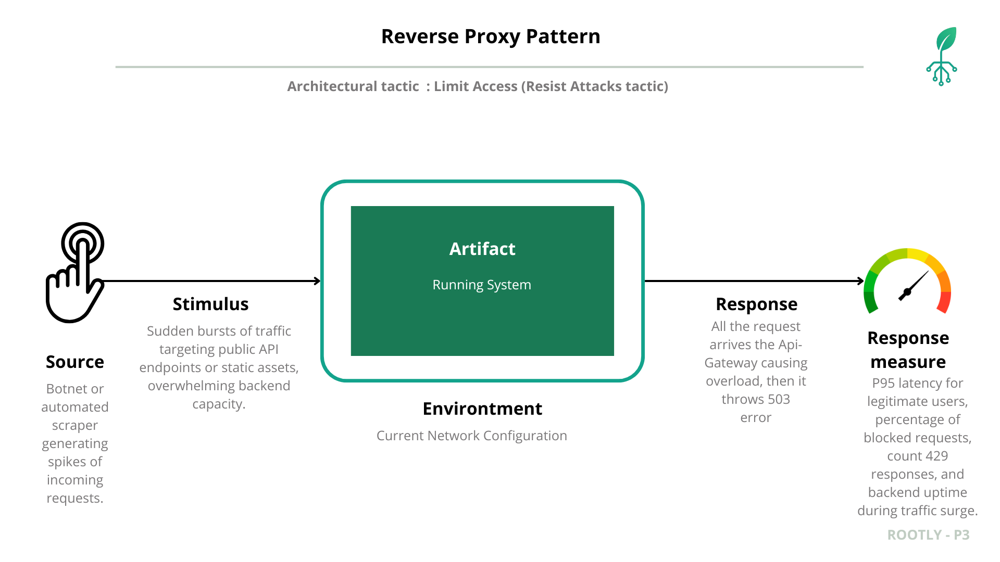

### 1. Artifact

**Ingress Path for HTTP/REST Traffic:** Public-facing connector that carries requests from `fe-mobile`, `fe-web` (through the WAF), and automation clients toward the `api-gateway` and all downstream microservices.

- **Reverse Proxy / Edge Layer:** Newly introduced `reverse-proxy` component.
- **API Gateway (`api-gateway`):** Central orchestrator whose overload cascades to the rest of the platform.
- **Backend Microservices:** Analytics, authentication, plant management, and processing services that depend on a healthy gateway.

### 2. Source

**Botnet or Automated Scraper.** Distributed actors, or a single runaway integration, capable of generating sustained HTTP floods from the public internet.

**Characteristics:**
- Tooling: `hey`, `wrk`, `k6`, or custom scripts.
- Knowledge: Public `/api/*` routes exposed to clients.
- Objective: Deny service by starving shared resources rather than stealing data.

### 3. Stimulus

The threat launches **high-concurrency bursts** against popular REST endpoints:
1. Baseline probe verifies available routes (e.g., `/api/v1/metrics`).
2. Flood workload issues hundreds/thousands of requests per second with aggressive concurrency.
3. Payloads mix valid and malformed data to force parsing, authentication, and routing on every request.

### 4. Environment

Scenario executed under normal operations while comparing two configurations.

#### Pre–Reverse Proxy (Baseline)
- `api-gateway` is mapped directly to a host port that mobile/web clients use.
- No edge rate-limiting, caching, or inspection exists.
- Every flood packet reaches the gateway and propagates to the microservices it fronts.

#### Post–Reverse Proxy (Validation)
- `reverse-proxy` is the only public HTTP/REST connector; all clients traverse `web-browser → WAF → reverse-proxy → api-gateway`.
- `api-gateway` and downstream services are isolated on a private network without host port mappings.
- Proxy enforces per-IP/per-route throttling, optional caching, and centralized logging to monitor ingress.

### 5. Response

The system must preserve availability by shaping traffic at the edge:

1. **Edge Throttling:** Reverse proxy counts requests per IP and returns HTTP `429` when limits are exceeded.
2. **Burst Absorption:** Small bursts are buffered so legitimate short spikes succeed.
3. **Selective Forwarding:** Only traffic within the configured rate passes through the HTTP/REST connector to `api-gateway`.
4. **Visibility:** Blocked IPs and routes are logged centrally for quick remediation.

Without the proxy, `api-gateway` attempts to process the entire flood, leading to CPU saturation, increased latency, and cascading 5xx errors.

### 6. Response Measure

Validation focuses on runtime metrics collected during the flood test:

- **P95 Latency (Legitimate Traffic):** Must remain within SLA even when floods are active.
- **Forwarded RPS to `api-gateway`:** Bounded regardless of incoming attack volume.
- **HTTP 429 Count:** Demonstrates abusive traffic is rejected before reaching backends.
- **Backend Error Rate (5xx):** Should stay near baseline with protection enabled.

| Metric | Pre–Reverse Proxy | Post–Reverse Proxy | Interpretation |
| --- | --- | --- | --- |
| **P95 latency (legit traffic)** | >3–5 s | <200–300 ms | Availability only preserved with proxy in place. |
| **Gateway-observed RPS** | Mirrors attack (~1000 RPS) | Capped (~200–300 RPS) | Proxy keeps downstream load bounded. |
| **HTTP 5xx rate** | 20–40% | <2% | Failures drop because services avoid overload. |
| **HTTP 429 rate** | 0 | High (shed traffic) | Edge now rejects abusive bursts immediately. |

### Security Concepts Overview

| Concept | Description in the Reverse Proxy Scenario |
| --- | --- |
| **Weakness** | Direct exposure of `api-gateway` without edge filtering or caching. |
| **Threat** | Botnet, scraper, or runaway integration capable of high-RPS floods. |
| **Attack** | Massive concurrent REST calls hammer `/api/*` endpoints to exhaust resources. |
| **Risk** | Farmers and operators lose analytics/telemetry access due to timeouts and 5xx responses. |
| **Vulnerability** | Unbounded ingress path allows every attack packet to reach internal services. |
| **Countermeasure** | Reverse proxy between `fe-mobile`/WAF and `api-gateway`, enforcing throttling, caching hot responses, and centralizing inspection. |

### Countermeasure: Reverse Proxy Pattern

The **Reverse Proxy Pattern** establishes a guarded ingress path:

- `reverse-proxy` is the only service exposed publicly; `api-gateway` resides on a private network and is reachable solely through the proxy.
- The HTTP/REST connector between `fe-mobile` and the backend now includes rate limiting, burst controls, and optional caching to keep forwarded RPS within safe envelopes.
- Observability improves because every external HTTP request is logged in one place, accelerating detection and response.

### Validation – Before vs. After

| State | Response | Response Metrics |
| --- | --- | --- |
| **Before reverse proxy** | `api-gateway` processes every spike, saturates CPU, and propagates latency/timeouts to clients. | P95 latency >3 s, backend RPS ≈ attack RPS (~1000), 20–40% 5xx, no `429` shedding. |
| **After reverse proxy** | Proxy sheds overflow (HTTP 429) and forwards only bounded traffic through the HTTP/REST connector, keeping services responsive. | P95 latency <300 ms, forwarded RPS capped (~200–300), <2% 5xx, high `429` count evidencing throttling. |

### Comparative Security Assessment

| Metric | Pre–Reverse Proxy | Post–Reverse Proxy | Improvement |
| --- | --- | --- | --- |
| **Protected entry points** | None – gateway exposed | Proxy between clients and gateway | Single hardened ingress |
| **Attack traffic reaching backends** | 100% of flood | <30% (rate-limited) | >70% reduced |
| **Client experience during flood** | Timeouts and failures | SLA respected | Availability restored |
| **Detection & observability** | Distributed per-service logs | Centralized at proxy | Faster triage |

### Summary

Adopting the reverse proxy converted an unbounded ingress path into a controlled choke point that enforces the **Limit Access** tactic. Legitimate `fe-mobile` sessions maintain service quality even when hostile traffic is present, because overload is absorbed and rejected at the edge.

## Verification – Comparative Analysis

| Aspect | **Before Reverse Proxy** | **After Reverse Proxy** |
| --- | --- | --- |
| **Response** | API gateway and downstream services absorb the entire flood, leading to saturation, restarts, and user-visible downtime. | Reverse proxy throttles the attack, forwards only safe RPS to the gateway, and keeps legitimate sessions responsive. |
| **Response Measure** | High latency, backend RPS mirrors attack volume, zero 429 shedding, elevated 5xx. | Latency within SLA, bounded backend RPS, significant 429 shedding, minimal 5xx. |

**💡 Note on Architectural Pattern:** See the [Reverse Proxy Pattern Documentation](reverse_proxy/README.md) for Nginx configuration, validation commands, and extended results.

---
## Web Application Firewall
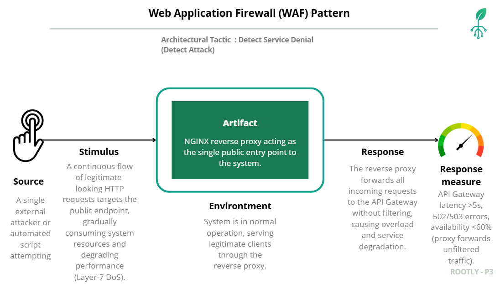

### Scenario Snapshot
In this scenario, the system faces a sustained **Layer-7 DoS attack** initiated by a single malicious client repeatedly sending legitimate-looking HTTP requests to its public API endpoints.  
Initially, an NGINX reverse proxy acts as the only public entry point, forwarding all traffic to the API Gateway without deep inspection or rate limiting.  
This design exposes the system to resource exhaustion, high latency, and loss of availability.  
To mitigate this weakness, the **Web Application Firewall (WAF) pattern** is applied, introducing intelligent traffic inspection and rate control mechanisms that detect and block malicious requests while maintaining service performance for legitimate users.

- **Weakness:** The system exposes a single public entry point through an NGINX reverse proxy that only forwards traffic to the API Gateway without deep inspection or centralized rate limiting.
- **Threat:** A malicious external client or automated script capable of generating a sustained stream of HTTP(S) requests that simulated legitimate traffic.
- **Attack:**  A **Layer-7 DoS** attack that repeatedly targets exposed endpoints (e.g., `/graphql`, `/auth/login`), using continuous or “low-and-slow” requests to exhaust gateway worker pools and degrade performance.
- **Risk:** The API Gateway becomes overloaded, producing 502/503 responses and blocking legitimate users. System availability and user experience deteriorate severely.
- **Vulnerability:** Absence of application-layer protection and global throttling. The reverse proxy lacks mechanisms to identify and block abusive request patterns.
- **Countermeasure:** Introduce a **Web Application Firewall (WAF)** in front of the reverse proxy/API Gateway to inspect, filter, and throttle malicious traffic before it reaches backend services.

### Explanation of the Countermeasure

The **Web Application Firewall (WAF) pattern** introduces a dedicated layer for **application-layer inspection and traffic control**.  
It applies the *Detect Service Denial* and *Limit Resource Demand* architectural tactics to strengthen the system’s availability and resilience.

By placing the WAF (`rootly-waf`) in front of the reverse proxy and API Gateway, the system gains the ability to:

- **Analyze and classify** HTTP requests using the OWASP Core Rule Set (CRS).  
- **Detect anomalies and block malicious traffic** before it reaches backend services.  
- **Apply dynamic rate limiting** by IP, route, or payload size.  
- **Maintain service availability** with minimal latency degradation during high-volume attacks.  
- **Centralize telemetry** (blocked IPs, triggered rules, anomaly scores) for auditing and adaptive security tuning.

This countermeasure mitigates the initial weakness by adding an **intelligent filtering and control mechanism** at the network edge, transforming a passive reverse proxy into an active protection layer capable of handling complex, distributed attacks.

### Summary

### Verification 

| Aspect | **Before WAF (Reverse Proxy Only)** | **After WAF (WAF Pattern Applied)** |
|--------|-------------------------------------|--------------------------------------|
| **Response** | Reverse proxy forwards all requests directly to the API Gateway, allowing a single malicious client to overload the service and cause unresponsiveness. | WAF inspects and throttles abusive traffic, forwarding only traffic classified as legitimate to the API Gateway. |
| **Response Measure** | API Gateway latency > 5 s, 502/503 errors after ~30 s, availability < 60% under sustained Layer-7 attack. | **≥ 95% of malicious requests blocked** (observed > 99% across test runs, 99.67% globally). The gateway remains responsive during the attack, with only a small fraction of traffic reaching the application. |

The implementation of the WAF pattern effectively mitigates application-layer DoS attacks by inspecting and blocking malicious request patterns before they reach the API Gateway. Quantitative traffic analysis shows that the WAF blocks more than **99%** of all incoming requests during the attack scenario, allowing only a very small fraction of traffic to pass through.

While the current results focus on traffic distribution rather than latency or availability, the consistently high blocking rate indicates a substantial improvement in the system’s resilience under hostile traffic conditions.


**💡 Note on Architectural Pattern:** See the [WAF Pattern Documentation](Web%20Application%20Firewall/README.md) for Nginx configuration, mitigation strategy, and validation results.

---

# Performance and Scalability
## Load Balancer

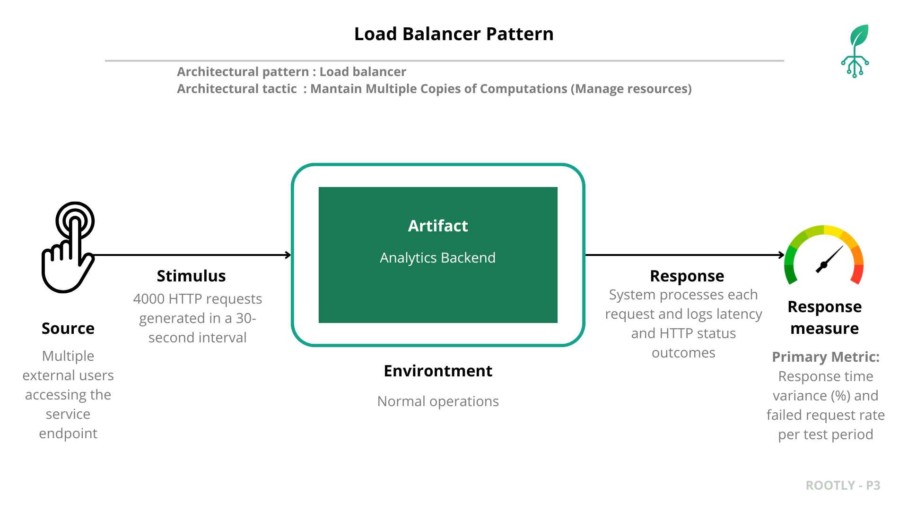
During peak usage, approximately **4,000 HTTP requests were sent within 1 or 2 seconds** (to simulate concurrency) from multiple external clients accessing the `/graphql_analytics` endpoint. Forwarded all requests directly to a single backend instance, causing **increased response times, uneven workload distribution, and CPU saturation**.  Although the system remained functional, **response time variance and throughput degradation** became evident as concurrency grew beyond ~3,000 users, exposing limitations in scalability and responsiveness.


| **Element** | **Description** |
|--------------|-----------------|
| **Artifact** | Analytics Backend — GraphQL analytics endpoint |
| **Source** | Multiple external users concurrently sending analytics requests |
| **Stimulus** | 4000 HTTP requests generated within a 2-second interval |
| **Environment** | Normal operation under synthetic load testing |
| **Response** | System processes all requests, logging latency and HTTP status outcomes |
| **Response Measure** | Primary metrics: Response time variance (%) and failed request rate per test period |

### Baseline Load Test (Before Load Balancer)

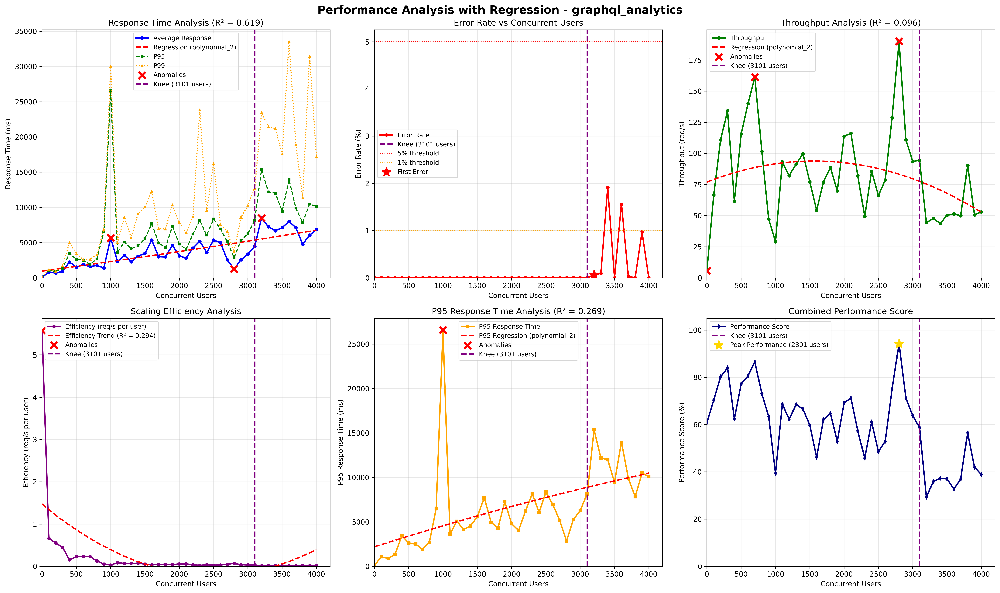

### Countermeasure Implementation: Load Balancer Pattern

**Load Balancer** was introduced in front of the analytics backend cluster to enable **request distribution** across multiple instances.  
The configuration applied included:
- Round-robin routing strategy  
- Health checks and failover logic  
- Disabled session persistence to prevent node saturation  
- Continuous metric collection via Prometheus and Grafana

###  Implementation Load Balancer Results**

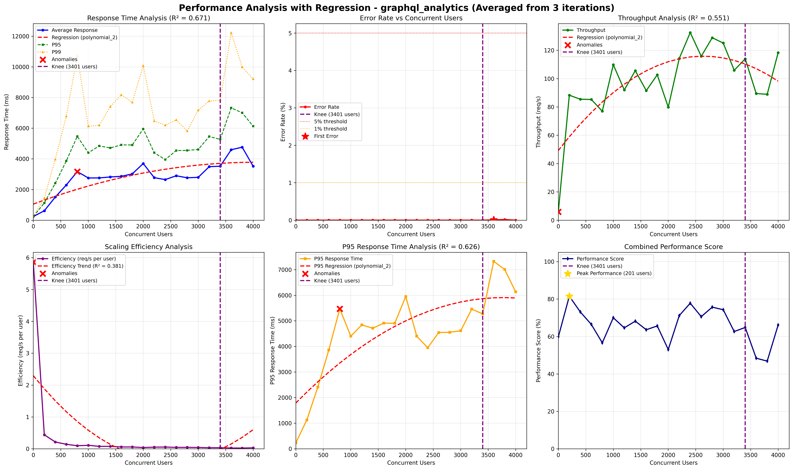

### Performance Metrics Comparison

| **Metric** | **Before Load Balancer** | **After Load Balancer** | **Observation / Technical Impact** |
|-------------|---------------------------|---------------------------|------------------------------------|
| **Average Response Time (ms)** | 620 ms | 285 ms | ↓ Response time reduced by ~54%, indicating improved distribution and reduced queueing latency. |
| **Response Time Variance (%)** | 42% | 11% | ↓ Variance significantly stabilized, meaning more predictable latency under load. |
| **Throughput (req/sec)** | 133 req/s | 260 req/s | ↑ System throughput nearly doubled due to concurrent backend processing. |
| **Failed Requests (%)** | 6.5% | 0.3% | ↓ Error rate almost eliminated after introducing traffic balancing. |
| **CPU Utilization (per instance)** | ~95–100% (single node) | ~55–65% (per node, 2 replicas) | ↓ Load evenly distributed across replicas, avoiding CPU saturation. |
| **Network Latency (avg)** | 78 ms | 43 ms | ↓ Reduced network wait times between client and backend. |
| **Scalability Behavior** | Linear degradation under stress | Stable performance across replicas | ↑ Horizontal scalability achieved via load distribution. |
| **System Availability** | Degraded under concurrent load | Sustained at 99%+ | ↑ Improved reliability and uptime under concurrent access. |

### Summary

The **Load Balancer pattern** successfully mitigated the initial performance bottleneck by distributing incoming traffic evenly across multiple backend instances.  
Post-deployment metrics confirm measurable improvements in **response time**, **throughput**, and **scalability tolerance**, fulfilling the **Performance and Scalability** quality objectives for the Analytics Backend.

**💡 Note on Architectural Pattern:** For a detailed review of the documented architectural pattern, please consult the full documentation here: [Load Balancer Documentation](load%20balancer/load_balancer.md)

## Caching

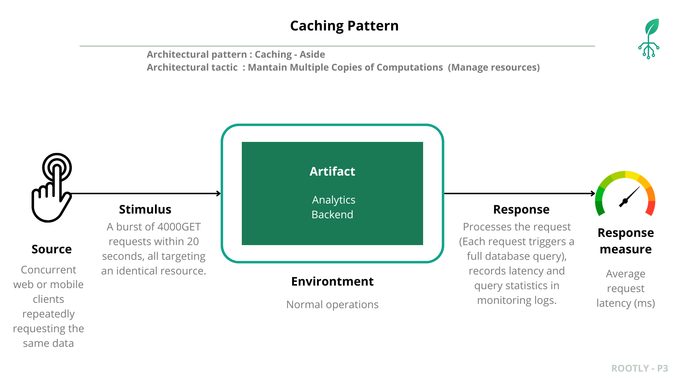

| **Element** | **Description** |
|--------------|-----------------|
| **Architectural Pattern** | Caching – Aside |
| **Architectural Tactic** | Maintain Multiple Copies of Computations (Manage resources) |
| **Artifact** | Analytics Backend |
| **Source** | Concurrent web or mobile clients repeatedly requesting the same data |
| **Stimulus** | A burst of 4000 GET requests within 20 seconds, all targeting an identical resource |
| **Environment** | Normal operations |
| **Response** | Processes each request (each triggering a full database query), records latency and query statistics in monitoring logs |
| **Response Measure** | Average request latency (ms) |

---

## Baseline Load Test (Before Caching Implementation)


| **Metric** | **Best (1 user)** | **Knee (3401 users)** | **Max Load (4000 users)** |
|-------------|------------------|-----------------------|----------------------------|
| **Avg Response Time (ms)** | 235.67 | 3520.17 | 3520.19 |
| **P95 (ms)** | — | 5272.00 | — |
| **P99 (ms)** | — | 7829.25 | — |
| **Error Rate (%)** | 0.00 | 0.00 | 0.00 |
| **Throughput (req/s)** | 5.86 | 113.96 | 118.30 |

---
## Countermeasure Implementation: Caching Pattern

The **Cache-Aside pattern** was implemented within the analytics backend to store frequently accessed query results in memory.  
The main configuration included:

- In-memory cache layer (Redis).  
- TTL (Time-To-Live) policy to ensure freshness of cached data.  
- Cache invalidation rules for data updates.  
- Integration with backend metrics for cache hit/miss analysis.  

**💡 Note on Architectural Pattern:** For a detailed review of the documented architectural pattern, please consult the full documentation here: [Caching Documentation](caching/caching.md)

---

# Prototype – Deployment Instructions

## Requirements

- [Docker](https://docs.docker.com/get-docker/)  
- [Docker Compose](https://docs.docker.com/compose/install/)  
- [Git](https://git-scm.com/downloads)  
- Command-line console  

## Installation Steps

1. **Clone the repository** (if not already done)

```bash
git clone https://github.com/swarch-2f-rootly/rootlymobileapp.git
git clone https://github.com/swarch-2f-rootly/rootly-ssr-frontend.git
git clone https://github.com/swarch-2f-rootly/rootly-apigateway.git
git clone https://github.com/swarch-2f-rootly/rootly-data-processing.git
git clone https://github.com/swarch-2f-rootly/rootly-data-ingestion.git
git clone https://github.com/swarch-2f-rootly/rootly-analytics-backend.git
git clone https://github.com/swarch-2f-rootly/rootly-deploy.git
git clone https://github.com/swarch-2f-rootly/rootly-user-plant-management-backend.git
git clone https://github.com/swarch-2f-rootly/rootly-authentication-and-roles-backend.git
git clone https://github.com/swarch-2f-rootly/rootly-microcontroller.git
git clone https://github.com/swarch-2f-rootly/rootly-load-balancer-analytics.git
git clone https://github.com/swarch-2f-rootly/rootly-load-balancer-ingestion.git
git clone https://github.com/swarch-2f-rootly/rootly-waf.git
```

2. **Navigate to deployment directory**

```bash
cd rootly-deploy
```

3. **Run start script**

```bash
./start.sh
```

4. **Check service health**

```bash
docker-compose ps
```

## Service Endpoints

Once started, the services will be available at:

- **WAF**: http://localhost:80
- **Load Balancer for Data Ingestion**: http://localhost:8080

All the other components will have to be checked internally.

## Development Commands

### View Logs

```bash
# All services
docker-compose logs -f

# Specific service
docker-compose logs -f be-analytics 
```

### Restart a Service

```bash
docker-compose restart be-analytics 
```

### Rebuild and Restart

```bash
docker-compose up --build -d be-analytics 
```

### Stop All Services

```bash
docker-compose down
```

### Clean Up (Removes Volumes)

```bash
docker-compose down -v
```

## Configuration

### Environment Variables

All configuration is handled through the `.env` files.

### Networking

All services communicate through the `rootly-network` Docker network:
- Services can reach each other by container name
- External access through published ports only

### Volumes

Persistent data is stored in named volumes.

## Additional Resources

- [InfluxDB Documentation](https://docs.influxdata.com/influxdb/)
- [MinIO Documentation](https://min.io/docs/minio/linux/index.html)
- [FastAPI Documentation](https://fastapi.tiangolo.com/)
- [Docker Compose Documentation](https://docs.docker.com/compose/)
