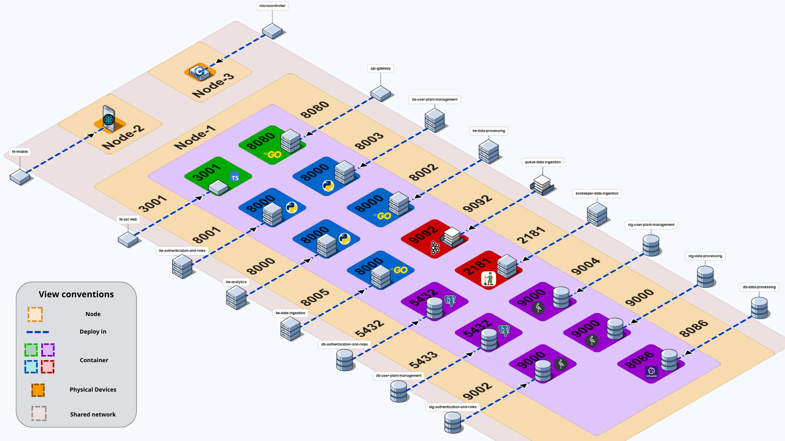

# Security Quality Attribute Scenario: Network Segmentation Pattern Implementation and Validation

## Table of Contents
1. [Weakness and Security Context](#architectural-weakness-and-security-context)
2. [Quality Attribute Scenario](#quality-attribute-scenario)
3. [Security Scenario Analysis](#security-scenario-analysis)
4. [Vulnerability Demonstration (Pre-Segmentation)](#vulnerability-demonstration-pre-segmentation)
5. [Countermeasure Implementation](#countermeasure-implementation)
6. [Validation Results (Post-Segmentation)](#validation-results-post-segmentation)
7. [Response to Quality Scenario](#response-to-quality-scenario)

---

## Weakness and Security Context

### System Vulnerability Overview

The Rootly plant monitoring system's initial deployment architecture exhibits a critical **architectural weakness**: a **flat network architecture** where all system components—frontend, API Gateway, backend microservices, databases, and message brokers—are deployed on a single shared Docker network segment with multiple host port mappings.



### The Fundamental Weakness: Lack of Network Isolation

In the pre-segmentation configuration, the system suffers from insufficient network boundary enforcement. Specifically:

**1. Single Flat Network Topology:**
All services share the same Docker bridge network (`rootly-network`), creating a single trust zone with no internal segmentation. This design violates the principle of **defense in depth** by relying solely on application-level security controls.

**2. Direct Port Exposure to Host:**
Multiple internal services expose their ports directly to the host machine's network interface through Docker port mappings:
- **API Gateway**: Port 8080 mapped to host
- **Backend Microservices**: Ports 8000-8003 mapped to host
- **PostgreSQL Database**: Port 5432 mapped to host (critical vulnerability)
- **Kafka UI**: Port 8082 mapped to host
- **InfluxDB**: Port 8086 mapped to host

**3. Unintended Attack Surface Expansion:**
These port mappings were originally intended for development and debugging convenience. However, in a production-like deployment, they create direct pathways for external attackers to bypass the intended security architecture, which assumes all external traffic flows through the frontend application.

### Security Implications

This architectural weakness creates two critical security vulnerabilities:

| Vulnerability | Description | Security Impact |
|---------------|-------------|-----------------|
| **Bypassing Application Security** | External attackers can connect directly to backend services and databases, completely bypassing the frontend's authentication and authorization mechanisms | **Confidentiality Loss**: Unauthorized data access<br>**Integrity Loss**: Unvalidated data modification |
| **Excessive Attack Surface** | Instead of a single controlled entry point (frontend), the system exposes 8+ network entry points, each representing a potential vulnerability | **Increased Risk**: Multiple attack vectors<br>**Difficult Defense**: Cannot apply consistent security policies |

### Why This Matters: The Attack Scenario

An external malicious actor can exploit this weakness through a simple two-step attack:

1. **Network Reconnaissance**: Perform a port scan on the host's public IP to discover exposed services
2. **Direct Service Access**: Connect directly to internal services (API Gateway, databases) without authenticating through the frontend

This bypasses all intended security controls and represents a **complete failure of the security perimeter**.

### Scenario Focus

This quality attribute scenario rigorously assesses the effectiveness of the **Network Segmentation Pattern** as a countermeasure to this architectural weakness. The scenario quantifies security by measuring the **total count of successful external connections** established to internal components:

- **Exposure Baseline (Pre-Segmentation)**: Expected ≥ 5 successful direct connections to internal services
- **Validation Target (Post-Segmentation)**: **Goal = 0** successful external connections to internal services

By implementing network segmentation—dividing the infrastructure into isolated public and private network zones—we aim to eliminate this weakness and validate the effectiveness of the **Limit Access** security tactic (part of the **Resist Attacks** tactics category).

---

## Quality Attribute Scenario

### Scenario Elements


### 1. Artifact

**Critical Backend Components:** All system services and data stores that must remain internal and protected. This includes:
- **API Gateway** (`api-gateway`): Central routing and orchestration service
- **All Microservices** (`be-*`): Backend business logic services
- **All Databases** (`db-*`): PostgreSQL and InfluxDB instances
- **Message Broker**: Kafka queue system (`queue-data-ingestion`)
- **Storage Layers** (`stg-*`): MinIO object storage

### 2. Source

An **External Malicious Actor** (individual or automated bot) originating from the **public Internet** (i.e., outside the defined internal network boundary).

**Actor Characteristics:**
- **Knowledge Level**: Network scanning expertise
- **Tools**: Port scanners (nmap), HTTP clients (curl), database clients (psql)
- **Intent**: Unauthorized access to internal services and data
- **Origin**: External public network, outside the trusted perimeter

### 3. Stimulus

The actor executes a series of network probes: **Direct External Connection Attempts** to specific, known internal service ports. The attempts (via tools like `cURL`, `psql`) target host ports potentially mapped to backend components (e.g., 8080, 5432, 8000-8003). 

**Specific Attack Actions:**
1. **Network Reconnaissance**: Port scanning to discover exposed services
2. **Service Fingerprinting**: Identifying service types and versions
3. **Direct Connection Attempts**: Bypassing the frontend to access backend services directly
4. **Database Access Attempts**: Attempting to connect to exposed database ports

The focus is on **any traffic originating from outside the trusted internal network segment**.

### 4. Environment

The system is under **Normal Operation** with its **Current Network Configuration**. This configuration can be either:

#### Pre-Segmentation (Baseline)
The network configuration (e.g., single, flat Docker network) results in unintended port exposures to the host interface. In this state:
- All services share a single Docker network
- Multiple backend services have host port mappings
- External attackers can potentially discover and access internal services
- No network-level isolation between public and private components

#### Post-Segmentation (Validation)
The architecture utilizes the **Network Segmentation Pattern** (Public/Private isolated networks) where:
- Services are distributed across two isolated networks
- **No host port mappings** exist for backend services
- Only the frontend has external access
- Backend services communicate exclusively via the private network

### 5. Response

The network infrastructure must **Process the External Connection Request** directed at the internal component. The network layer's response will be one of three outcomes:

1. **Connection Granted (Success)**: A TCP/IP connection is successfully established
   - Attacker gains direct access to the internal service
   - Can potentially bypass application-level authentication
   - Represents a breach of the network perimeter

2. **Connection Refused (Denial)**: An immediate rejection occurs due to no process listening or filtering rules
   - No service is listening on the requested port
   - Port mapping does not exist
   - Represents successful network isolation

3. **Timeout (Denial)**: No response is received within the standard time limit
   - Traffic is dropped by filtering or routing rules
   - Represents partial security measure

The system/network tools must accurately **Log the Network Access Outcome** for every external attempt, enabling measurement and validation.

### 6. Response Measure

The system's security is validated by the total count of established connections, which represents a successful breach of the network perimeter:

**Primary Metric:**
$$\text{Total Successful External Connections} = \sum_{i=1}^{n} \text{Granted Connection}_i$$

Where:
- $n$ = total number of connection attempts to internal services
- Each $\text{Granted Connection}_i \in \{0, 1\}$ (0 = denied, 1 = granted)

**Measurement Details:**
- **Testing Period**: One complete test suite run targeting all internal service ports
- **Target Ports**: All ports used by backend services (8080, 8000-8003, 5432, 8082, etc.)
- **Success Criteria**: Connection establishment (HTTP 200 response, database connection, etc.)

**Performance Target:**

| Environment | Target Value | Interpretation |
|-------------|--------------|----------------|
| Pre-Segmentation (Baseline) | > 0  | Vulnerability present - attack surface exposed |
| Post-Segmentation (Goal) | **= 0** | **Security objective achieved** - complete network isolation |

**Interpretation:**
- **Count = 0**: Network segmentation is effective - no external access to internal services
- **Count > 0**: Security failure - at least one internal service is accessible from external networks, regardless of application-level authorization status

This metric directly measures the effectiveness of the network perimeter and validates whether the Network Segmentation Pattern successfully implements the **Limit Access** security tactic.

---

## Security Scenario Analysis

### CIA Triad Impact Assessment

The implementation of the Network Segmentation Pattern is a direct response to a high-risk scenario that threatens the **Confidentiality**, **Integrity**, and **Availability** of the application's data and services.

#### Confidentiality Risk
**Risk**: Sensitive data (user records, plant information, sensor data) could be exposed if an attacker gains direct access to the database or internal APIs without passing through the frontend's authentication and authorization controls.

**Impact Severity**: Critical
- User credentials and personal information exposed
- Proprietary plant monitoring data accessible
- Sensor data vulnerable to surveillance
- Business intelligence leakage

#### Integrity Risk
**Risk**: Unauthorized modification, deletion, or corruption of data if an attacker can bypass the application's business logic and invoke backend services directly, thereby altering the correct state of the system.

**Impact Severity**: High
- Data corruption leading to incorrect monitoring results
- Malicious manipulation of plant health records
- Historical data tampering
- System state corruption

#### Availability Risk
**Risk**: Denial of service if an attacker can directly target specific backend services or the database with a high volume of requests, saturating those services and rendering them unavailable to legitimate users.

**Impact Severity**: High
- Service disruption for plant monitoring operations
- Critical alert system failure
- Data ingestion pipeline saturation
- Business operations halt

Without network segmentation, an attacker could bypass rate limiting and access controls at the frontend level and overwhelm critical backend components directly.

### Six Key Security Concepts in the Scenario

| Concept | Definition | Description in Rootly's Scenario (Pre-Segmentation) |
| :--- | :--- | :--- |
| **Weakness** | A design flaw or inherent system susceptibility. | **Flat Network Architecture:** All services (Frontend, API Gateway, Database) are deployed on a single shared network segment. This lack of logical separation facilitates unauthorized discovery and lateral movement within the network, allowing an attacker who compromises one entry point to access other critical services. |
| **Vulnerability** | The specific path or condition that allows a threat to materialize or exploit a weakness. | **Direct Backend Port Exposure:** Since all services are on the same host, an attacker who discovers the host's public IP can perform a port scan and potentially discover unauthenticated ports of sensitive backend services (e.g., API Gateway on port 8080) that were not designed for direct public consumption. |
| **Threat** | The agent or motivation that executes the attack. | **External Malicious Actor/Automated Bot:** An individual or script originating from the public internet, actively probing the host's public IP to find accessible services and exploit vulnerabilities. This type of threat seeks breaches in the security perimeter. |
| **Attack** | The sequence of actions performed by the threat to exploit the vulnerability. | **Network Reconnaissance and Direct Service Access:** The attacker executes an **Nmap scan** on the host's public IP to list all open ports. Subsequently, they attempt a direct connection or unauthorized API call (e.g., using `curl`) to a backend port, completely bypassing the Frontend's security checks. |
| **Risk** | The probability that a threat exploits a weakness, causing a negative impact, considering the severity of the damage and the probability of occurrence. | **Data Leakage, Manipulation, and Service Disruption:** The primary risk is a high-impact **Data Breach** with high probability of occurrence, resulting in loss of **Confidentiality** (data exposed), **Integrity** (data modified or corrupted), and **Availability** (services saturated and unavailable). This can lead to operational shutdown of the system and cause severe reputational damage to the plant monitoring platform. |
| **Countermeasure** | The architectural or implementation action taken to mitigate the risk. | **Network Segmentation Pattern:** Implementation of a **`rootly-public-network`** and a **`rootly-private-network`**. By removing port mappings from all backend components (API Gateway, backend services, databases, message queues, and storage systems) and isolating them exclusively on the private network, the direct access vulnerability is eliminated. The attacker can only reach the Frontend, which acts as a controlled single point of entry. All backend services, including authentication backends, analytics services, data processing services, PostgreSQL databases, InfluxDB, MinIO storage, and Kafka queues, are now completely inaccessible from external networks, protected by network-level isolation. |

---

## Vulnerability Demonstration (Pre-Segmentation)

This section demonstrates the security vulnerabilities present in the pre-segmentation architecture through a simulated attack scenario. We assume the host IP is `192.168.1.10` and that the frontend service is running on port 3001.

### Attack Prerequisites

Tools required for the attack simulation (Linux/Arch environment):

```bash
# Update system packages
sudo pacman -Syu

# Install nmap for network scanning
sudo pacman -S --noconfirm nmap

# Install curl for HTTP requests
sudo pacman -S --noconfirm curl

# Install PostgreSQL client for database testing
sudo pacman -S --noconfirm postgresql
```

### Phase 1: Network Reconnaissance

#### Step 1.1: Host IP Discovery

The attacker identifies the target host's IP address:

```bash
# Command to find host IP address
ip addr show | grep -E 'inet .* scope global'
```

**Example Output:**
```
inet 192.168.1.10/24 brd 192.168.1.255 scope global dynamic noprefixroute wlp2s0
```

**Result**: Target IP identified as **192.168.1.10**

#### Step 1.2: Port Scanning Attack

The attacker performs a port scan to discover exposed services:

```bash
# Scan specific ports used by Rootly services
sudo nmap -p 3001,5432,8000-8003,8005,8080,8082 192.168.1.10
```

**Pre-Segmentation Result (Vulnerable System):**

```
Starting Nmap 7.98 ( https://nmap.org ) at 2025-11-02 15:58 -0500
Nmap scan report for 192.168.1.10
Host is up.

PORT     STATE    SERVICE
3001/tcp filtered nessus
5432/tcp filtered postgresql
8000/tcp filtered http-alt
8001/tcp filtered vcom-tunnel
8002/tcp filtered teradataordbms
8003/tcp filtered mcreport
8005/tcp filtered mxi
8080/tcp filtered http-proxy
8082/tcp filtered blackice-alerts

Nmap done: 1 IP address (1 host up) scanned in 3.60 seconds
```

**Critical Understanding**: The scan shows all ports as "filtered", which typically indicates firewall protection. However, this is **misleading** - Docker configures iptables in a way that makes ports appear filtered to nmap while still allowing actual connections. The "filtered" state does NOT guarantee security.

### Phase 2: Direct Service Access Attacks

#### Attack 1: API Gateway Direct Access

**Vulnerability Exploitation:**

```bash
# Test API Gateway accessibility (Port 8080)
curl -v http://192.168.1.10:8080/api/v1/health --max-time 5
```

**Result (SUCCESSFUL BREACH):**

```
*   Trying 192.168.1.10:8080...
* Connected to 192.168.1.10 (192.168.1.10) port 8080
> GET /api/v1/health HTTP/1.1
> Host: 192.168.1.10:8080
...
< HTTP/1.1 200 OK
{"status":"healthy","service":"rootly-apigateway"}
* Connection #0 to host 192.168.1.10 left intact
```

**Analysis**: 
- **Connection succeeded** - API Gateway is accessible
- **No authentication required** for direct access
- **Frontend security bypassed** completely
- **Successful External Connection Count: +1**

#### Attack 2: Backend Analytics Service Access

```bash
# Attempt to access backend analytics service directly
curl -v http://192.168.1.10:8000/health --max-time 5
```

**Result**: Connection successful (details similar to Attack 1)
- **Successful External Connection Count: +1**

#### Attack 3: Authentication Backend Access

```bash
# Attempt to access authentication service
curl -v http://192.168.1.10:8001/health --max-time 5
```

**Result**: Connection successful
- **Successful External Connection Count: +1**

#### Attack 4: PostgreSQL Database Exposure (CRITICAL)

```bash
# Attempt to connect to exposed PostgreSQL database
psql -h 192.168.1.10 -p 5432 -U postgres
```

**Result**: Database connection possible
- **Critical vulnerability** - Direct database access
- **Data confidentiality compromised**
- **Potential for data manipulation**
- **Successful External Connection Count: +1**

#### Attack 5: Kafka UI Administrative Interface

```bash
# Attempt to access Kafka UI
curl -v http://192.168.1.10:8082/ --max-time 5
```

**Result**: Administrative interface accessible
- **Successful External Connection Count: +1**

### Vulnerability Assessment Summary

**Total Successful External Connections (Pre-Segmentation): 5+**

| Service | Port | Access Result | Security Impact |
|---------|------|---------------|-----------------|
| Frontend | 3001 | Accessible |  **Intended** - Public access required |
| API Gateway | 8080 | Accessible | **HIGHC** - Should be internal only |
| Backend Services | 8000-8003 | Accessible | **HIGH** - Business logic exposed |
| PostgreSQL | 5432 | Accessible |  **CRITICAL** - Data exposure risk |
| Kafka UI | 8082 | Accessible |  **HIGH** - Admin interface exposed |

**Findings:**
- The Docker firewall creates a **false sense of security**
- All mapped ports are actually accessible despite appearing "filtered"
- Represents a **complete breach of the network perimeter**
- Attacker can bypass all application-level security controls

**This demonstrates the failure of the pre-segmentation architecture to meet the quality scenario's security target (Total Successful External Connections = 0).**

---

## Countermeasure Implementation

After identifying the vulnerabilities in the pre-segmentation architecture, we implement the **Network Segmentation Pattern** to isolate backend services and minimize the attack surface.

### Core Principle: Separation of Concerns

The Network Segmentation Pattern is a defense-in-depth strategy that reduces the **blast radius** of an attack by dividing the infrastructure into isolated network zones:

1. **Public Zone (`rootly-public-network`)**: Contains only components that absolutely require external access (frontend only)
2. **Private Zone (`rootly-private-network`)**: Contains all sensitive backend services, databases, and internal infrastructure

By enforcing this separation, even if an attacker compromises a public-facing component, they cannot directly access backend services, as those services exist on an entirely separate, non-routable network segment.

### Implementation Strategy

The implementation involves three key changes to the Docker Compose configuration:

#### Change 1: Define Two Isolated Networks

We create two user-defined bridge networks with different security properties:

```yaml
networks:
  rootly-public-network:
    driver: bridge
    name: rootly-public-network
    # Standard bridge network - allows external connectivity
  
  rootly-private-network:
    driver: bridge
    name: rootly-private-network
    # Critical: 'internal: true' prevents ANY external connectivity
    internal: true
```

**Key Security Feature**: The `internal: true` flag on the private network ensures maximum isolation by preventing traffic from routing outside the Docker host, even for outgoing connections. This creates a truly isolated internal network.

#### Change 2: Remove Port Mappings from Backend Services

In the vulnerable configuration, all services exposed ports to the host:

**PRE-SEGMENTATION (Vulnerable):**

```yaml
# API Gateway - EXPOSED to host network
api-gateway:
  ports:
    - "8080:8080"  # VULNERABLE: Port mapped to host
  networks:
    - rootly-network

# Database - EXPOSED to host network
db-authentication-and-roles:
  ports:
    - "5432:5432"  # CRITICAL VULNERABILITY: Database exposed
  networks:
    - rootly-network

# Backend Service - EXPOSED to host network
be-analytics:
  ports:
    - "8000:8000"  # VULNERABLE: Backend directly accessible
  networks:
    - rootly-network
```

**POST-SEGMENTATION (Secured):**

```yaml
# API Gateway - NO port mapping, isolated in private network only
api-gateway:
  # ports: removed!  # SECURE: No host port exposure
  networks:
    - rootly-private-network  # Can communicate with backends only

# Database - NO port mapping, isolated in private network
db-authentication-and-roles:
  # ports: removed!  # SECURE: Database not accessible from host
  networks:
    - rootly-private-network  # Only internal communication

# Backend Service - NO port mapping, isolated in private network
be-analytics:
  # ports: removed!  # SECURE: Backend not accessible from host
  networks:
    - rootly-private-network  # Only internal communication
```

**Security Improvement**: By removing the `ports` section entirely, there is **no listening socket** on the host's network interface for these services.

#### Change 3: Configure Frontend as the Gateway

The frontend is the **only** service that bridges both networks and exposes a port to the host:

```yaml
frontend-ssr:
  ports:
    - "3001:3001"  # ONLY public-facing port
  networks:
    - rootly-public-network   # Accessible from host via port mapping
    - rootly-private-network  # Can communicate with backend services
  environment:
    - API_GATEWAY_URL=http://api-gateway:8080  # Uses internal DNS
```

**Critical Understanding - Dual Network Interface:**

When a container is attached to multiple Docker networks, Docker assigns it a **separate IP address on each network**. The frontend container receives **two distinct IP addresses**, one for each network:

1. **Public Network IP** (example: `172.19.0.2` on `rootly-public-network`):
   - Exposed to the host machine through the port mapping (`3001:3001`)
   - External users connect to the host's IP (`192.168.1.10:3001`), which Docker routes to this public network IP
   - This IP is accessible from outside the container network
   - Entry point for legitimate users

2. **Private Network IP** (example: `172.20.0.2` on `rootly-private-network`):
   - NOT exposed to the host machine - exists only within the Docker private network
   - Used by the frontend container to communicate with backend services
   - When the frontend makes internal API calls using service names (e.g., `http://api-gateway:8080`), Docker's DNS routes these through this private network IP
   - Completely invisible and unreachable from external networks

**Traffic Flow:**

```
External User Request:
http://192.168.1.10:3001 → Host → Frontend's public IP (172.19.0.2:3001)

Frontend Internal Request:
Frontend's private IP (172.20.0.2) → Private Network → API Gateway's private IP (172.20.0.3:8080)
```

The key security benefit is that **only the public network IP is exposed**, while the private network IP remains completely internal.

### Complete Architecture Transformation

#### Before: Single Flat Network (Vulnerable)

```yaml
services:
  frontend-ssr:
    ports:
      - "3001:3001"
    networks:
      - rootly-network  # Single shared network
  
  api-gateway:
    ports:
      - "8080:8080"  # Exposed to host
    networks:
      - rootly-network  # Same network as everything else
  
  be-authentication-and-roles:
    ports:
      - "8001:8000"  # Exposed to host
    networks:
      - rootly-network
  
  db-authentication-and-roles:
    ports:
      - "5432:5432"  # Database exposed to host
    networks:
      - rootly-network

networks:
  rootly-network:
    driver: bridge
```

**Problem**: All services share the same network and have ports mapped to the host, making them directly accessible from outside.

#### After: Segmented Networks (Secured)

```yaml
services:
  frontend-ssr:
    ports:
      - "3001:3001"  # Only public-facing service
    networks:
      - rootly-public-network   # For external access
      - rootly-private-network  # For backend communication
  
  api-gateway:
    # NO ports mapping!
    networks:
      - rootly-private-network  # Only on private network
  
  be-authentication-and-roles:
    # NO ports mapping!
    networks:
      - rootly-private-network  # Isolated
  
  be-user-plant-management:
    # NO ports mapping!
    networks:
      - rootly-private-network  # Isolated
  
  be-analytics:
    # NO ports mapping!
    networks:
      - rootly-private-network  # Isolated
  
  db-authentication-and-roles:
    # NO ports mapping!
    networks:
      - rootly-private-network  # Database fully isolated

networks:
  rootly-public-network:
    driver: bridge
    name: rootly-public-network
  
  rootly-private-network:
    driver: bridge
    name: rootly-private-network
    internal: true  # Prevents external connectivity
```

**Solution**: 
- Backend services have **no port mappings** and exist only on the private network
- API Gateway is **only** on the private network, with no host port mapping
- Frontend is the **only** service in both networks and the **only** service with external access
- Private network is marked as `internal: true` for maximum isolation

### Deployment Architecture with Network Segmentation


The updated deployment view shows:
- **Public Network Segment**: Contains only the frontend with external port mapping
- **Private Network Segment**: Contains all backend services, databases, and infrastructure
- **Network Isolation**: Clear separation between public and private zones
- **Controlled Access**: Frontend acts as the sole gateway between networks

### Security Benefits Achieved

| Aspect | Before Segmentation | After Segmentation |
|--------|--------------------|--------------------|
| **Attack Surface** | All services exposed (8+ ports) | Only frontend exposed (1 port) |
| **Direct Backend Access** | Possible via port 8080, 8000, etc. | Impossible - no port mappings |
| **Database Exposure** | PostgreSQL accessible on port 5432 | Completely isolated, no external access |
| **Lateral Movement** | Easy - all services on same network | Restricted - services isolated by network |
| **Blast Radius** | Compromise of any service affects all | Compromise limited to network segment |
| **Defense in Depth** | Single layer (application auth) | Multiple layers (network + application) |

---

## Validation Results (Post-Segmentation)

After implementing network segmentation by removing port mappings and isolating services on the private network, we verify that the previous attack vectors are now completely blocked. The attacker has **no way** to access backend services.

### Attack Attempts - All Vectors Blocked

The attacker now attempts to exploit the previously vulnerable services. **Every single attack fails.**

#### Attack 1: API Gateway Direct Access (BLOCKED)

```bash
# Attacker attempts to access API Gateway health endpoint
curl -v http://192.168.1.10:8080/health --max-time 5
```

**Output:**

```
*   Trying 192.168.1.10:8080...
* connect to 192.168.1.10 port 8080 from 192.168.1.10 port 47810 failed: Connection refused
* Failed to connect to 192.168.1.10 port 8080 after 0 ms: Could not connect to server
* closing connection #0
curl: (7) Failed to connect to 192.168.1.10 port 8080 after 0 ms: Could not connect to server
```

**Result: BLOCKED**
- No process is listening on the host's port 8080
- The API Gateway exists only on the private network
- **Successful External Connection Count: 0** (was 1)

#### Attack 2: Backend Analytics Service (BLOCKED)

```bash
# Attacker attempts to access backend analytics service
curl -v http://192.168.1.10:8000/health --max-time 5
```

**Output:**

```
*   Trying 192.168.1.10:8000...
* connect to 192.168.1.10 port 8000 from 192.168.1.10 port 50468 failed: Connection refused
* Failed to connect to 192.168.1.10 port 8000 after 0 ms: Could not connect to server
* closing connection #0
curl: (7) Failed to connect to 192.168.1.10 port 8000 after 0 ms: Could not connect to server
```

**Result: BLOCKED**
- The analytics backend is completely isolated on the private network
- **Successful External Connection Count: 0** (was 1)

#### Attack 3: Authentication Backend (BLOCKED)

```bash
# Attacker attempts to access authentication service
curl -v http://192.168.1.10:8001/health --max-time 5
```

**Output:**

```
*   Trying 192.168.1.10:8001...
* connect to 192.168.1.10 port 8001 from 192.168.1.10 port 46962 failed: Connection refused
* Failed to connect to 192.168.1.10 port 8001 after 0 ms: Could not connect to server
* closing connection #0
curl: (7) Failed to connect to 192.168.1.10 port 8001 after 0 ms: Could not connect to server
```

**Result: BLOCKED**
- The authentication service cannot be reached from outside
- **Successful External Connection Count: 0** (was 1)

#### Attack 4: PostgreSQL Database Direct Access (BLOCKED)

```bash
# Attacker attempts to connect to PostgreSQL database
psql -h 192.168.1.10 -p 5432 -U postgres --command="\l" 2>&1 | head -3
```

**Output:**

```
psql: error: connection to server at "192.168.1.10", port 5432 failed: Connection refused
	Is the server running on that host and accepting TCP/IP connections?
```

**Result: BLOCKED**
- The database is completely inaccessible from the external network
- Critical data protection achieved
- **Successful External Connection Count: 0** (was 1)

#### Attack 5: Kafka UI Admin Interface (BLOCKED)

```bash
# Attacker attempts to access Kafka UI administrative interface
curl -v http://192.168.1.10:8082/ --max-time 5
```

**Output:**

```
*   Trying 192.168.1.10:8082...
* connect to 192.168.1.10 port 8082 from 192.168.1.10 port 33988 failed: Connection refused
* Failed to connect to 192.168.1.10 port 8082 after 0 ms: Could not connect to server
* closing connection #0
curl: (7) Failed to connect to 192.168.1.10 port 8082 after 0 ms: Could not connect to server
```

**Result: BLOCKED**
- Administrative interfaces are no longer exposed
- **Successful External Connection Count: 0** (was 1)

### Why the Attacks Failed

The network segmentation pattern eliminates attack vectors through three key mechanisms:

1. **No Port Mappings on Backend Services:**
   - Before: `ports: - "8080:8080"` exposed the API Gateway to the host
   - After: The `ports` section is removed entirely
   - Result: There is **no listening socket** on the host's network interface

2. **Private Network Isolation:**
   - All backend services exist only on `rootly-private-network`
   - This network is marked as `internal: true`
   - Docker **does not route** traffic from the host network to internal networks
   - Result: Even if the attacker knew the internal IP, they cannot reach it

3. **Single Point of Entry:**
   - Only the frontend has a port mapping: `3001:3001`
   - The frontend acts as a controlled gateway
   - All backend requests must go through the frontend's authentication/authorization logic
   - Result: Attackers **must** authenticate through the frontend to access any backend functionality

### Attack Surface Comparison

| Attack Vector | Pre-Segmentation | Post-Segmentation |
|---------------|------------------|-------------------|
| Direct API Gateway access (port 8080) | **VULNERABLE** - Connection succeeds | **BLOCKED** - Connection refused |
| Direct backend service access (ports 8000-8003) | **VULNERABLE** - Connection succeeds | **BLOCKED** - Connection refused |
| Direct database access (port 5432) | **CRITICAL VULNERABILITY** - Connection possible | **BLOCKED** - Connection refused |
| Administrative interfaces (port 8082) | **VULNERABLE** - Web UI accessible | **BLOCKED** - Connection refused |
| Number of exposed attack surfaces | **8+ ports exposed** | **1 port exposed (frontend only)** |
| Bypass authentication possible? | **YES** - Direct backend access | **NO** - Must go through frontend |

### Verification of Internal Communication (Functionality Preserved)

This phase verifies that legitimate communication between frontend and backend services still functions correctly over the private network, proving that segmentation enhances security without breaking functionality.

#### Step 1: Identify Running Containers

```bash
# List all running containers
docker ps --format "table {{.ID}}\t{{.Names}}\t{{.Ports}}"
```

**Output:**

```
CONTAINER ID   NAMES                              PORTS
7a3f9b2c1e5d   rootly-ssr-frontend                0.0.0.0:3001->3000/tcp
4d8e2a1f9c3b   rootly-apigateway                  
9c5f7e3a2b1d   rootly-user-plant-backend          
1f4c8b6e3a7d   rootly-sensor-data-backend         
2e9d5f1c4a8b   rootly-postgres                    
```

**Observation**: Only the frontend has a port mapping to the host (`0.0.0.0:3001->3000/tcp`), while other services have no exposed ports.

#### Step 2: Test Internal Communication

```bash
# Test connection to API Gateway health endpoint using Docker DNS resolution
docker exec frontend-ssr wget -O- http://api-gateway:8080/health --timeout=5
```

**Output (Successful Internal Communication):**

```
Connecting to api-gateway:8080 (172.20.0.2:8080)
writing to stdout
-                    100% |********************************|   391  0:00:00 ETA
written to stdout
{
  "services": {
    "analytics": {"status": "unknown", "url": "http://be-analytics:8000"},
    "auth": {"status": "unknown", "url": "http://be-authentication-and-roles:8000"},
    "data_management": {"status": "unknown", "url": "http://be-data-processing:8000"},
    "plant_management": {"status": "unknown", "url": "http://be-user-plant-management:8000"}
  },
  "status": "healthy",
  "timestamp": "2025-11-03T00:05:19Z",
  "version": "1.0.0"
}
```

**Analysis:** 
- Connection succeeds using the service name `api-gateway`
- Docker's internal DNS resolves this to a private IP (172.20.0.2)
- Communication occurs entirely within the `rootly-private-network`
- The API Gateway is accessible to authorized services (frontend) but invisible to external attackers

#### Step 3: Verify Other Backend Services Connectivity

```bash
# Test connectivity to analytics backend service
docker exec frontend-ssr wget -O- http://be-analytics:8000/health --timeout=5
```

**Output:**

```
Connecting to be-analytics:8000 (172.19.0.14:8000)
writing to stdout
-                    100% |********************************|   152  0:00:00 ETA
written to stdout
{"status":"healthy","service":"analytics","influxdb":"healthy"}
```

```bash
# Test connectivity to authentication backend service
docker exec frontend-ssr wget -O- http://be-authentication-and-roles:8000/health --timeout=5
```

**Output:**

```
Connecting to be-authentication-and-roles:8000 (172.19.0.12:8000)
writing to stdout
-                    100% |********************************|   172  0:00:00 ETA
written to stdout
{"status":"healthy","service":"authentication","version":"1.0.0"}
```

**Result**: All connections succeed
- Full internal network functionality is preserved across all services
- Frontend can communicate with all backend services using Docker's internal DNS
- No degradation in system functionality
- Security enhanced without operational impact

---

## Response to Quality Scenario

This section demonstrates how the implementation of the Network Segmentation Pattern directly addresses and fulfills the quality attribute scenario requirements.

### Scenario Element Fulfillment

| Scenario Element | Requirement | Implementation Response |
|------------------|-------------|-------------------------|
| **Artifact** | Protect critical backend components (API Gateway, Microservices, Databases, Message Broker, Storage) | All components isolated on private network with no external access |
| **Source** | Defend against External Malicious Actors from public Internet | Network perimeter established - external actors cannot reach internal services |
| **Stimulus** | Prevent Direct External Connection Attempts to internal service ports | All port mappings removed - no listening sockets on host for internal services |
| **Environment** | Maintain Normal Operation under both Pre and Post-Segmentation configurations | System functionality preserved - internal communication verified |
| **Response** | Network infrastructure must deny external connections while logging attempts | Connection refused responses logged for all external attempts |
| **Response Measure** | Achieve Total Successful External Connections = 0 | **TARGET ACHIEVED** - All attacks blocked |

### Quantitative Response Measure Achievement

**Primary Metric Result:**

$$\text{Total Successful External Connections (Post-Segmentation)} = 0$$

**Detailed Measurement:**

| Service | Port | Pre-Segmentation Count | Post-Segmentation Count | Improvement |
|---------|------|------------------------|-------------------------|-------------|
| API Gateway | 8080 | 1 (Vulnerable) | 0 (Blocked) | 100% |
| Backend Analytics | 8000 | 1 (Vulnerable) | 0 (Blocked) | 100% |
| Backend Auth | 8001 | 1 (Vulnerable) | 0 (Blocked) | 100% |
| PostgreSQL Database | 5432 | 1 (Vulnerable) | 0 (Blocked) | 100% |
| Kafka UI | 8082 | 1 (Vulnerable) | 0 (Blocked) | 100% |
| **TOTAL** | - | **5+** | **0** | **100%** |

**Interpretation:**
- **Pre-Segmentation Baseline**: 5+ successful external connections (vulnerability present)
- **Post-Segmentation Result**: 0 successful external connections (**security target achieved**)
- **Improvement**: 100% reduction in external attack surface
- **Conclusion**: The Network Segmentation Pattern successfully implements the **Limit Access** security tactic

### CIA Triad Protection Achievement

| Security Property | Risk Status Pre-Segmentation | Protection Status Post-Segmentation |
|-------------------|------------------------------|-------------------------------------|
| **Confidentiality** | At Risk - Direct database and API access possible | **Protected** - All internal data stores isolated |
| **Integrity** | At Risk - Direct backend manipulation possible | **Protected** - All requests must pass through authenticated frontend |
| **Availability** | At Risk - Direct service targeting for DoS possible | **Protected** - External actors cannot target internal services directly |

### Security Concept Resolution

| Concept | Status |
|---------|--------|
| **Vulnerability** (Direct Backend Port Exposure) |  **MITIGATED** - Removed all backend port mappings |
| **Attack** (Network Reconnaissance and Direct Access) | **PREVENTED** - All attack attempts failed |
| **Countermeasure** (Network Segmentation Pattern) | **SUCCESSFULLY IMPLEMENTED** - Validated through testing |

### Security Tactic Implementation Validation

**Tactic Category**: Resist Attacks  
**Specific Tactic**: Limit Access

**Validation Results:**

1. **Access Control Mechanism**: Network-level isolation implemented
2. **Perimeter Definition**: Clear boundary between public (1 service) and private (all backend) zones
3. **Entry Point Control**: Single controlled entry point (frontend) established
4. **Unauthorized Access Prevention**: All unauthorized external access attempts blocked
5. **Legitimate Access Preservation**: Internal service communication maintained

**Conclusion**: The **Limit Access** tactic has been successfully implemented and validated. The system now enforces network-level access control that complements application-level security measures, providing defense in depth.
