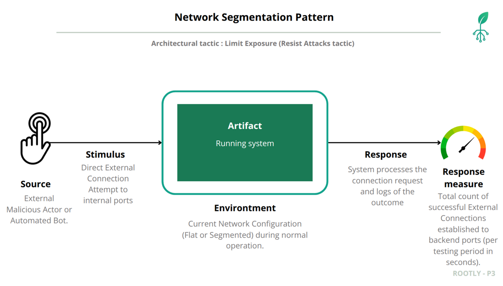

# Security Quality Attribute Scenario: Network Segmentation Pattern Implementation and Validation

## Quality Attribute Scenario

### Scenario Elements

---

Six Key Security Concepts in the Scenario

| Concept | Definition | Description in Rootly's Scenario (Pre-Segmentation) |
| :--- | :--- | :--- |
| **Weakness** | A design flaw or inherent system susceptibility. | **Flat Network Architecture:** All services (Frontend, API Gateway, Database) are deployed on a single shared network segment. This lack of logical separation facilitates unauthorized discovery and lateral movement within the network, allowing an attacker who compromises one entry point to access other critical services. |
| **Vulnerability** | The specific path or condition that allows a threat to materialize or exploit a weakness. | **Direct Backend Port Exposure:** Since all services are on the same host, an attacker who discovers the host's public IP can perform a port scan and potentially discover unauthenticated ports of sensitive backend services (e.g., API Gateway on port 8080) that were not designed for direct public consumption. |
| **Threat** | The agent or motivation that executes the attack. | **External Malicious Actor/Automated Bot:** An individual or script originating from the public internet, actively probing the host's public IP to find accessible services and exploit vulnerabilities. This type of threat seeks breaches in the security perimeter. |
| **Attack** | The sequence of actions performed by the threat to exploit the vulnerability. | **Network Reconnaissance and Direct Service Access:** The attacker executes an **Nmap scan** on the host's public IP to list all open ports. Subsequently, they attempt a direct connection or unauthorized API call (e.g., using `curl`) to a backend port, completely bypassing the Frontend's security checks. |
| **Risk** | The probability that a threat exploits a weakness, causing a negative impact, considering the severity of the damage and the probability of occurrence. | **Data Leakage, Manipulation, and Service Disruption:** The primary risk is a high-impact **Data Breach** with high probability of occurrence, resulting in loss of **Confidentiality** (data exposed), **Integrity** (data modified or corrupted), and **Availability** (services saturated and unavailable). This can lead to operational shutdown of the system and cause severe reputational damage to the plant monitoring platform. |
| **Countermeasure** | The architectural or implementation action taken to mitigate the risk. | **Network Segmentation Pattern:** Implementation of a **`rootly-public-network`** and a **`rootly-private-network`**. By removing port mappings from all backend components (API Gateway, backend services, databases, message queues, and storage systems) and isolating them exclusively on the private network, the direct access vulnerability is eliminated. The attacker can only reach the Frontend, which acts as a controlled single point of entry. All backend services, including authentication backends, analytics services, data processing services, PostgreSQL databases, InfluxDB, MinIO storage, and Kafka queues, are now completely inaccessible from external networks, protected by network-level isolation. |

---

### Scenario Elements

| Element | Description |
|---------|--------|
| **Artifact**  |  Critical backend components (API Gateway, Microservices, Databases, Message Broker, Storage) |
| **Source**  | External Malicious Actor from public Internet with network scanning expertise |
| **Stimulus**  | Direct external connection attempts to internal service ports (bypassing frontend) |
| **Environment**  |  System under normal operation with current network configuration |
| **Response**  | Network infrastructure processes connection requests (grant/refuse/timeout) |
| **Response Measure**  | Total count of successful external connections to internal services |

## Countermeasure: Network Segmentation Pattern

The Network Segmentation Pattern mitigates this security scenario by implementing a defense-in-depth strategy that isolates backend services from external access through:

Public/Private Network Isolation: Creating separate rootly-public-network and rootly-private-network

Port Mapping Elimination: Removing all host port mappings from backend services

Single Entry Point: Only frontend service remains publicly accessible

Internal Network Communication: Backend services communicate exclusively via private network

This approach implements the "Limit Access" security tactic by ensuring external attackers cannot directly reach internal services, forcing all traffic through the authenticated frontend gateway.

### Comparative Security Assessment

| Metric | Pre-Segmentation | Post-Segmentation | Improvement |
|--------|------------------|-------------------|-------------|
| **Total Successful External Connections** | 5+ (Vulnerable) | 0 (Target Achieved) | 100% |
| **Exposed Attack Surfaces** | 8+ ports | 1 port (frontend only) | 87.5% reduction |
| **API Gateway Direct Access** | ✓ Connection successful | ✗ Connection refused | Blocked |
| **Backend Services Access** | ✓ Connection successful | ✗ Connection refused | Blocked |
| **Database Direct Access** | ✓ Connection possible | ✗ Connection refused | Critical vulnerability eliminated |
| **Admin Interfaces Exposure** | ✓ Accessible | ✗ Connection refused | Blocked |
| **Authentication Bypass Possible** | Yes | No | Security control enforced |

### Security Outcome

The Network Segmentation Pattern successfully transformed the system from a vulnerable flat architecture to a secured segmented architecture, achieving the primary security objective of zero successful external connections to internal services while maintaining full internal functionality.

