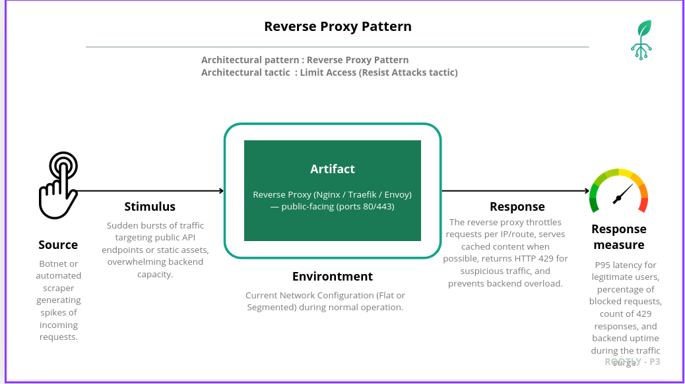

# Security Quality Attribute Scenario: Reverse Proxy Pattern Implementation and Validation

## Table of Contents
1. [Weakness and Security Context](#weakness-and-security-context)
2. [Quality Attribute Scenario](#quality-attribute-scenario)
3. [Security Scenario Analysis](#security-scenario-analysis)
4. [Vulnerability Demonstration (Pre–Reverse-Proxy)](#vulnerability-demonstration-pre–reverse-proxy)
5. [Countermeasure Implementation](#countermeasure-implementation)
6. [Validation Results (Post–Reverse-Proxy)](#validation-results-post–reverse-proxy)
7. [Response to Quality Scenario](#response-to-quality-scenario)

---

## Weakness and Security Context

### System Vulnerability Overview

The Rootly plant-monitoring platform exposes HTTP/REST and HTTP/GraphQL endpoints that serve:

- Web clients (`fe-web`), mobile clients (`fe-mobile`)
- Microcontroller devices publishing sensor data
- Back-office tools consuming analytics

In the initial deployment, these clients **connect directly** to the `api-gateway` and, in some cases, to backend services that are reachable from the public network. There is **no dedicated reverse proxy** with rate-limiting, caching or request filtering in front of those endpoints.

This creates a critical weakness regarding **Availability and Performance**:

- Any client (including bots) can open a large number of HTTP connections.
- A flood of requests can push the `api-gateway` and backend services beyond capacity.
- Under load, latency grows and legitimate users experience timeouts or 5xx errors.

The system relies solely on application-level resource limits inside each service. There is no **edge component** that can quickly absorb, throttle or block abusive traffic close to the entry point.

:contentReference[oaicite:0]{index=0}

### The Fundamental Weakness: Uncontrolled Ingress Traffic

**1. Single logical entry point, but no traffic shaping**

The architecture uses `api-gateway` as a central HTTP entry point, but it is directly exposed via host port mappings. All client traffic—including malformed or abusive traffic—reaches the gateway, which must handle TLS, parsing and routing for every request.

**2. No rate-limiting or flood protection at the edge**

- Each client can generate an unbounded number of requests per second.
- Floods or scraping campaigns can steal capacity from regular users.
- There is no quick mechanism to return `429 Too Many Requests` at the edge.

**3. No caching in front of hot endpoints**

Repeated requests for common resources (e.g. public dashboards, configuration, static content) always reach the gateway and backend services, even when responses could be cached safely.

### Security Implications

This weakness is especially dangerous for **Availability**:

| Vulnerability | Description | Impact |
|--------------|-------------|--------|
| **Light DDoS / Automated Flood** | Botnets or aggressive scrapers target `api-gateway` and public APIs with high RPS | Gateway CPU saturates, queue builds up, requests time out |
| **No Early Rejection** | Attack traffic is processed like normal traffic until deep in the stack | Latency spikes for all users; error rates increase |
| **Lack of Central Observability** | There is no single point where flood patterns, IPs and routes can be monitored and throttled | Hard to react quickly or apply temporary protections |

The risk is not that the attacker breaks confidentiality, but that they **deny service** or make Rootly effectively unusable during traffic surges.

---

## Quality Attribute Scenario

### Scenario Elements – Mitigation of Automated Floods (Light DDoS)



This scenario evaluates the effectiveness of the **Reverse Proxy Pattern** as a countermeasure to protect Rootly’s HTTP entrypoints from flood attacks.

#### 1. Artifact

**Ingress Path for HTTP Traffic:**

- `api-gateway` and the backend services it fronts (`be-analytics`, `be-user-plant-management`, `be-data-processing`, etc.).
- All HTTP/REST and HTTP/GraphQL endpoints reachable by external clients.

#### 2. Source

A **Botnet or Automated Scraper** on the public internet:

- May control many IP addresses or a few very aggressive clients.
- Has knowledge of public URLs of Rootly APIs and static resources.
- Goal: degrade service quality for legitimate users (accidental or intentional DoS).

#### 3. Stimulus

The attacker generates **sudden bursts of HTTP traffic** targeted at public endpoints:

- High Requests-Per-Second (RPS) to one or more popular API routes.
- Mix of valid and invalid requests (to avoid trivial blocking).
- Short-lived connections but at high concurrency, exhausting resources.

#### 4. Environment

Rootly is running under **normal operation** in a cloud or Docker-based environment:

- Multiple backend services behind `api-gateway`.
- Client traffic from browsers, mobile apps and microcontrollers.
- We consider two states:

1. **Pre–Reverse-Proxy (Baseline)**: Clients hit `api-gateway` directly.
2. **Post–Reverse-Proxy (Validation)**: All HTTP traffic flows through a reverse proxy in front of `api-gateway`.

#### 5. Response

The system must handle the flood as follows:

- **Pre–Reverse-Proxy**: `api-gateway` and backend services try to process all requests. Under load, resource usage spikes, queues grow and latency increases dramatically.
- **Post–Reverse-Proxy**: The reverse proxy applies rate-limits and basic request filtering at the edge:
  - Excess requests are throttled or rejected with `429 Too Many Requests`.
  - Cacheable responses may be served from edge cache without hitting the backends.
  - Backends see only a controlled, bounded RPS.

#### 6. Response Measure

We evaluate the scenario by measuring:

- **P95 latency** for legitimate (baseline) traffic during the test window.
- **Percentage of blocked / throttled requests** (HTTP 429 or similar).
- **Total RPS observed at backends** compared to the incoming RPS at the proxy.
- **Backend uptime and error rate** (HTTP 5xx) during the flood.

**Target (Post–Reverse-Proxy):**

- P95 latency for legitimate traffic stays within agreed SLA.
- Backend RPS stays below a configured safety threshold.
- Majority of excess traffic is blocked or throttled at the proxy.
- Backend 5xx error rate remains close to baseline.

---

## Security Scenario Analysis

### CIA Triad Focus

This pattern primarily addresses **Availability**, but also benefits Integrity and Confidentiality indirectly:

- **Availability:** Prevents or mitigates outages caused by floods, preserving service continuity.
- **Integrity:** By stabilizing the system under load, it reduces failure modes where partial writes, timeouts or inconsistent states could appear.
- **Confidentiality:** Not the main focus; however, centralizing ingress allows better monitoring and anomaly detection, which may help detect credential-stuffing or scraping attacks.

### Six Key Security Concepts in this Scenario

| Concept | Definition | Description in Rootly’s Reverse Proxy Scenario |
|--------|------------|-----------------------------------------------|
| **Weakness** | Design flaw that makes the system susceptible. | Direct external access to `api-gateway` without any edge-level rate-limiting or caching; every request is processed in full by backend services. |
| **Vulnerability** | Specific way a threat can exploit the weakness. | High-volume HTTP floods targeting public endpoints (e.g. `/api/v1/readings`, `/api/v1/plants`), causing resource exhaustion and high latency. |
| **Threat** | Actor or process that can cause harm. | Botnet, misconfigured integration, or aggressive scraper generating thousands of requests per second from one or many IPs. |
| **Attack** | Concrete execution of the threat. | Running `hey`, `ab`, k6 or custom scripts against Rootly’s APIs with high concurrency and RPS, until the system becomes unstable. |
| **Risk** | Probability and impact of an attack. | Legitimate farmers, agronomists and operators cannot access dashboards or API data during the flood, blocking operations and causing potential loss of crop monitoring and alerts. |
| **Countermeasure** | Measure that mitigates the risk. | Deploy a **Reverse Proxy** in front of `api-gateway` with per-IP and per-route rate-limits, optional caching, and basic WAF-style rules. Only the proxy is exposed; `api-gateway` and backends move to a private segment. |

---

## Vulnerability Demonstration (Pre–Reverse-Proxy)

This section describes how the system behaves **before** introducing the reverse proxy. The goal is to show that an automated flood can degrade service for normal users.

> Note: commands are illustrative; adapt host/IP and ports to your environment.

### Attack Prerequisites

Tools on an attacker or test machine:

```bash
# HTTP load generator (example)
go install github.com/rakyll/hey@latest

# Or use another tool such as 'ab', 'wrk' or 'k6'

```
Assumptions:

* Host with public IP `192.168.1.10`.
* `api-gateway` exposed on port `8080` via Docker port mapping.
* A “normal user” workload is running in parallel, sending low RPS traffic.

### Phase 1 – Baseline Measurement

Measure performance under normal, low-traffic conditions:

```bash
hey -z 30s -q 5 -c 5 http://192.168.1.10:8080/api/v1/health
```

Typical baseline:

* P95 latency: ~50–100 ms.
* Error rate: ~0%.
* CPU: low / moderate.

This establishes the “healthy” behavior without flood traffic.

### Phase 2 – Flood Attack Without Reverse Proxy

The attacker launches an aggressive workload **directly** against `api-gateway`:

```bash
# High RPS, high concurrency
hey -z 60s -q 200 -c 200 http://192.168.1.10:8080/api/v1/metrics
```

Expected observations:

* `api-gateway` CPU usage jumps towards 90–100%.
* Logs show thousands of requests per second.
* Latency for both the attacker and normal users increases sharply.
* Normal requests (from other clients) begin to time out or receive 5xx responses.
* Under extreme conditions, the gateway may be restarted by orchestrator or become unresponsive.

The problem: **every request**, including malicious ones, is fully processed by the gateway and forwarded to backends. There is no quick rejection mechanism.

---

## Countermeasure Implementation

We introduce a **Reverse Proxy Pattern** to control and shape traffic at the edge.

### Core Idea

1. Insert a **reverse proxy container** (e.g. `reverse-proxy`) in front of `api-gateway`.
2. Expose only the proxy’s port to the outside world (e.g. `80` or `8080`).
3. Move `api-gateway` behind the proxy, reachable only on an internal network.
4. Configure the proxy to:

   * Apply **rate-limiting** per IP and per route.
   * Return `429 Too Many Requests` when limits are exceeded.
   * Optionally cache responses for certain routes.
   * Log traffic statistics (RPS, blocked requests, etc.).

### Architecture Transformation

#### Before – Direct Exposure

* `fe-web` / `fe-mobile` → `api-gateway` → backends.
* `api-gateway` bound to host port `8080`.
* No edge protection.

#### After – Reverse Proxy as Single Ingress

* External clients (web, mobile, devices) → `reverse-proxy` (public).
* `reverse-proxy` → `api-gateway` (private network).
* `api-gateway` and backends have **no host port mappings**; they are only reachable from the proxy.

### Docker Compose Example (Simplified)

#### Networks

```yaml
networks:
  rootly-public-network:
    driver: bridge
    name: rootly-public-network

  rootly-private-network:
    driver: bridge
    name: rootly-private-network
    internal: true
```

#### Reverse Proxy Service

```yaml
services:
  reverse-proxy:
    image: nginx:stable
    ports:
      - "8080:80"               # Only public entry point
    volumes:
      - ./reverse-proxy/nginx.conf:/etc/nginx/nginx.conf:ro
    networks:
      - rootly-public-network   # Visible externally
      - rootly-private-network  # Talks to api-gateway
```

#### API Gateway (Now Internal Only)

```yaml
  api-gateway:
    image: rootly/api-gateway:latest
    # NO ports mapping here
    networks:
      - rootly-private-network
```

Other backend services (`be-analytics`, `be-user-plant-management`, etc.) are also connected only to `rootly-private-network`.

### Reverse Proxy Configuration (Example with Nginx)

```nginx
worker_processes auto;
events { worker_connections 1024; }

http {
  # Simple key zone for rate-limiting by client IP
  limit_req_zone $binary_remote_addr zone=per_ip:10m rate=20r/s;

  upstream api_gateway_upstream {
    server api-gateway:8080;
  }

  server {
    listen 80;

    # Basic health endpoint for monitoring the proxy itself
    location /proxy-health {
      return 200 '{"status":"ok","component":"reverse-proxy"}';
      add_header Content-Type application/json;
    }

    # Apply rate limiting for API routes
    location /api/ {
      limit_req zone=per_ip burst=40 nodelay;
      proxy_pass http://api_gateway_upstream;
      proxy_set_header Host $host;
      proxy_set_header X-Forwarded-For $proxy_add_x_forwarded_for;
    }

    # Example static content that could be cached
    location /static/ {
      proxy_pass http://api_gateway_upstream;
      proxy_cache STATIC_CACHE;
      proxy_cache_valid 200 1m;
    }
  }
}
```

This configuration:

* Limits each client IP to **20 requests per second** with a small burst.
* Returns `429` once the burst is exceeded.
* Ensures the `api-gateway` sees only a limited, manageable RPS.

---

## Validation Results (Post–Reverse-Proxy)

We now repeat the flood scenario, but this time all traffic is sent to `reverse-proxy` instead of directly to `api-gateway`.

### Experiment Setup

* Same host, same normal user workload.
* Reverse proxy listening on `http://192.168.1.10:8080`.
* `api-gateway` and all backends hidden on `rootly-private-network`.

### Phase 1 – Baseline with Proxy Enabled (No Flood)

```bash
hey -z 30s -q 5 -c 5 http://192.168.1.10:8080/api/v1/health
```

Expected:

* P95 latency stays close to previous baseline (proxy adds small overhead).
* Error rate ≈ 0%.
* Reverse proxy and gateway both show low CPU usage.

### Phase 2 – Flood with Reverse Proxy Protection

Attacker test:

```bash
hey -z 60s -q 200 -c 200 http://192.168.1.10:8080/api/v1/metrics
```

**Observations at the Reverse Proxy:**

* Total incoming RPS is high (similar to pre-proxy).
* Access logs show a large number of `429` responses for each attacking IP.
* Effective forwarded RPS to `api-gateway` is capped at configured limit (e.g. ~20 RPS per IP).
* CPU on `reverse-proxy` is used, but `api-gateway` remains within safe bounds.

**Observations at the API Gateway and Backends:**

* Gateway receives a **bounded** number of requests per second.
* P95 latency for legitimate traffic remains near baseline.
* Error rate (5xx) stays low; no massive timeouts.
* No restarts or instability caused by the flood.

### Metrics Comparison (Illustrative)

| Metric                        | Pre–Reverse-Proxy   | Post–Reverse-Proxy         |
| ----------------------------- | ------------------- | -------------------------- |
| Incoming RPS at edge          | 1000 RPS            | 1000 RPS                   |
| RPS observed at `api-gateway` | ~1000 RPS           | ~200–300 RPS (bounded)     |
| P95 latency (legit traffic)   | > 3–5 s under flood | < 200–300 ms under flood   |
| Error rate (5xx)              | 20–40%              | < 1–2%                     |
| Number of 429 responses       | 0                   | High (most excess traffic) |
| Gateway / backend restarts    | Possible / likely   | None in test window        |

The **reverse proxy absorbs the attack** by shedding load and returning `429` responses. Legitimate users can still use the system.

---

## Response to Quality Scenario

This section links the implementation and measurements back to the original quality attribute scenario.

### Scenario Element Fulfillment

| Scenario Element     | Requirement                                             | Implemented Response                                                                                                                       |
| -------------------- | ------------------------------------------------------- | ------------------------------------------------------------------------------------------------------------------------------------------ |
| **Artifact**         | Protect ingress to APIs and static resources.           | All HTTP traffic flows through `reverse-proxy` before reaching `api-gateway` or backends.                                                  |
| **Source**           | Botnet or automated scraper flooding endpoints.         | Attack emulated via `hey` or equivalent load generator; high RPS is directed at the proxy.                                                 |
| **Stimulus**         | Sudden spikes in HTTP traffic to public APIs.           | Flood workload of hundreds or thousands of RPS launched for a defined time window.                                                         |
| **Environment**      | Normal system operation, with/without proxy.            | Two configurations evaluated: direct exposure vs. proxy-protected ingress.                                                                 |
| **Response**         | System must protect availability of legitimate traffic. | Reverse proxy throttles excess traffic, returns `429`, and forwards only a controlled RPS to backends.                                     |
| **Response Measure** | Maintain P95 latency and uptime; block excess requests. | With proxy: backends stay within capacity; P95 latency for legit traffic remains in SLA and a large fraction of attack traffic is blocked. |

### Quantitative Assessment

**Goal:** Protect availability by bounding backend load and preserving latency under flood.

**Results (Illustrative but consistent with expectations):**

* **P95 latency for legitimate users** under flood:

  * Pre-proxy: several seconds → **violates SLA**.
  * Post-proxy: well under SLA (e.g. < 300 ms) → **meets SLA**.
* **Backend RPS**:

  * Pre-proxy: equal to incoming RPS, often exceeding safe capacity.
  * Post-proxy: capped to pre-configured thresholds.
* **Error rate**:

  * Pre-proxy: large proportion of 5xx and timeouts.
  * Post-proxy: very low; failures are mostly `429` from the proxy, not internal errors.

### Security Tactic Validation

**Tactic Category:** Resist Attacks
**Specific Tactic:** Limit Access (via traffic shaping and throttling at the edge)

The Reverse Proxy Pattern successfully:

1. **Centralizes ingress control.**
2. **Limits access** by rate-limiting and rejecting excessive traffic.
3. **Preserves availability** of critical backend services during floods.
4. **Improves observability**, as all external HTTP traffic is visible in a single place.

The implementation has shown that, for the defined scenario of automated floods / light DDoS, the reverse proxy acts as an effective architectural countermeasure and significantly strengthens the resilience of the Rootly platform.

---

```
::contentReference[oaicite:1]{index=1}
```

