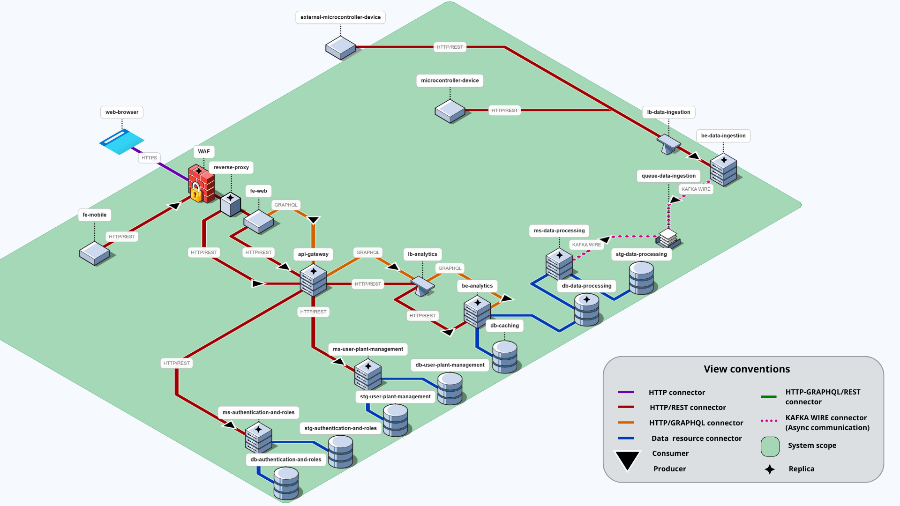
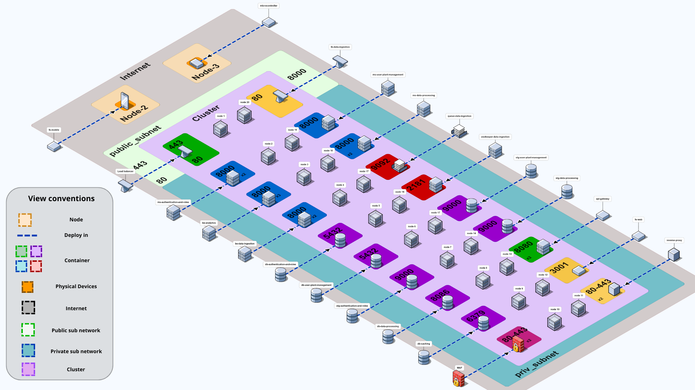
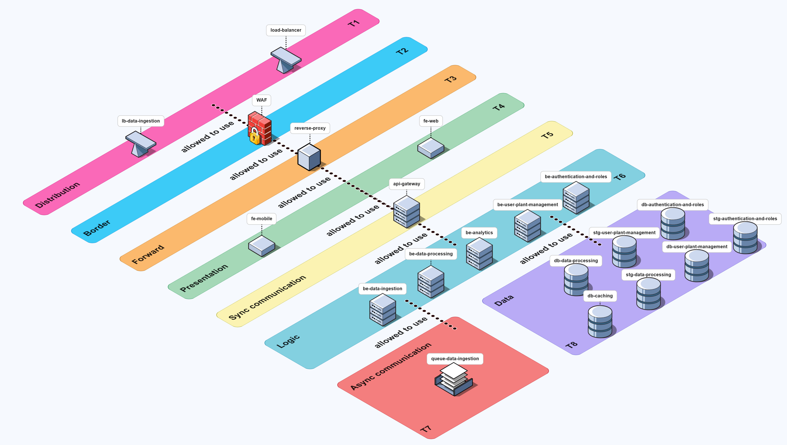
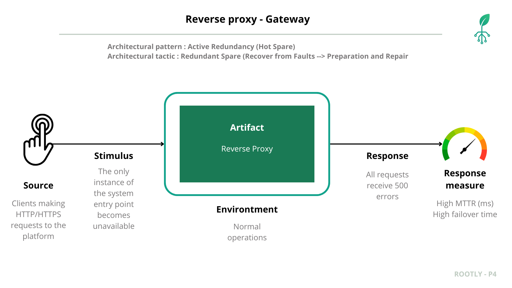
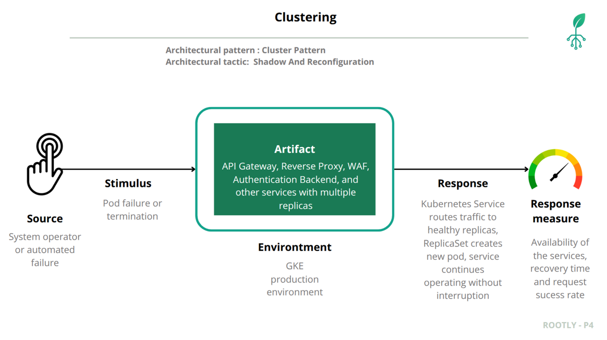
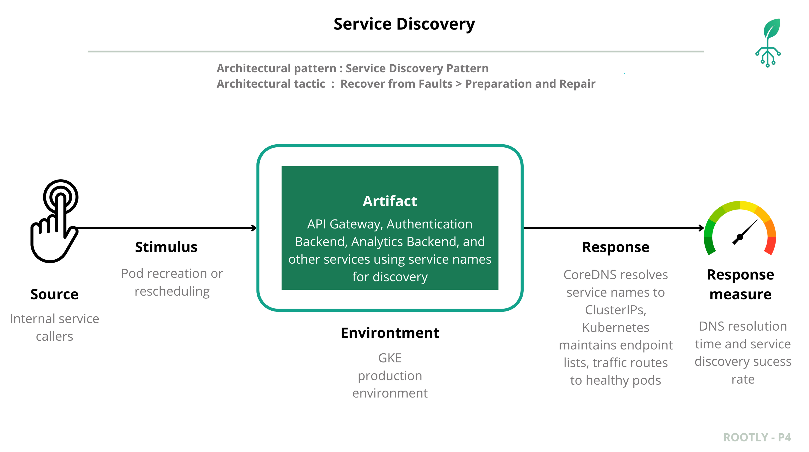
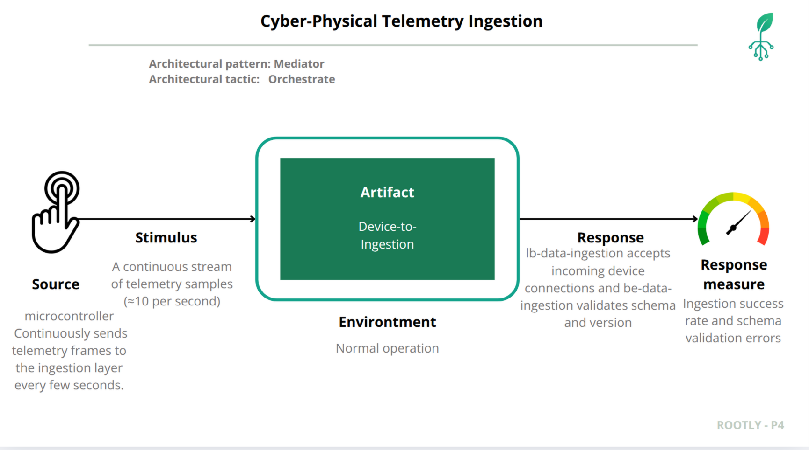

# Rootly 
## Prototype 4 - Quality Attributes, Part 2

## Team 2F
- Carlos Santiago Sandoval Casallas
- Cristian Santiago Tovar Bejarano
- Danny Marcelo Yaluzan Acosta
- Esteban Rodriguez Muñoz
- Santiago Restrepo Rojas
- Gabriela Guzmán Rivera
- Gabriela Gallegos Rubio
- Andrés Camilo Orduz Lunar

## Table of Contents

- [Software System](#software-system)
- [Architectural Structures](#architectural-structures)
  - [Components and Connector Structure](#components-and-connector-view)
  - [Deployment Structure](#deployment-view)
  - [Layered Structure](#layered-view)
  - [Decomposition Structure](#decomposition-view)
- [Quality Attributes](#quality-attributes)
  - [Security](#security)
    - [Network Segmentation](#network-segmentation)
    - [Secure Channel](#secure-channel)
    - [Reverse Proxy](#reverse-proxy)
    - [Web Application Firewall](#web-application-firewall)
  - [Performance and Scalability](#performance-and-scalability)
    - [Load Balancer](#load-balancer)
    - [Caching](#caching)
  - [Reliability](#reliability)
    - [Replication pattern Reverse Proxy](#replication-pattern-reverse-proxy)
    - [Cluster pattern](#cluster-pattern)
    - [Replication pattern for Analytics Data Sources](#replication-pattern-for-analytics-data-source)
    - [Service Discovery](#service-discovery)
  - [Interoperability](#interoperability)
  
- [Prototype – Deployment Instructions](#deployment-instructions)


## Software System
- **Name:** Rootly  
- **Logo:**  


**Description:**
  
**ROOTLY** is an agricultural monitoring system designed to support significant decision-making in the agricultural environment. It leverages a microservices-based architecture to integrate field devices, process data, and deliver real-time analytics to users through a web and mobile application.

The system operates by capturing environmental and soil data—such as humidity and temperature—directly from the field using microcontroller devices. This information is then sent to a central platform where it is processed, validated, and analyzed. The platform's architecture combines robust databases for storing both transactional information (like user profiles and configurations) and large volumes of time-series sensor data.

Finally, users can access all this information through an intuitive interface, available on both web and mobile. They can view real-time metrics, explore historical data, manage their crops, and receive analytical insights to optimize their agricultural practices.

---
## Components and Connector Structure
### Components and Connector view


### External Components (Out of System Scope)

- **Web Browser**
  - Type: External client
  - Responsibility: User interface for web applications
  - Protocols: **HTTPS**
  - Relations: Consumes `fe-web` via HTTPS

- **External Microcontroller Device**
  - Type: External IoT/embedded device
  - Responsibility: Collects and sends sensor and plant data
  - Protocols: **HTTP/REST**
  - Relations: Consumes `lb-data-ingestion` via HTTP/REST

### Internal Components 

- **Microcontroller Device**
  - Type: External IoT/embedded device
  - Responsibility: Collects and sends sensor and plant data
  - Protocols: **HTTP/REST**
  - Relations: Consumes `lb-data-ingestion` via HTTP/REST

- **Load Balancer**
  - Type: Load Balancer
  - Responsibility:
    - Manages multiple **WAF** instances to avoid bottlenecks.
    - Distributes incoming traffic from clients (web and mobile) across WAF instances.
  - Protocols: **HTTPS**
  - Relationships:
    - Receives traffic from `web-browser` and `fe-mobile`.
    - Sends requests to `WAF` instances.

- **WAF**
  - Type: Security Firewall / Edge Service
  - Responsibility: Protects web applications from common attacks while running.
  - Protocols: **HTTPS**
  - Relations:
    - Receives requests from `load balancer`.
    - Forwards validated traffic to `reverse proxy`

- **Reverse Proxy**
  - Type: Network Routing Component
  - Responsibility: Routes traffic to internal services, handles URL mapping and request forwarding.
  - Protocols: **HTTP**
  - Relations:
    - Receives sanitized traffic from WAF.
    - Routes requests to api-gateway and fe-web.

- **lb-data-ingestion**
  - Type: Load Balancer
  - Responsibility: Distributes incoming data ingestion requests from microcontroller devices across multiple instances of the `be-data-ingestion` service.
  - Protocols: **HTTP/REST**
  - Relations:
    - Receives data from `microcontroller-device` and `external-microcontroller-device`.
    - Routes traffic to `be-data-ingestion`.

- **Frontend Mobile (fe-mobile)**
  - Type: Mobile client application
  - Responsibility: Provides a mobile-optimized interface consuming backend APIs directly via REST.
  - Protocols: **HTTP/REST**
  - Relations: Consumes the chain `load balancer` → `WAF` → `reverse-proxy`.

- **fe-web**
  - Type: Web client application
  - Responsibility: Provides the user interface for the web platform; handles presentation logic, user interactions, and requests to backend services.
  - Role in connections: Consumer
  - Relations:
    - Serves the "web-browser" (HTTPS).
    - Consumes `reverse-proxy` (HTTPS).

- **api-gateway**
  - Type: Gateway / API Orchestrator
  - Responsibility: Central entry point for all clients. Routes, aggregates, and authenticates API requests to backend microservices.
  - Protocols: **HTTP/GraphQL/REST**
  - Relations:
    - Receives requests from the `reverse-proxy`.
    - Consumes services from backend modules ( `ms-user-plant-management`, `ms-authentication-and-roles`, etc.).

- **ms-authentication-and-roles**
  - Type: Backend Microservice
  - Responsibility: Authentication and authorization service.
  - Relations:
    - Serves the `api-gateway` (HTTP/REST).
    - Connects to `db-authentication-and-roles` (data resource protocol).
    - Connects to `stg-authentication-and-roles` (data resource protocol).

- **ms-user-plant-management**
  - Type: Backend Microservice
  - Responsibility: Plant and user management service.
  - Relations:
    - Serves the `api-gateway` (HTTP/REST).
    - Connects to `db-user-plant-management` (data resource protocol).
    - Connects to `stg-user-plant-management` (data resource protocol).

- **be-analytics**
  - Type: Backend service
  - Responsibility: Analytics and reporting service.
  - Protocols: **HTTP/GraphQL** for flexible queries.
  - Relations:
    - Consumes `db-caching` (data resource protocol).
    - Consumes `db-data-processing` (data resource protocol).

- **be-data-ingestion**
  - Type: Backend service
  - Responsibility: Receives and ingests sensor data from devices, validating and forwarding to the processing pipeline.
  - Relations:
    - Served by `lb-data-ingestion`.
    - Produces asynchronous messages to `queue-data-ingestion` (Kafka WIRE).

- **ms-data-processing**
  - Type: Backend Microservice
  - Responsibility: Transforms, aggregates, and stores data received from ingestion queues.
  - Relations:
    - Consumes data from `queue-data-ingestion` (Kafka WIRE).
    - Connects to `db-caching` (data resource protocol).
    - Produces processed results stored in `stg-data-processing` (data resource protocol).
    - Produces processed results stored in `db-data-processing` (data resource protocol).

### Internal Components (Data & Asynchronous)

- **queue-data-ingestion**
  - Type: Message Broker (Kafka)
  - Responsibility: Asynchronous event queue for decoupling ingestion and processing services.
  - Protocols: **Kafka WIRE**.
  - Relations:
    - Producer: `be-data-ingestion`.
    - Consumer: `ms-data-processing`.

- **db-caching**
  - Type: Caching Database
  - Responsibility: High-speed, volatile storage for frequently accessed data to improve read performance.
  - Protocols: **data resource protocol**
  - Relations:
    - Consumed by `be-analytics`.

- **Databases (DB)**
  - Protocols: **data resource protocol**
  - `db-authentication-and-roles`: Transactional storage for users and permissions. Consumed by `ms-authentication-and-roles`.
  - `db-user-plant-management`: Transactional storage for plants and relationships. Consumed by `ms-user-plant-management`.
  - `db-data-processing`: Storage for processed and analytical data. Consumed by `be-analytics` and `ms-data-processing`.

- **Storage (STG)**
  - Protocols: **data resource protocol**
  - `stg-authentication-and-roles`: Reference data for authentication. Consumed by `ms-authentication-and-roles`.
  - `stg-user-plant-management`: Master data and plant configurations. Consumed by `ms-user-plant-management`.
  - `stg-data-processing`: Temporary or raw storage for device data. Consumed by `ms-data-processing`.

### Architectural Styles
1. **Client–Server**  
   The browser (client) requests resources from the frontend (server) via HTTP. This ensures separation between presentation and business logic.  

2. **Microservices Architecture**  
   The backend is decomposed into a set of fine-grained, independently deployable services. Each service is responsible for a specific business capability (e.g., authentication, user management, analytics). This approach promotes scalability, resilience, and technological flexibility, as each service is developed, deployed, and scaled independently. Communication between services is handled via well-defined APIs (REST/GraphQL) and asynchronous messaging (Kafka).

### Architectural Patterns

1.  **API Gateway Pattern**
    This pattern provides a single, unified entry point for all client requests. The `api-gateway` component acts as a reverse proxy, routing requests from the frontend clients to the appropriate backend microservice. This simplifies the client application, offloads responsibilities like authentication and SSL termination, and provides an additional layer of security.

2.  **Broker Pattern**
    This pattern decouples producers and consumers through a message broker that handles routing, delivery guarantees, retries, and dead-letter queues. It enables asynchronous communication, smooths traffic spikes with backpressure, and allows services to evolve independently without tight coupling.
In Rootly, Kafka acts as the broker: rootly-data-ingestion publishes sensor events to the queue, and rootly-data-processing consumes them for validation, transformation, and storage. The queue between these services (Kafka topics under the “queue-data-ingestion” namespace) provides at-least-once delivery and horizontal scalability.

2.  **Tiers Architecture**
    The level architecture improves communication between components by separating responsibilities into tiers (physical) and layers (logical). It also has a hierarchy, since the upper layers depend on the lower ones.The levels establish clear boundaries and responsibilities for components to collaborate with each other, facilitating communication between components. The logical layers represent the internal structure of the components and internal dependencies.
The result is predictable interactions, easier evolution, and independent scaling of responsibilities.

### Architectural Elements & Relations  

#### **External Clients & Edge Services**

- **Web Browser**
  - External actor that runs the frontend (SSR in React).
  - Consumes APIs via the security and network layers.
  - **Relation:** Connects to **WAF**.

- **Mobile App (fe-mobile)**
  - Native mobile application for on-the-go monitoring and management.
  - **Relation:** Connects to **WAF**.

- **Load Balancer**
  - Balances incoming client traffic across WAF instances.

- **WAF (Web Application Firewall)**
  - First security boundary protecting the system from common web exploits (SQLi, XSS, CSRF).
  - Filters, blocks, and sanitizes inbound HTTP traffic.
  - **Relation:** Forwards validated traffic to the **Reverse Proxy**.

- **Reverse Proxy**
  - Performs SSL termination, request buffering, compression, routing to frontend or backend load balancers.
  - Hides the internal network topology.
  - **Relation:** Forwards requests to **lb-frontend** and **api-gateway**, depending on routing rules.


#### **Frontend Services**

- **Frontend Web (fe-web)**
  - User interface built with React + TypeScript; displays dashboards, device states, and analytics.
  - **Relation:** Consumes services via the **WAF → reverse proxy → API Gateway** path.

#### **Gateway & Core Logic Services**

- **API Gateway (api-gateway)**
  - Central entry point for all external clients (web and mobile). Handles **authentication**, **rate limiting**, **request routing**, and **aggregation**.
  - **Relation:** Receives traffic from **WAF** and routes requests to **ms-authentication-and-roles**, **ms-user-plant-management**.

- **Authentication and Roles (ms-authentication-and-roles)**
  - Handles user authentication, role-based access control, and JWT token validation.
  - **Relation:** Connects to **db-authentication-and-roles** and **stg-authentication-and-roles**.

- **User and Plant Management (ms-user-plant-management)**
  - Manages user profiles, plant configurations, and device associations.
  - **Relation:** Accesses **db-user-plant-management** and **stg-user-plant-management**; requests routed via **API Gateway**.

- **Analytics (be-analytics)**
  - Performs computation of key metrics, aggregates processed data, and provides dashboards.
  - **Relation: Consumes **db-caching** and **db-data-processing** for faster query response.

- **Load Balancer - Data Ingestion (lb-data-ingestion)**
  - Distributes high-volume IoT data streams across **be-data-ingestion** instances.
  - **Relation:** Receives data from **microcontroller-device**; forwards to **be-data-ingestion**.

- **Data Ingestion (be-data-ingestion)**
  - Receives and validates raw IoT sensor data; transforms payloads and publishes them to **queue-data-ingestion**.
  - **Relation:** Served by **lb-data-ingestion**; produces messages for asynchronous processing.

- **Data Processing (ms-data-processing)**
  - Consumes messages from the queue, performs data transformation, aggregation, and persistence.
  - **Relation:** Consumes **queue-data-ingestion**; interacts with **db-caching**, **stg-data-processing**, and **db-data-processing**.

## Components description

| **Component / Service** | **Responsibilities** | **Boundaries** | **Interfaces** |
|---|---|---|---|
| **WAF (Web Application Firewall)** | Identify malicious traffic, sanitizes requests, protects surface endpoints. | First layer of protection | Intercepts HTTP/S; forwards accepted traffic to Reverse Proxy. |
| **Reverse Proxy** | SSL termination, routing, compression, request forwarding to load balancers and API gateway. | Sits between the WAF and fe-web and apigateway. | HTTP routing to fe-web, api-gateway. |
| **Load Balancer** | Receives incoming traffic from web browsers, mobile clients, and IoT devices, distributing requests across the available WAF entry points. Ensures high availability of the system’s external access point. | Serves as the logical boundary between external clients (including IoT devices) and the system’s security perimeter. Forwards all traffic exclusively to the WAF. | Accepts client connections via **HTTPS** and forwards validated traffic using **HTTP/REST** toward the WAF. |
| **Frontend** | Provides the main user interface for real-time visualization of sensor data, dashboards, and management of plants and devices. | Executed as a SSR in the user’s browser; depends on the `api-gateway`. | Communicates with the `api-gateway` using REST/GraphQL and HTTP/REST . |
| **api-gateway** | Central entry point for all client interactions. Routes, aggregates, and authenticates API requests to backend microservices. | Coordinates backend communication; does not contain domain logic. | REST/GraphQL and HTTP/REST |
| **ms-authentication-and-roles** | Handles user authentication and authorization, managing JWT tokens, sessions, and role-based access control (RBAC). | Operates independently with its own database; does not directly interact with sensor or plant data. | HTTP/REST for authentication and role management. |
| **ms-user-plant-management** | Manages user–plant–device relationships, device registration, and plant configurations. | Specialized in domain entities (plants, devices); consumes user info from the authentication service. |HTTP/REST CRUD operations on plants and devices. |
| **be-analytics** | Processes and analyzes historical sensor data, providing performance metrics, trend analyses, and reports. | Has read-only access to processed data; operates without modifying primary datasets. | REST/GraphQL and HTTP/REST for analytics and reports. |
| **be-data-ingestion** | Receives sensor data from IoT microcontrollers, validates input, and forwards it to the data processing pipeline. | Dedicated entry point for IoT device communication; ensures integrity and structure of incoming data. | HTTP endpoints for ingestion; interacts with Kafka for event publishing. |
| **ms-data-processing** | Aggregates, transforms, and stores data from ingestion streams into the analytical databases. | Consumes messages from Kafka and persists structured data. | Kafka consumer KAFKA WIRE protocol; data source connector for service-to-service data delivery. |
| **Microcontroller** | Collect environmental sensor data (e.g., temperature, humidity, soil metrics) and send it periodically to the backend. | Operate at the network edge; limited resources; communicate only with the ingestion endpoint. | HTTP requests or MQTT to the ingestion service. |
| **queue-data-ingestion** | Kafka message broker enabling asynchronous communication between ingestion and processing services. | Shared middleware for decoupled data flow; ensures reliable message delivery. | Kafka topics and consumer APIs. |
| **db-authentication-and-roles** | PostgreSQL database storing user credentials, roles, and session tokens. | Private data store for authentication service. | SQL queries via ORM;  data source connector |
| **db-user-plant-management** | PostgreSQL database managing associations between users, plants, and devices. | Dedicated data store for plant and device domain logic. | SQL/ORM access; data source connector |
| **db-data-processing** | InfluxDB database storing time-series agricultural data and computed metrics. | Optimized for analytical queries and visualization. | InfluxQL/Flux queries;  data source connector|
| **db-caching** | Redis in-memory database for caching user sessions, authentication tokens, and frequently accessed queries. | Shared fast-access layer to reduce latency across backend services. | Redis key-value operations via SDK - data source connector. |
| **stg-authentication-and-roles** | MinIO storage for user profile photos and access logs. | Attached to authentication service; persistent object storage. | S3-compatible API -  data source connector. |
| **stg-data-processing** | MinIO storage for analytical data files, backups, and unstructured content. | Used by analytics and processing services. | S3-compatible API -  data source connector. |
| **stg-user-plant-management** | MinIO storage for plant images and related documents. | Attached to user-plant management domain. | S3-compatible API -  data source connector. |
---


## Deployment Structure
### Deployment view



### Description of Architectural Elements and Relations

The system is deployed on **Google Cloud Platform (GCP)** using a combination of **Google Kubernetes Engine (GKE)**, **Compute Engine VMs**, **Cloud Storage buckets**, **Cloud NAT**, and **GCP Load Balancers**. The architecture leverages **containerization** and **clustering** patterns to ensure high availability, scalability, and resilience.

Based on the deployment view, the system's elements are allocated as follows:

*   **Software Elements:** All services are deployed as containerized applications within a **GKE cluster**, organized into public and private network segments. This includes:
    
    *   **GCP Load Balancer (Entry Point):** The **GCP Load Balancer** serves as the primary entry point for all web and mobile client traffic. It distributes incoming requests across multiple **WAF** instances to ensure high availability and prevent bottlenecks. This is the first point of contact for external traffic entering the system.
    
    *   **WAF (Web Application Firewall):** Multiple **WAF** instances are deployed in a clustered configuration, receiving traffic from the GCP Load Balancer. Each WAF instance provides deep packet inspection, SQL injection prevention, and DDoS mitigation. The load balancer ensures traffic is distributed evenly across all healthy WAF instances.
    
    *   **Reverse Proxy:** The `reverse-proxy` receives validated traffic from the WAF instances and performs SSL termination, request routing, and compression. It routes requests to frontend services and the API Gateway.
    
    *   **Client Applications:** The `fe-web` (Next.js/TypeScript) provides server-side rendering for web clients, deployed in the public subnet within the GKE cluster.
    
    *   **API Gateway:** The `api-gateway` (Go) acts as the central orchestration layer, implementing authentication (JWT), rate limiting, and routing to backend microservices. Multiple instances are deployed using clustering for high availability.
    
    *   **Backend Microservices:** Deployed in the private subnet with dedicated persistence, all services use clustering with multiple replicas:
        *   `ms-authentication-and-roles` (FastAPI/Python): Manages authentication and RBAC, connected to `db-authentication-and-roles` (PostgreSQL) and `stg-authentication-and-roles` (Cloud Storage via MinIO proxy).
        *   `ms-user-plant-manager` (FastAPI/Python): Handles user/plant CRUD operations, connected to `db-user-plant-management` (PostgreSQL).
        *   `be-analytics` (FastAPI/Python with Pandas, multiple instances): Performs statistical analysis and aggregations, connected to `db-caching` (Redis) and `db-data-processing` (InfluxDB).
        *   `be-data-ingestion` (Go, multiple instances): Receives IoT sensor data and publishes to Kafka, load-balanced by `lb-data-ingestion`.
        *   `ms-data-processing` (Python with Kafka Consumer, multiple instances): Consumes from Kafka, transforms and validates data, writes to `stg-data-processing`and reads `db-data-processing` (InfluxDB).
    
    *   **Asynchronous Communication Services:**
        *   `queue-data-ingestion` (Apache Kafka with Zookeeper): Provides asynchronous event streaming backbone with persistent storage.

*   **Environmental Elements:**
    
    *   **Google Cloud Platform Infrastructure:**
        *   **GKE Cluster:** A managed Kubernetes cluster hosting all containerized services. The cluster spans multiple nodes across availability zones for high availability.
        *   **Public Subnet:** Contains the GCP Load Balancer and lb-data-ingestion, exposing controlled access to external clients.
        *   **Private Subnet:** Contains all backend microservices, databases, message queue, and internal load balancers, isolated from direct external access. Services communicate via Kubernetes internal networking and service discovery.
        *   **Cloud NAT:** Provides outbound internet access for private subnet resources without exposing them to the internet.
        *   **Cloud Storage Buckets:** Used for persistent storage of time-series data, logs, and backups, accessed via MinIO proxy services.
        *   **Compute Engine VMs:** Used for supporting infrastructure components and management tasks.
    
    *   **External Clients:**
        *   **Web Browsers:** External users accessing the system via HTTPS through the GCP Load Balancer.
        *   **Mobile App (fe-mobile):** Mobile devices (smartphone/tablet running iOS/Android) executing the `fe-mobile` application (React Native), which communicates with the system via HTTPS through the GCP Load Balancer.
        *   **IoT Devices (Microcontrollers):** Physical microcontrollers (ESP32-based), equipped with environmental sensors (temperature, humidity, soil moisture, light, pH), transmitting telemetry data in JSON format over HTTPS to the Data Ingestion Load Balancer.

*   **Relations (Network Communication):**
    
    *   **External Communication (User Traffic):**
        *   Web browsers → **GCP Load Balancer** → **WAF instances** (distributed) → `reverse-proxy` → `fe-web` or `api-gateway` → Backend microservices
        *   `fe-mobile` → **GCP Load Balancer** → **WAF instances** (distributed) → `reverse-proxy` → `api-gateway` → Backend microservices
        *   The GCP Load Balancer is the primary entry point, distributing traffic across multiple WAF instances for high availability and load distribution.
    
    *   **External Communication (IoT Traffic):**
        *   `microcontroller` → **GCP Load Balancer (Data Ingestion)** → `lb-data-ingestion` → `be-data-ingestion` (multiple instances) → `queue-data-ingestion`
        *   IoT traffic uses a separate GCP Load Balancer dedicated to data ingestion, providing a second entry point to the system optimized for high-throughput sensor data streams.
    
    *   **Internal Communication (GKE Cluster):**
        *   All services within the GKE cluster communicate via Kubernetes internal networking using ClusterIP services and DNS-based service discovery.
        *   `api-gateway` routes requests to backend services based on endpoint mappings:
            *   Authentication endpoints → `ms-authentication-and-roles` (clustered)
            *   User/plant management → `ms-user-plant-manager` (clustered)
        *   Backend services connect to their dedicated databases and storage layers using Kubernetes service names for DNS resolution.
        *   Internal load balancer (`lb-data-ingestion`) distribute traffic across multiple service instances with automatic health checks and failover.
        *   Kubernetes automatically provides load balancing for all service-to-service communication.
    
    *   **Asynchronous Data Flow:**
        *   `be-data-ingestion` → `queue-data-ingestion` (Kafka) → `ms-data-processing` → `db-data-processing` → `db-caching`
        *   Kafka provides temporal decoupling, message persistence, and replay capabilities for high-throughput sensor data streams.
    
    *   **Storage and Persistence:**
        *   Databases (PostgreSQL, InfluxDB) are deployed as stateful services within the GKE cluster with persistent volumes.
        *   Object storage is provided via Cloud Storage buckets, accessed through MinIO proxy services running in the cluster.
        *   All data is backed up to Cloud Storage buckets for disaster recovery.

### Description of Architectural Patterns Used

The deployment structure reveals several key architectural patterns:

*   **Clustering Pattern:** All critical services are deployed with multiple replicas in an Active/Active cluster configuration. This includes WAF instances, reverse proxy, API Gateway, and all backend microservices. Kubernetes ReplicaSets ensure the desired number of replicas are maintained, providing high availability and automatic failover. When a pod fails, Kubernetes automatically creates a new instance and routes traffic to healthy replicas.

*   **Service Discovery Pattern:** Kubernetes provides built-in DNS-based service discovery. Services locate each other using stable DNS names (e.g., `api-gateway.rootly-platform.svc.cluster.local`) rather than hardcoded IP addresses. When pods are recreated with new IPs, the service endpoints are automatically updated, and DNS resolution ensures seamless connectivity.

*   **Event-Driven (Message Broker):** The `queue-data-ingestion` (Kafka) decouples the data ingestion and processing pipelines. This allows the system to handle high volumes of sensor data asynchronously and reliably, enabling temporal decoupling and independent scaling of producers and consumers.

*   **Containerization:** Every software component is deployed as a containerized application within the GKE cluster. This standardizes the deployment, simplifies dependency management, and ensures consistency across environments. Kubernetes manages container lifecycle, resource allocation, and networking.

*   **Load Balancing:** GCP Load Balancers provide external traffic distribution at the cloud infrastructure level, while Kubernetes Services provide internal load balancing for service-to-service communication. This multi-tier load balancing ensures optimal traffic distribution and high availability.

---

## Layered Structure
  
### Layered view



- **Layered view  - Layers** The structure of the logic layer is shown below to avoid redundancy in the main view.

### **Border Element**

- **Component:** Web Application Firewall (WAF)
- **Responsibility:** It protects the system's entry point by filtering and inspecting incoming HTTP traffic.
- **Capabilities:**  IP reputation filtering, rate limiting, DoS mitigation.
- **Communication flow:** Directs validated requests exclusively to Tier 1 (Forward).
- **Communication style:** HTTP/HTTPS

### **Layer Specifications**

#### **T1 – Distribution Layer**
- **Responsibility:** Handles initial distribution of external traffic coming from web clients and IoT devices. Directs web/mobile traffic toward the WAF and routes IoT ingestion traffic toward the ingestion backend entry point.
- **Components:** `load-balancer`, `lb-data-ingestion`
- **Constraint:** The load balancer receives all external traffic, but only web/mobile traffic is forwarded to the WAF. IoT ingestion traffic is routed directly to `be-data-ingestion` through `lb-data-ingestion`.
- **Communication style:** HTTP/REST, HTTPS

#### **T2 – Border Layer**
- **Responsibility:** Defines the external boundary of the system and receives validated requests directed by the WAF.
- **Component:** `WAF`
- **Behavior:** Passes approved traffic strictly toward the Forward layer.
The WAF is a border/observer element conceptually external to the tier hierarchy, but it is included in this view to clarify its responsibilities and role within the overall architectural flow.

#### **Tier 3 – Forward Layer**
- **Responsibility:** managing request routing (traffic control) and hiding the internal architecture to improve security.
- **Components:** `reverse proxy`
- **Communication style:** Synchronous HTTP/REST
- **Constraint:** Cannot access deeper tiers directly.

#### **Tier 4 – Presentation Layer**
- **Responsibility:** Provides user interfaces and manages client-side logic.
- **Components:** `fe-web`, `fe-mobile`
- **Communication style:** Synchronous HTTP/REST
- **Constraint:** Cannot access deeper tiers directly.

#### **Tier 5 – Synchronous Communication Layer**
- **Responsibility:** Manages synchronous request routing and API orchestration.
- **Components:** `api-gateway`
- **Capabilities:** Request aggregation, throttling, authentication, and routing.
- **Communication style:** Synchronous HTTP/gRPC

#### **Tier 6 – Logic Layer**
- **Responsibility:** Implements the system’s business logic and processing workflows.
- **Components:**
  - `be-authentication-and-roles`
  - `be-user-plant-management`
  - `be-analytics`
  - `be-data-ingestion`
  - `be-data-processing`
- **Capabilities:** Core computation, orchestration, and validation.
- **Communication style:** HTTP and message-based (Kafka, queues).

#### **Tier 7 – Asynchronous Communication Layer**
- **Responsibility:** Handles event-driven communication and background processing.
  - `be-data-ingestion` (producer)
  - `be-data-processing` (consumer)
- **Components:**
 - `queue-data-ingestion`
- **Capabilities:** Asynchronous data ingestion, queue management, and event propagation.
- **Communication style:** Kafka/Event Streaming

#### **Tier 8 – Data Layer**
- **Responsibility:** Manages data persistence and storage across all domains.
- **Datastores:**
  - `db-authentication-and-roles`, `stg-authentication-and-roles`
  - `db-user-plant-management`, `stg-user-plant-management`
  - `db-data-processing`, `stg-data-processing`
  - `db-caching`
- **Capabilities:** Data durability, query optimization, and caching for improved performance.

**Logic Layer Structure (Internal)**
The diagram below illustrates the internal architecture of each microservice within the Logic Layer. To maintain a clear separation of concerns and promote modularity, each service adopts a 4-layer architecture.


1. **Layered Architecture**
   Each microservice is internally structured into four distinct layers. This pattern ensures that responsibilities are clearly segregated, making the service easier to develop, test, and maintain. The dependencies flow in one direction, from the outer layers to the inner layers.
    -   **Layer 1: Adapters:** This outermost layer is responsible for protocol-specific communication. It adapts incoming requests (e.g., from Kafka consumers or other services) and translates them into a format that the application's core understands.
    -   **Layer 2: Controllers:** This layer acts as the entry point for API requests (e.g., HTTP REST/GraphQL). It handles request validation, parsing, and calls the appropriate business logic in the Services layer.
    -   **Layer 3: Services:** This is the core of the microservice, containing the main business logic and orchestrating application operations. It is completely independent of the delivery mechanism (e.g., HTTP).
    -   **Layer 4: Models:** This innermost layer represents the application's data structures and domain entities. It is responsible for data access and persistence logic, interacting directly with the database.

### Architectural patterns

- **8-Tier Architecture Pattern:**  
  The system is logically divided into eight layers, each serving a distinct function — from presentation and routing to computation, distribution, asynchronous messaging, and data management.
  
- **Security Perimeter (Border):**  
  The WAF operates as an external **border layer**, isolating the system from untrusted traffic and acting as the first defensive boundary.
---

## Decomposition Structure
### Decomposition View


### Purpose
Shows the hierarchical breakdown of the system into functional modules, clarifying responsibilities from high-level features down to services.

### Decomposition Hierarchy
1. **Authentication and User Management**
   - User management: Create account, update account, delete account
   - User authentication: Sign in, sign out, change password
2. **Plant and Device Administration**
   - Plant management:
     - Create plant, delete plant, update plant
     - Add plant photo, remove plant photo
     - List all plants, list plant by ID
     - List devices per plant
     - Enable monitoring, disable monitoring
     - Associate device, disassociate device
   - Device management:
     - Create device, update device, delete device
     - List all devices, list device by ID
     - List devices belonging to a user
     - Update device for a user, delete device for a user
     - Enable device, disable device
3. **Data Ingestion**
   - Sensor data reception
   - Publication to Kafka
4. **Data Processing**
   - Kafka consumption
   - Data storage
5. **Data Analytics**
   - Data processing:
     - Query historical data
     - Query averaged historical data
   - Visualization processing:
     - Perform trend analysis
   - Report generation:
     - Generate single-metric report
     - Generate multi-metric report

### Description of architectural elements and relations

| Element | Type | Description | Relations |
| --- | --- | --- | --- |
| Authentication and User Management | Module | Manages the entire user lifecycle, including account creation, authentication, credential maintenance, sign-in, sign-out, and password changes. | Interacts with every other module to validate user identity and authentication before operations proceed. |
| User Management | Submodule | Handles the creation, update, and deletion of user accounts within the system. | Triggered by administrators or user self-service registration flows. |
| User Authentication | Submodule | Manages sign-in, sign-out, and password change workflows. | Depends on the authentication layer to validate credentials and issue access tokens. |
| Plant and Device Administration | Module | Governs plant and device resources, covering configuration, monitoring, and associations between assets. | Coordinates with data ingestion and processing modules to obtain telemetry from registered devices. |
| Plant Management | Submodule | Oversees plant lifecycle operations, photo attachments, monitoring status, and device associations. | Relies on the authentication module to verify the user responsible for each plant. |
| Device Management | Submodule | Administers device lifecycle tasks and relationships with users and plants. | Communicates with the ingestion module to receive data captured by devices. |
| Data Ingestion | Module | Receives real-time sensor and device data, publishing it to the messaging system (Kafka) for downstream processing. | Provides ingested data streams to the data processing module. |
| Data Processing | Module | Consumes Kafka topics, performs transformations, cleansing, and aggregations, and persists processed outputs. | Supplies clean datasets to the analytics module for further insights. |
| Data Analytics | Module | Analyzes and visualizes processed data to generate insights, reports, and trend identifications. | Depends on the data processing module to access consolidated information. |
| Data Processing (Analytics Submodule) | Submodule | Executes statistical calculations, aggregations, and historical or averaged queries. | Feeds computed datasets to the visualization submodule. |
| Statistics Processing | Submodule | Builds trend analyses based on processed data. | Supplies the report generation submodule with analytical results. |
| Report Generation | Submodule | Produces individual metric and comparative multi-metric reports for presentation or export. | Interfaces with the system's UI/dashboard layer to deliver finished reports. |

----  
## Quality Attributes
##  Security

The security quality attribute is addressed through four key architectural patterns that protect the system at different layers and entry points. Each pattern addresses specific security concerns and is validated through comprehensive testing in the GKE/GCP cloud environment.

### Security Scenarios and Patterns

The following security scenarios have been implemented and validated in Prototype 4:

1. **[Web Application Firewall (WAF)](./web_application_firewall/README.md)**
   - **Pattern**: Web Application Firewall Pattern
   - **Purpose**: Protects web applications from common attacks (SQLi, XSS, CSRF, Layer-7 DoS) by inspecting and filtering HTTP traffic at the application layer
   - **Validation**: Achieves 83.9% blocking rate during simulated attacks, maintaining consistent protection across multiple test runs

2. **[Secure Channel](./secure_channel/README.md)**
   - **Pattern**: Secure Channel Pattern
   - **Purpose**: Ensures all external traffic is encrypted via HTTPS/TLS, preventing sensitive data exposure during network transmission
   - **Validation**: All traffic encrypted with TLS 1.3; zero readable sensitive data packets captured

3. **[Reverse Proxy](./reverse_proxy/README.md)**
   - **Pattern**: Reverse Proxy Pattern
   - **Purpose**: Routes traffic from WAF to internal services, handles SSL termination, and hides internal network topology
   - **Validation**: Traffic flows correctly through WAF → Reverse Proxy → API Gateway chain with >99% routing success rate

4. **[Network Segmentation](./network_segmentation/README.md)**
   - **Pattern**: Network Segmentation Pattern
   - **Purpose**: Isolates backend services from external access, exposing only intended public entry points (WAF, Data Ingestion LoadBalancers)
   - **Validation**: All backend services remain as ClusterIP (internal only); zero successful external connections to internal services

For detailed information about each security scenario, including quality attribute scenarios, validation steps, and results, please refer to the respective documentation in each pattern's directory.

---

##  Performance and Scalability

The performance and scalability quality attribute is addressed through two key architectural patterns that optimize system responsiveness and resource utilization under high concurrent load. Each pattern addresses specific performance concerns and is validated through comprehensive testing in the GKE/GCP cloud environment.

### Performance Scenarios and Patterns

The following performance scenarios have been implemented and validated in Prototype 4:

1. **[Load Balancer](./load_balancer/README.md)**
   - **Pattern**: Load Balancer Pattern
   - **Purpose**: Distributes incoming client requests across multiple backend instances to avoid overload, reduce latency, and improve performance under concurrent usage
   - **Validation**: Achieves 99.67% system availability, maintains stable performance across replicas, and prevents single-instance bottlenecks

2. **[Caching](./caching/README.md)**
   - **Pattern**: Cache-Aside Pattern
   - **Purpose**: Improves performance by storing frequently-used or expensive-to-compute data in a fast-access memory layer (Redis), reducing database load and accelerating repeated access
   - **Validation**: Achieves 0.00% failed request rate, significantly reduces database pressure, and maintains system stability under extreme load

For detailed information about each performance scenario, including quality attribute scenarios, validation steps, and results, please refer to the respective documentation in each pattern's directory.

---

## Reliability

### Replication pattern Reverse Proxy



This scenario validates the Active Redundancy Pattern implementation for the Reverse Proxy component in GKE to improve system availability and eliminate the Single Point of Failure (SPOF). The system migrated from Docker (Prototype 3) with single-instance deployment to GKE (Prototype 4) with multiple replicas using Active Redundancy.

**Architectural Pattern**: Active Redundancy (Hot Spare)  
**Architectural Tactic**: Redundant Spare (Recover from Faults → Preparation and Repair)  
**Replication Type**: Active/Active

**Quality Attribute Scenario Elements:**

1. **Artifact**: The `reverse-proxy` component responsible for routing validated traffic from the WAF to the frontend SSR (Next.js) and API Gateway services. The reverse-proxy service operates in the private network and is critical for the service chain: WAF → Reverse Proxy → API Gateway / Frontend. The `rootly-waf` service acts as the entry point, responsible for terminating TLS/SSL connections, applying ModSecurity (OWASP CRS) rules for application-layer protection, enforcing rate limiting policies, and forwarding validated traffic to the reverse-proxy instances.

2. **Source**: External clients making HTTPS requests to the platform, including end users accessing the web frontend through browsers and client applications consuming REST or GraphQL APIs. All external traffic enters the system through ports 80 (HTTP) and 443 (HTTPS), which are handled by the `rootly-waf` instance. The source generates continuous request streams that may vary from normal operational load to peak traffic conditions affecting availability.

3. **Stimulus**: A pod instance of the reverse-proxy service fails or is terminated. Failure causes include manual pod deletion for testing purposes, node failure, resource exhaustion leading to OOM kill, application crash, or network partition. The system must continue routing traffic using remaining healthy pod replicas.

4. **Environment**: GKE production environment with the reverse-proxy service deployed in the `rootly-platform` namespace with multiple pod replicas running. Kubernetes ReplicaSets manage the pod lifecycle, while service discovery operates via Kubernetes DNS. Load balancing is handled through Kubernetes Services using ClusterIP type. The system is under normal operation with all services healthy and receiving traffic.

5. **Response**: When a pod fails, the Kubernetes Service automatically routes traffic away from the failed pod to healthy replicas. The ReplicaSet detects the pod failure and automatically creates a new pod instance to replace it. The application continues routing traffic without interruption, maintaining service continuity. Kubernetes health checks, including liveness and readiness probes, ensure that only healthy pods receive traffic. The service remains available during pod failure with no service interruption for end users.

6. **Response Measure**: Primary metrics include availability during failure (target > 99%), recovery time from pod failure to new pod ready (target < 60 seconds), request success rate during failure (target > 99%), and failover time for traffic to route to healthy replicas (target < 3 seconds). Measured results show 100% availability, recovery times of 14 seconds, and 100% request success rate.

**Baseline (Docker - Prototype 3):**

In Docker Compose, the reverse-proxy is deployed as a single instance. When the reverse-proxy container is stopped, all traffic routing fails completely. The WAF cannot forward traffic to backend services because the reverse-proxy is the single entry point for internal routing. This creates a critical single point of failure, resulting in 0% availability for all user-facing services during the failure period. No automatic recovery mechanism exists, requiring manual intervention to restore service. All requests fail with connection errors or timeouts until the container is manually restarted.

**GKE Implementation (Prototype 4):**

The reverse-proxy is deployed with multiple replicas (2 replicas) using Kubernetes ReplicaSets. Kubernetes Services automatically load balance traffic across pod replicas using round-robin distribution. When a pod fails, the Kubernetes Service immediately routes traffic away from the failed pod to healthy replicas. The ReplicaSet detects the pod failure and automatically creates a new pod instance to replace it. The Active Redundancy pattern ensures that all replicas are fully active and ready to handle traffic at all times, eliminating the need for activation or initialization time when a failure occurs.

**Validation Results:**

- **Availability During Failure**: 100% availability maintained during pod failures in the conducted tests. The reverse-proxy continued serving requests without interruption, with all traffic automatically routed to remaining healthy replicas. Note: This represents the observed behavior during testing; absolute 100% availability cannot be guaranteed in all production scenarios.

- **Measured Recovery Times**: Reverse Proxy recovered in 14 seconds (measured during testing). Recovery time is well below the 60 second target, demonstrating efficient automatic recovery. With multiple replicas, service availability remained at 100% throughout the recovery period in the conducted tests because the remaining healthy replica continued handling all traffic.

- **Request Success Rate**: 100% of requests succeeded during pod failures in the conducted tests. Traffic automatically routed to remaining healthy pods with no service interruption observed, demonstrating zero downtime during the test period.

- **Failover Time**: < 1 second (immediate). The Kubernetes Service immediately detects pod failure through health checks and routes traffic to healthy replicas without delay.

- **Replica Count Maintenance**: Desired replica counts are automatically maintained. When a pod is deleted, the ReplicaSet immediately creates a new pod to restore the desired count.

The Active Redundancy Pattern with Redundant Spare tactic successfully eliminates the single point of failure in the reverse-proxy component and provides high availability for traffic routing to backend services. The test results demonstrate significant improvement over the Docker baseline, which required manual intervention to restore service after a failure.

For detailed validation steps, test results, baseline comparisons, and complete scenario documentation, see the [Replication Reverse Proxy Quality Scenario documentation](replication_reverse_proxy/README.md).


---

### Cluster Pattern



This scenario validates the Cluster Pattern implementation in GKE to improve system availability through multiple pod replicas. The system migrated from Docker (Prototype 3) with single-instance deployments to GKE (Prototype 4) with multiple replicas using the N+1 schema.

**Architectural Pattern**: Cluster Pattern  
**Architectural Tactic**: Shadow and Reconfiguration
**Cluster Schema**: N+1 (Star Schema)  
**Cluster Type**: Active/Active

**Quality Attribute Scenario Elements:**

1. **Artifact**: Critical services in GKE deployment including API Gateway, Reverse Proxy, WAF, Authentication Backend, User Plant Backend, Data Ingestion, Data Processing, and Analytics Backend. All services must maintain availability even when individual pod instances fail.

2. **Source**: System administrator or automated system monitoring with knowledge of the Kubernetes platform, using tools such as Kubernetes CLI (kubectl) and container orchestration platform. The intent is to simulate pod failure to test cluster resilience.

3. **Stimulus**: A pod instance of a critical service fails or is terminated. Failure causes include manual pod deletion for testing, node failure, resource exhaustion (OOM kill), application crash, or network partition. The system must continue serving requests using remaining healthy pod replicas.

4. **Environment**: GKE production environment with services deployed in `rootly-platform` namespace. Multiple pod replicas run for each critical service. Kubernetes ReplicaSets manage pod lifecycle, service discovery operates via Kubernetes DNS, and load balancing is handled through Kubernetes Services using ClusterIP type. The system is under normal operation with all services healthy and receiving traffic.

5. **Response**: When a pod fails, the Kubernetes Service automatically routes traffic away from the failed pod to healthy replicas. The ReplicaSet detects the pod failure and automatically creates a new pod instance to replace it. The application continues serving requests without interruption, maintaining service continuity. Kubernetes health checks (liveness and readiness probes) ensure only healthy pods receive traffic.

6. **Response Measure**: Primary metrics include availability during failure, recovery time from pod failure to new pod ready, request success rate during failure, and replica count maintenance. Measured results show 100% availability, recovery times of 12-35 seconds, and 100% request success rate.

**Baseline (Docker - Prototype 3):**

In Docker Compose, services are deployed as single instances. When the API Gateway container is stopped, all requests that normally pass through it fail completely with connection refused errors. Backend services (Analytics, Authentication, User Plant Management) remain healthy but become unreachable because the API Gateway is the single entry point. This creates a critical single point of failure, resulting in 0% availability for all user-facing services during the failure period. No automatic recovery mechanism exists, requiring manual intervention to restore service.

**GKE Implementation (Prototype 4):**

All critical services are deployed with multiple replicas: API Gateway (2 replicas), Reverse Proxy (2 replicas), WAF (2 replicas), Authentication Backend (2 replicas), User Plant Backend (2 replicas), Data Ingestion (2 replicas), Data Processing (2 replicas), and Analytics Backend (3 replicas). Kubernetes Services automatically load balance traffic across pod replicas using round-robin distribution. When a pod fails, the Kubernetes Service immediately routes traffic away from the failed pod to healthy replicas. The ReplicaSet detects the pod failure and automatically creates a new pod instance to replace it.

**Validation Results:**

- **Availability During Failure**: 100% availability maintained during pod failures (in the testing period). All tested services (API Gateway, Reverse Proxy, Authentication Backend) continue serving requests without interruption.

- **Measured Recovery Times**: API Gateway recovered in 12 seconds, Reverse Proxy recovered in 14 seconds, and Authentication Backend recovered in 35 seconds. All recovery times are well below the 60 second target.

- **Request Success Rate**: 100% of requests succeed during pod failures (in the testing period). Traffic automatically routes to remaining healthy pods with no service interruption.

- **Automatic Load Balancing**: Kubernetes Services act as load balancers, automatically distributing traffic across pod replicas. Load balancing is transparent to applications and requires no code changes.

- **Replica Count Maintenance**: Desired replica counts are automatically maintained. When a pod is deleted, the ReplicaSet immediately creates a new pod to restore the desired count.

The Cluster Pattern with N+1 schema successfully eliminates single points of failure and ensures continuous service operation without manual intervention.

For detailed validation steps, test results, baseline comparisons, and complete scenario documentation, see the [Clustering Quality Scenario documentation](clustering/README.md).

---

### Replication pattern for Analytics Data Sources


This scenario validates the reliability of the analytics data-access layer by applying the **Active Redundancy** pattern and the **Redundant Spare** tactic. The objective is to ensure continuous availability of analytics metrics even if one of the data sources (`db-caching` or `db-data-processing`) fails.

**Architectural Pattern**: Active Redundancy (Hot Spare)  
**Architectural Tactic**: Redundant Spare (Recover from Faults → Preparation and Repair)  
**Replication Type**: Active/Active (Heterogeneous)

**Quality Attribute Scenario Elements:**

1. **Artifact**: The **Analytics Backend** data-access subsystem, which interacts with two active data stores: **db-caching** (Redis) for frequently accessed metric summaries, and **db-data-processing** (InfluxDB) for the primary computed dataset.

2. **Source**: A high-volume request generator simulating peak operational load, issuing concurrent metric queries to the analytics backend.

3. **Stimulus**: The induced failure of one active data store (`db-caching` or `db-data-processing`). This is triggered by either resource saturation (overloading CPU/Memory/IO) or operational interruption (terminating the process, container, or network connection).

4. **Environment**: The system operates under normal conditions with both data stores active and reachable. No external failover mechanisms are pre-configured; the application logic handles the redundancy.

5. **Response**: Upon failure of a data source instance, the consuming component detects the timeout or connection error. Traffic is immediately redirected to the remaining active data source. The system continues to serve requests using the surviving replica while the infrastructure recovers the failed instance.

6. **Response Measure**: Primary metrics include System Availability (target > 99%), Failover Behavior (automatic switch without manual intervention), Error Rate (target < 1%), and Latency (maintained within defined thresholds).

**Baseline (Docker - Prototype 3):**

In the previous Docker Compose prototype, the analytics backend relied on single instances of data stores without any replication or redundancy strategies. The `db-caching` and `db-data-processing` components operated as single points of failure. If `db-caching` failed, the system experienced increased latency and load on the primary database. If `db-data-processing` failed, the analytics service became completely unavailable for historical data queries, resulting in 500 errors and a complete service outage for analytics features. No automatic recovery or fallback mechanism existed.

**GKE Implementation (Prototype 4):**

In the GKE implementation, the Analytics Backend is configured to treat `db-caching` and `db-data-processing` as active redundant providers. Although they serve different primary purposes (caching vs. persistence), both are capable of independently supplying the required data. The backend logic is designed to failover seamlessly: if the primary cache fails, it retrieves data directly from the persistent DB; if the persistent DB fails, it serves available data from the cache. This ensures continuous operation while Kubernetes handles the restart of the failed pod.

**Validation Results:**

- **System Availability**: Maintained at > 99% during the failure window. The system successfully returned data from the surviving replica.

- **Failover Behavior**: The application automatically switched to the alternate source without manual intervention upon detecting the failure.

- **Error Rate**: Negligible (< 1%) connection refused or timeouts were observed during the transition period.

- **Latency**: A minor transient spike (< 100ms) was detected during the failover to the secondary data source, stabilizing immediately.

- **Pod Recovery**: Kubernetes successfully recreated the failed pod, restoring full redundancy automatically.

For detailed validation steps, test results, baseline comparisons, and complete scenario documentation, see the [Replication Quality Scenario documentation](replication/README.md).

---

### Service Discovery Pattern



This scenario validates the Service Discovery Pattern implementation in GKE to enable reliable service-to-service communication using stable service names and DNS resolution. The system migrated from Docker (Prototype 3) with container name-based discovery and ephemeral IPs to GKE (Prototype 4) with DNS-based service discovery and stable ClusterIPs.

**Architectural Pattern**: Service Discovery Pattern  
**Architectural Tactic**: Reconfiguration (Recover from Faults → Preparation and Repair)

**Quality Attribute Scenario Elements:**

1. **Artifact**: Service-to-service communication system in GKE deployment including API Gateway, Authentication Backend, Analytics Backend, User Plant Backend, and Data Processing Service. Kubernetes DNS (CoreDNS) provides automatic DNS resolution for service names, while Service Endpoints maintain automatically updated endpoint lists. All services must discover and communicate with each other using stable service names, regardless of pod IP changes or rescheduling.

2. **Source**: Internal service callers with knowledge at the application code and configuration level, using tools such as HTTP clients and service configuration through ConfigMaps. The intent is to make service-to-service calls using service names. The origin includes API Gateway making requests to backend services, as well as backend services calling other backends.

3. **Stimulus**: Service discovery events including pod recreation or rescheduling resulting in new IP addresses, service scaling up or down causing endpoint changes, pod failure and replacement triggering endpoint list updates, first-time service access requiring DNS resolution, and network partition or DNS server restart. The system must continue resolving service names correctly and routing traffic to healthy endpoints.

4. **Environment**: GKE production environment with services deployed in `rootly-platform` namespace using Kubernetes Services with ClusterIP type for internal communication. CoreDNS provides DNS resolution, while service endpoints are automatically maintained by Kubernetes. Pods are recreated, rescheduled, or scaled dynamically. The system is under normal operation with services making inter-service calls using service names.

5. **Response**: CoreDNS resolves service names to ClusterIPs, providing DNS resolution. Kubernetes maintains endpoint lists for each service, enabling endpoint discovery. Service ClusterIP routes traffic to healthy pod endpoints. Endpoint lists update automatically when pods change, ensuring current routing information. Applications continue making requests using service names without requiring code changes, maintaining service continuity.

6. **Response Measure**: Primary metrics include DNS resolution time, endpoint update time, service discovery success rate, and connection success rate. All metrics achieved their targets.

**Baseline (Docker - Prototype 3):**

In Docker Compose, services communicate using container names in Docker networks. Container IP addresses change when containers restart, causing applications using hardcoded IPs to break. Container names work for service discovery but are less reliable in dynamic environments where containers are frequently recreated. There is no stable virtual IP address like Kubernetes ClusterIP, requiring manual configuration for reliable service discovery. DNS resolution depends on Docker's embedded DNS server, which introduces delays and is not as robust as Kubernetes DNS. Service discovery breaks when containers are recreated with different names, requiring manual intervention to restore connectivity.

**GKE Implementation (Prototype 4):**

Each Kubernetes Service receives a stable DNS name in the format `<service-name>.<namespace>.svc.cluster.local`. Services in the same namespace use short names, simply `<service-name>`. CoreDNS automatically resolves service names to ClusterIPs, which are virtual IPs that remain stable regardless of pod changes. Service endpoints are automatically updated when pods are created, deleted, or rescheduled. Applications use service names in URLs, such as `http://auth-backend-service:8000`, instead of IP addresses. The API Gateway configuration uses service names like `http://auth-backend-service:8000` for all backend services, with no hardcoded IP addresses.

**Validation Results:**

- **DNS Resolution**: Service names resolve to stable ClusterIPs automatically. DNS resolution works immediately for new services with resolution times under 50ms.

- **Endpoint Updates**: Service endpoints update automatically when pods change. Endpoint lists update within 3 seconds of pod changes, well below the 5 second target.

- **Service Discovery Success Rate**: 100% of service name resolutions succeed (in the testing period). All tested services (API Gateway, Authentication Backend, Analytics Backend, User Plant Backend, Data Processing) successfully resolve and communicate using service names.

- **Connection Success Rate**: 100% of connections using service names succeed (in the testing period). Service-to-service communication remains functional during pod changes, recreations, and rescheduling.

- **ClusterIP Stability**: ClusterIPs remain stable regardless of pod changes. The `auth-backend-service` maintains ClusterIP `10.12.137.232` even when pods are recreated with new IPs, ensuring consistent service discovery.

- **Cross-Namespace Discovery**: Full DNS names enable cross-namespace service discovery. Short names work within the same namespace for convenience.

The Service Discovery Pattern with DNS-based resolution successfully eliminates the need for hardcoded IPs and ensures reliable service-to-service communication even when pods are recreated or rescheduled.

For detailed validation steps, test results, baseline comparisons, and complete scenario documentation, see the [Service Discovery Quality Scenario documentation](service_discovery/README.md).

---

## Interoperability



This scenario validates the Interoperability Pattern implementation to ensure effective communication between cyber-physical microcontroller devices and the data ingestion service. The system must interoperate with external IoT devices that continuously stream sensor data, validating payloads against the expected schema and rejecting values outside acceptable ranges to maintain data quality.

**Architectural Pattern**: Interoperability Pattern (Interface Adaptation)  
**Architectural Tactics**: Discover Service, Orchestrate, Interface Adaptation (SAIP)

The Interoperability Pattern enables communication between heterogeneous systems with different data formats, protocols, or schemas. The pattern focuses on the system's ability to understand, interpret, and validate data from external systems, ensuring successful information exchange despite differences in implementation. The data ingestion service validates incoming payloads against the expected schema, checks required fields, validates data types, and ensures measurement values are within acceptable ranges before forwarding data to Kafka for processing.

**Quality Attribute Scenario Elements:**

1. **Artifact**: Device-to-Ingestion contract defining REST/HTTP payload structure, schema expectations, validation rules, and orchestration steps.

2. **Source**: Cyber-physical microcontroller devices equipped with environmental sensors (temperature, humidity, soil humidity, light intensity) sending telemetry frames every few seconds.

3. **Stimulus**: Continuous telemetry stream with sensor measurements from microcontroller devices.

4. **Environment**: GKE production environment with GCP Load Balancer providing stable external IP accessible from internet locations. Multiple microcontroller devices communicate with the service from remote agricultural field locations over the internet.

5. **Response**: Devices discover stable Load Balancer endpoint accessible from internet, requests are validated and orchestrated, values are checked against acceptable ranges, valid frames are accepted and forwarded, invalid or out-of-range frames are rejected with clear error messages.

6. **Response Measure**: Processing success rate for valid frames, 100% rejection rate for invalid or out-of-range frames with logging, validation success rate for data conforming to schema and ranges, internet connectivity success rate from remote locations.

**GKE Implementation:**

The GCP Load Balancer for Data Ingestion provides a stable external IP address accessible from internet locations, enabling remote microcontroller devices deployed in agricultural fields to communicate with the service over the internet. This eliminates the LAN requirement of the Docker baseline, where devices must be on the same local network. The service validates incoming payloads against the expected schema, checks required fields, validates data types, and ensures measurement values are within acceptable ranges before forwarding to Kafka, ensuring downstream consumers receive valid data within expected ranges.

**Validation Results:**

Device communication from remote internet locations achieves high processing success rate for valid telemetry frames. The service validates incoming payloads against the expected schema and rejects values outside acceptable ranges, ensuring data quality. Invalid payloads or values outside acceptable ranges are correctly rejected with clear error messages and logged for operator review. The stable Load Balancer IP enables successful internet connectivity from remote agricultural field locations.

The Interoperability Pattern with Interface Adaptation is successfully implemented in GKE, providing effective communication between cyber-physical devices and the data ingestion service from internet locations while maintaining data quality through schema validation and range checking.

For detailed validation steps, test results, baseline comparisons, and complete scenario documentation, see the [Interoperability Quality Scenario documentation](interoperability/README.md).

---

# Prototype – Deployment Instructions

## Requirements

- **Google Cloud Platform (GCP)** account with billing enabled
- **Google Kubernetes Engine (GKE)** cluster created and configured
- **kubectl** configured to connect to your GKE cluster
- **gcloud** CLI installed and authenticated
- **Docker** installed (for building images, if needed)
- Access to **Google Artifact Registry** for container images

## Prerequisites

1. **GKE Cluster**: Ensure you have a GKE cluster running with:
   - Node pool with sufficient resources (3 nodes, 4 vCPU, 16GB RAM each)
   - Network and firewall rules configured
   - Cloud NAT configured for outbound internet access
   - Cloud Storage buckets created for persistent data

2. **Namespace**: Create the `rootly-platform` namespace:

```bash
kubectl create namespace rootly-platform
```

3. **Verify Cluster Access**:

```bash
kubectl cluster-info
kubectl get nodes
```

## Deployment Order

The system must be deployed in the following order to ensure dependencies are satisfied:

### Step 1: Common Resources (ConfigMaps and Secrets)

Deploy shared configuration and secrets used by all services:

```bash
cd rootly-deployment/k8s

# Apply common ConfigMaps and Secrets
kubectl apply -f common/configmap.yaml -n rootly-platform
kubectl apply -f common/secret.yaml -n rootly-platform
```

### Step 2: Infrastructure Services (Kafka and Zookeeper)

Deploy the message queue infrastructure required by data ingestion and processing:

```bash
cd rootly-deployment/k8s/data-ingestion

# Deploy Zookeeper (required by Kafka)
kubectl apply -f zookeeper.yaml -n rootly-platform
kubectl wait --for=condition=available --timeout=300s deployment/zookeeper-data-ingestion -n rootly-platform

# Deploy Kafka
kubectl apply -f kafka-broker-1.yaml -n rootly-platform
kubectl wait --for=condition=available --timeout=300s deployment/kafka-data-ingestion -n rootly-platform

# Deploy Kafka UI for monitoring
kubectl apply -f kafka-ui-new.yaml -n rootly-platform
```

### Step 3: Backend Services

Deploy backend microservices in the following order:

#### 3.1 Authentication Backend

```bash
cd rootly-deployment/k8s/authentication-backend

kubectl apply -f configmap.yaml -n rootly-platform
kubectl apply -f secret.yaml -n rootly-platform
kubectl apply -f deployment.yaml -n rootly-platform
kubectl wait --for=condition=available --timeout=300s deployment/authentication-backend -n rootly-platform
```

#### 3.2 User Plant Backend

```bash
cd rootly-deployment/k8s/user-plant-backend

kubectl apply -f configmap.yaml -n rootly-platform
kubectl apply -f secret.yaml -n rootly-platform
kubectl apply -f deployment.yaml -n rootly-platform
kubectl wait --for=condition=available --timeout=300s deployment/user-plant-backend -n rootly-platform
```

#### 3.3 Analytics Backend

```bash
cd rootly-deployment/k8s/analytics

# Deploy Redis (required by Analytics)
kubectl apply -f redis.yaml -n rootly-platform
kubectl wait --for=condition=available --timeout=300s deployment/redis -n rootly-platform

# Deploy Analytics Backend
kubectl apply -f configmap.yaml -n rootly-platform
kubectl apply -f secret.yaml -n rootly-platform
kubectl apply -f deployment.yaml -n rootly-platform
kubectl wait --for=condition=available --timeout=300s deployment/be-analytics -n rootly-platform
```

#### 3.4 Data Processing

```bash
cd rootly-deployment/k8s/data-processing

kubectl apply -f configmap.yaml -n rootly-platform
kubectl apply -f secret.yaml -n rootly-platform
kubectl apply -f deployment.yaml -n rootly-platform
kubectl wait --for=condition=available --timeout=300s deployment/data-processing-worker -n rootly-platform
```

### Step 4: Data Ingestion Service

Deploy the data ingestion service with its LoadBalancer (second entry point):

```bash
cd rootly-deployment/k8s/data-ingestion

# Apply configuration
kubectl apply -f configmap.yaml -n rootly-platform
kubectl apply -f secret.yaml -n rootly-platform

# Deploy data ingestion workers
kubectl apply -f deployment.yaml -n rootly-platform
kubectl wait --for=condition=available --timeout=300s deployment/data-ingestion-worker -n rootly-platform

# Deploy LoadBalancer for data ingestion (IoT device entry point)
kubectl apply -f ingress.yaml -n rootly-platform

# Deploy network policies
kubectl apply -f network-policy.yaml -n rootly-platform
```

The data ingestion LoadBalancer receives an external IP automatically. Verify with:

```bash
kubectl get svc data-ingestion-loadbalancer -n rootly-platform
```

### Step 5: API Gateway

Deploy the API Gateway (internal service, not directly exposed):

```bash
cd rootly-deployment/k8s/apigateway

kubectl apply -f configmap.yaml -n rootly-platform
kubectl apply -f config-yaml.yaml -n rootly-platform
kubectl apply -f secret.yaml -n rootly-platform
kubectl apply -f deployment.yaml -n rootly-platform
kubectl wait --for=condition=available --timeout=300s deployment/apigateway -n rootly-platform
```

### Step 6: Reverse Proxy

Deploy the reverse proxy (routes traffic from WAF to internal services):

```bash
cd rootly-deployment/k8s/reverse-proxy

kubectl apply -f deployment.yaml -n rootly-platform
kubectl wait --for=condition=available --timeout=300s deployment/reverse-proxy -n rootly-platform
```

### Step 7: WAF (Web Application Firewall)

Deploy the WAF with its LoadBalancer (primary entry point for web/mobile traffic):

```bash
cd rootly-deployment/k8s/waf

# Deploy WAF instances
kubectl apply -f deployment.yaml -n rootly-platform
kubectl wait --for=condition=available --timeout=300s deployment/waf -n rootly-platform

# Deploy WAF LoadBalancer (primary entry point)
kubectl apply -f loadbalancer.yaml -n rootly-platform
```

The WAF LoadBalancer receives an external IP automatically. This is the primary entry point for all web and mobile client traffic. Verify with:

```bash
kubectl get svc waf-loadbalancer -n rootly-platform
```

### Step 8: SSR Frontend

Deploy the frontend web application:

```bash
cd rootly-deployment/k8s/ssr-frontend

kubectl apply -f configmap.yaml -n rootly-platform
kubectl apply -f secret.yaml -n rootly-platform
kubectl apply -f deployment.yaml -n rootly-platform
kubectl wait --for=condition=available --timeout=300s deployment/ssr-frontend -n rootly-platform
```

### Step 9: Ingress (Alternative Routing)

To use Ingress instead of LoadBalancer services:

```bash
cd rootly-deployment/k8s

kubectl apply -f ingress.yaml -n rootly-platform
```

## Verification

### Check All Pods

```bash
kubectl get pods -n rootly-platform
```

All pods are in `Running` state with `READY` status showing the correct number of replicas.

### Check Services

```bash
kubectl get services -n rootly-platform
```

Verify that:
- `waf-loadbalancer` has an `EXTERNAL-IP` (primary entry point)
- `data-ingestion-loadbalancer` has an `EXTERNAL-IP` (IoT entry point)
- All other services have `ClusterIP` type for internal communication

### Check LoadBalancer IPs

```bash
# Get WAF LoadBalancer IP (primary entry point)
kubectl get svc waf-loadbalancer -n rootly-platform -o jsonpath='{.status.loadBalancer.ingress[0].ip}'
echo

# Get Data Ingestion LoadBalancer IP (IoT entry point)
kubectl get svc data-ingestion-loadbalancer -n rootly-platform -o jsonpath='{.status.loadBalancer.ingress[0].ip}'
echo
```

### Test Health Endpoints

```bash
# Get WAF LoadBalancer IP
WAF_IP=$(kubectl get svc waf-loadbalancer -n rootly-platform -o jsonpath='{.status.loadBalancer.ingress[0].ip}')

# Test health endpoint through WAF
curl -k https://${WAF_IP}/api/v1/health

# Get Data Ingestion LoadBalancer IP
DATA_INGESTION_IP=$(kubectl get svc data-ingestion-loadbalancer -n rootly-platform -o jsonpath='{.status.loadBalancer.ingress[0].ip}')

# Test data ingestion health endpoint
curl http://${DATA_INGESTION_IP}/health
```

## Service Endpoints

Once deployed, the system provides two entry points:

1. **WAF LoadBalancer** (Primary Entry Point):
   - **Purpose**: Entry point for all web and mobile client traffic
   - **Protocol**: HTTPS (ports 80 and 443)
   - **Traffic Flow**: Internet → GCP Load Balancer → WAF instances → Reverse Proxy → API Gateway / Frontend
   - **Access**: `https://<WAF_LOADBALANCER_IP>`

2. **Data Ingestion LoadBalancer** (IoT Entry Point):
   - **Purpose**: Entry point for IoT device sensor data
   - **Protocol**: HTTPS
   - **Traffic Flow**: IoT Devices → GCP Load Balancer → Data Ingestion Workers → Kafka
   - **Access**: `https://<DATA_INGESTION_LOADBALANCER_IP>`

## Monitoring and Logs

### View Pod Logs

```bash
# View logs for a specific service
kubectl logs -f deployment/<service-name> -n rootly-platform

# Examples:
kubectl logs -f deployment/waf -n rootly-platform
kubectl logs -f deployment/apigateway -n rootly-platform
kubectl logs -f deployment/data-ingestion-worker -n rootly-platform
```

### Check Pod Status

```bash
# Detailed pod information
kubectl describe pod <pod-name> -n rootly-platform

# Check events
kubectl get events -n rootly-platform --sort-by='.lastTimestamp'
```

### Check Service Endpoints

```bash
# Verify service endpoints are correctly configured
kubectl get endpoints -n rootly-platform
```

## Scaling Services

All services are deployed with multiple replicas for high availability. To scale manually:

```bash
# Scale a specific service
kubectl scale deployment/<service-name> --replicas=<number> -n rootly-platform

# Example: Scale API Gateway to 3 replicas
kubectl scale deployment/apigateway --replicas=3 -n rootly-platform
```

## Updating Services

### Rolling Update

```bash
# Update a service image
kubectl set image deployment/<service-name> <container-name>=<new-image>:<tag> -n rootly-platform

# Monitor rollout status
kubectl rollout status deployment/<service-name> -n rootly-platform
```

### Rollback

```bash
# Rollback to previous version
kubectl rollout undo deployment/<service-name> -n rootly-platform
```

## Cleanup

To remove all deployed resources:

```bash
# Delete all resources in namespace
kubectl delete namespace rootly-platform

# Or delete specific resources
kubectl delete -f <directory-path> -n rootly-platform
```

## Troubleshooting

### Pods Not Starting

```bash
# Check pod status and events
kubectl describe pod <pod-name> -n rootly-platform

# Check logs
kubectl logs <pod-name> -n rootly-platform
```

### LoadBalancer Without External IP

```bash
# Check service status
kubectl describe svc <service-name> -n rootly-platform

# Verify firewall rules in GCP
gcloud compute firewall-rules list
```

### Service Discovery Issues

```bash
# Verify DNS resolution
kubectl run -it --rm debug --image=busybox --restart=Never -- nslookup <service-name>.rootly-platform.svc.cluster.local

# Check service endpoints
kubectl get endpoints <service-name> -n rootly-platform
```

## Additional Resources

- [GKE Documentation](https://cloud.google.com/kubernetes-engine/docs)
- [Kubernetes Documentation](https://kubernetes.io/docs/)
- [Google Cloud Load Balancing](https://cloud.google.com/load-balancing/docs)
- [Kubernetes Service Discovery](https://kubernetes.io/docs/concepts/services-networking/service/)

