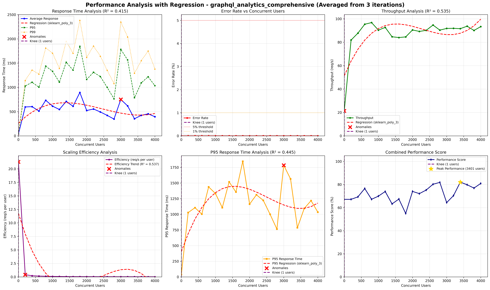

# Rootly 
## Prototype 4 - Quality Attributes, Part 2

## Team 2F
- Carlos Santiago Sandoval Casallas
- Cristian Santiago Tovar Bejarano
- Danny Marcelo Yaluzan Acosta
- Esteban Rodriguez Muñoz
- Santiago Restrepo Rojas
- Gabriela Guzmán Rivera
- Gabriela Gallegos Rubio
- Andrés Camilo Orduz Lunar

## Table of Contents

- [Software System](#software-system)
- [Architectural Structures](#architectural-structures)
  - [Components and Connector Structure](#components-and-connector-view)
  - [Deployment Structure](#deployment-view)
  - [Layered Structure](#layered-view)
  - [Decomposition Structure](#decomposition-view)
- [Quality Attributes](#quality-attributes)
  - [Security](#security)
    - [Network Segmentation](#network-segmentation)
    - [Secure Channel](#secure-channel)
    - [Reverse Proxy](#reverse-proxy)
    - [Web Application Firewall](#web-application-firewall)
  - [Performance and Scalability](#performance-and-scalability)
    - [Load Balancer](#load-balancer)
    - [Caching](#caching)
  - [Reliability](#reliability)
    - [Replication pattern lb analytics](#replication-pattern-lb-analytics)
    - [Cluster pattern](#cluster-pattern)
    - [Replication pattern db caching](#replication-pattern-db-caching)
    - [Service Discovery](#service-discovery)
  - [Interoperability](#interoperability)
  
- [Prototype – Deployment Instructions](#deployment-instructions)

## Software System
- **Name:** Rootly  
- **Logo:**  

**Description:**
  
**ROOTLY** is an agricultural monitoring system designed to support significant decision-making in the agricultural environment. It leverages a microservices-based architecture to integrate field devices, process data, and deliver real-time analytics to users through a web and mobile application.

The system operates by capturing environmental and soil data—such as humidity and temperature—directly from the field using microcontroller devices. This information is then sent to a central platform where it is processed, validated, and analyzed. The platform's architecture combines robust databases for storing both transactional information (like user profiles and configurations) and large volumes of time-series sensor data.

Finally, users can access all this information through an intuitive interface, available on both web and mobile. They can view real-time metrics, explore historical data, manage their crops, and receive analytical insights to optimize their agricultural practices.

---

## Decomposition Structure
### Decomposition View

### Purpose
Shows the hierarchical breakdown of the system into functional modules, clarifying responsibilities from high-level features down to services.

### Decomposition Hierarchy
1. **Authentication and User Management**
   - User management: Create account, update account, delete account
   - User authentication: Sign in, sign out, change password
2. **Plant and Device Administration**
   - Plant management:
     - Create plant, delete plant, update plant
     - Add plant photo, remove plant photo
     - List all plants, list plant by ID
     - List devices per plant
     - Enable monitoring, disable monitoring
     - Associate device, disassociate device
   - Device management:
     - Create device, update device, delete device
     - List all devices, list device by ID
     - List devices belonging to a user
     - Update device for a user, delete device for a user
     - Enable device, disable device
3. **Data Ingestion**
   - Sensor data reception
   - Publication to Kafka
4. **Data Processing**
   - Kafka consumption
   - Data storage
5. **Data Analytics**
   - Data processing:
     - Query historical data
     - Query averaged historical data
   - Visualization processing:
     - Perform trend analysis
   - Report generation:
     - Generate single-metric report
     - Generate multi-metric report

### Description of architectural elements and relations

| Element | Type | Description | Relations |
| --- | --- | --- | --- |
| Authentication and User Management | Module | Manages the entire user lifecycle, including account creation, authentication, credential maintenance, sign-in, sign-out, and password changes. | Interacts with every other module to validate user identity and authentication before operations proceed. |
| User Management | Submodule | Handles the creation, update, and deletion of user accounts within the system. | Triggered by administrators or user self-service registration flows. |
| User Authentication | Submodule | Manages sign-in, sign-out, and password change workflows. | Depends on the authentication layer to validate credentials and issue access tokens. |
| Plant and Device Administration | Module | Governs plant and device resources, covering configuration, monitoring, and associations between assets. | Coordinates with data ingestion and processing modules to obtain telemetry from registered devices. |
| Plant Management | Submodule | Oversees plant lifecycle operations, photo attachments, monitoring status, and device associations. | Relies on the authentication module to verify the user responsible for each plant. |
| Device Management | Submodule | Administers device lifecycle tasks and relationships with users and plants. | Communicates with the ingestion module to receive data captured by devices. |
| Data Ingestion | Module | Receives real-time sensor and device data, publishing it to the messaging system (Kafka) for downstream processing. | Provides ingested data streams to the data processing module. |
| Data Processing | Module | Consumes Kafka topics, performs transformations, cleansing, and aggregations, and persists processed outputs. | Supplies clean datasets to the analytics module for further insights. |
| Data Analytics | Module | Analyzes and visualizes processed data to generate insights, reports, and trend identifications. | Depends on the data processing module to access consolidated information. |
| Data Processing (Analytics Submodule) | Submodule | Executes statistical calculations, aggregations, and historical or averaged queries. | Feeds computed datasets to the visualization submodule. |
| Statistics Processing | Submodule | Builds trend analyses based on processed data. | Supplies the report generation submodule with analytical results. |
| Report Generation | Submodule | Produces individual metric and comparative multi-metric reports for presentation or export. | Interfaces with the system's UI/dashboard layer to deliver finished reports. |

---

----  
## Quality Attributes
##  Security

---

##  Performance and Scalability
###  Load Balancer

During peak usage, approximately **4,000 HTTP requests were sent within 1 or 2 seconds** (to simulate concurrency) from multiple external clients accessing the `/graphql_analytics` endpoint. Forwarded all requests directly to a single backend instance, causing **increased response times, uneven workload distribution, and CPU saturation**.  Although the system remained functional, **response time variance and throughput degradation** became evident as concurrency grew beyond ~3,000 users, exposing limitations in scalability and responsiveness.

| **Element** | **Description** |
|--------------|-----------------|
| **Artifact** | Analytics Backend — GraphQL analytics endpoint |
| **Source** | Multiple external users concurrently sending analytics requests |
| **Stimulus** | 4000 HTTP requests generated within a 2-second interval |
| **Environment** | Normal operation under synthetic load testing |
| **Response** | System processes all requests, logging latency and HTTP status outcomes |
| **Response Measure** | Primary metrics: Response time variance (%) and failed request rate per test period |

####  Countermeasure Implementation: Load Balancer Pattern

**Load Balancer** was introduced in front of the analytics backend cluster to enable **request distribution** across multiple instances.  
The configuration applied included:
- Round-robin routing strategy  
- Health checks and failover logic  
- Disabled session persistence to prevent node saturation  
- Continuous metric collection via Prometheus and Grafana

#### Architectural Pattern: Load Balancer

The **Load Balancer pattern** enables the system to distribute incoming client requests across multiple backend instances to avoid overload, reduce latency, and improve performance under concurrent usage. Instead of directing all requests to a single analytics processor—as in the baseline configuration—the load balancer acts as an intelligent traffic director that continuously evaluates server health, routing capacity, and response times. This ensures a more uniform distribution of workload and prevents any single instance from becoming a bottleneck. By operating as an intermediary layer, the load balancer also improves fault isolation: when one backend instance becomes slow or unresponsive, the load balancer stops forwarding traffic to it and seamlessly redirects requests to healthy nodes.

#### Architectural Tactic: Maintain Multiple Copies of Computations (Manage Resources)

The **Maintain Multiple Copies of Computations** tactic enhances performance by replicating computation logic across several backend instances. Rather than relying on a single server to evaluate all GraphQL analytics queries, the system keeps multiple identical processors active at the same time. Each replica computes the same type of analytics workload, enabling the platform to absorb high request volumes by parallelizing the execution of identical computations. This ensures that heavy analytical operations do not saturate a single node and that response times remain stable even under sudden spikes in demand.

Within the context of the load balancer, this tactic allows the system to scale out efficiently, because each new backend instance contributes additional computational capacity. The combination of the tactic and the load balancer pattern results in improved throughput, reduced latency variance, and more predictable performance during stress conditions.

####  Implementation Load Balancer Results

####   Redesign prototype 4 Results

####  *Performance Metrics Comparison*

| **Metric** | **After Load Balancer** | **Redesign P4** | **Observation / Technical Impact** |
|-------------|---------------------------|---------------------------|------------------------------------|
| **Average Response Time (ms)** | 285 ms |  ms |  |
| **Response Time Variance (%)** | 11% | % |  |
| **Throughput (req/sec)** | 260 req/s |  req/s | |
| **Failed Requests (%)** | 0.3% | % ||
| **CPU Utilization (per instance)** |~55–65% (per node, 2 replicas) |  | |
| **Network Latency (avg)** | 43 ms |  ms | |
| **Scalability Behavior** | Stable performance across replicas|  |  |
| **System Availability** |Sustained at 99%+ |  |  |

####  Summary
The **Load Balancer pattern** successfully mitigated the initial performance bottleneck by distributing incoming traffic evenly across multiple backend instances. 

###  Caching

| **Element** | **Description** |
|--------------|-----------------|
| **Architectural Pattern** | Caching – Aside |
| **Architectural Tactic** | Maintain Multiple Copies of Computations (Manage resources) |
| **Artifact** | Analytics Backend |
| **Source** | Concurrent web or mobile clients repeatedly requesting the same data |
| **Stimulus** | A burst of 4000 GET requests within 20 seconds, all targeting an identical resource |
| **Environment** | Normal operations |
| **Response** | Processes each request (each triggering a full database query), records latency and query statistics in monitoring logs |
| **Response Measure** | Average request latency (ms) |

###  Countermeasure Implementation: Caching Pattern

The **Cache-Aside pattern** was implemented within the analytics backend to store frequently accessed query results in memory.  
The main configuration included:

- In-memory cache layer (Redis).  
- TTL (Time-To-Live) policy to ensure freshness of cached data.  
- Cache invalidation rules for data updates.  
- Integration with backend metrics for cache hit/miss analysis.

#### Architectural Pattern: Caching – Aside

The **Cache-Aside pattern** improves performance by storing frequently-used or expensive-to-compute data in a fast-access memory layer. Instead of querying the primary database every time clients request analytics data, the backend first checks whether the result is already stored in the cache. If it is (cache hit), the data is returned immediately, significantly reducing latency. If the data is not present (cache miss), it is fetched from the database, returned to the client, and then written to the cache so future requests can be served faster. This pattern reduces load on the database and accelerates repeated access to popular analytics endpoints.

Cache-Aside is particularly effective in read-heavy analytics scenarios where users repeatedly request the same metrics or dashboards. By ensuring that expensive computations or database operations are performed once and reused many times, the pattern stabilizes performance during bursts of traffic. Additionally, the use of TTL and invalidation rules ensures that cached values remain fresh while still providing substantial performance gains.

#### Architectural Tactic: Maintain Multiple Copies of Computations (Manage Resources)

In the context of caching, this tactic refers to storing precomputed or repeatedly-used results in multiple locations—the primary database and the cache. Instead of recalculating analytics for each request or executing identical database queries thousands of times, the system maintains an additional copy of the result in Redis. This secondary copy acts as a computational shortcut that avoids redundant work and reduces overall system strain.

By maintaining these additional computed copies, the system can rapidly serve repetitive workloads and absorb high traffic volumes without overwhelming the database. The tactic directly supports performance efficiency by minimizing duplicate computations, improving response times, and allowing the backend to sustain significantly more concurrent users. In combination with the Cache-Aside pattern, this tactic forms a powerful mechanism for stabilizing platform performance during peak read demand.

####  Implementation Caching Results

####   Redesign prototype 4 Results

####  *Performance Metrics Comparison*

| **Metric** | **After Caching** | **Redesign P4** | **Observation / Technical Impact** |
|-------------|---------------------------|---------------------------|------------------------------------|
| **Average Response Time (ms)** | 394.13 ms |  ms |  |
| **Response Time Variance (%)** | 71.30 % | % |  |
| **Throughput (req/sec)** | 93.32 req/s |  req/s | |
| **Failed Requests (%)** | 0.00 % | % ||
| **CPU Utilization (per instance)** | - |  | |
| **Network Latency (avg)** | - |  ms | |
| **Scalability Behavior** | Throughput saturated at ~93 req/s |  |  |
| **System Availability** | 100% |  |  |

####  Summary
The implementation of the **Cache-Aside** pattern has provided significant advantages in terms of reliability and resource protection. Comparing the metrics with the previous phase (Load Balancer), the following points stand out:

*   **Error Elimination:** The system achieved a **0.00% failed request rate**, a critical improvement over the 0.3% observed previously. This demonstrates that the cache acts as an effective buffer, preventing the database from becoming a point of failure under extreme load.
*   **Stability vs. Speed:** While the recorded throughput (93.32 req/s) and response time (394.13 ms) show different behavior compared to the load balancing test, the system prioritized total availability (100%). The increase in response time variance (71.30%) is expected in cached systems: it reflects the difference between immediate responses (cache hits) and full database queries (cache misses).
*   **Resource Efficiency:** By serving frequent data from Redis, pressure on the primary database is drastically reduced, allowing the system to handle traffic spikes without degrading service integrity or rejecting requests.

---

## Reliability

### Replication pattern Reverse Proxy

This scenario describes the baseline reliability assessment for the Reverse Proxy component. The objective is to document the current system behavior when the reverse-proxy fails, establishing metrics that will later be compared against the improved system after applying the Active Redundancy architectural pattern and the Redundant Spare tactic in GCP Kubernetes cluster.

#### Artifact

The artifact under evaluation is the `reverse-proxy` component in its current baseline configuration. The `reverse-proxy` service operates in the private network and is responsible for routing validated traffic to the frontend SSR (Next.js) and API Gateway services. The `rootly-waf` service acts as an observer and entry point, responsible for terminating TLS/SSL connections, applying ModSecurity (OWASP CRS) rules for application-layer protection, enforcing rate limiting policies, and generally verifying traffic that goes directly to the single reverse-proxy instance.

**Current Network Architecture:**
- `rootly-waf`: Connected to both `rootly-public-network` and `rootly-private-network`, exposing ports 80/443 publicly
- `reverse-proxy`: Single container instance connected only to `rootly-private-network`, exposing port 443 internally

In the current baseline configuration, the reverse-proxy operates as a single instance without redundancy:
- `reverse-proxy`: Single container instance exposing port 443 internally (only in private network)
- `rootly-waf`: Container (observer) that routes traffic directly to the single reverse-proxy instance

The reverse-proxy represents a Single Point of Failure (SPOF). The reverse-proxy is critical for routing traffic to backend services. If the reverse-proxy fails, traffic cannot reach the frontend and API Gateway, even if the WAF remains operational.

#### Source

The source of the stimulus is external clients making HTTPS requests to the platform. These clients may include:
- End users accessing the web frontend through browsers
- Client applications consuming REST or GraphQL APIs

All external traffic enters the system through ports 80 (HTTP) and 443 (HTTPS), which are handled by the `rootly-waf` instance. The source generates continuous request streams that may vary from normal operational load to peak traffic conditions affecting availability.

#### Stimulus

The stimulus consists of inducing the failure of one active reverse-proxy instance. This may be triggered in several possible ways, however we will employ:

**Operational interruption**: Deliberate termination such as killing the service process, stopping the container, introducing a network partition, or shutting down the virtual machine.

Regardless of the method, the stimulus results in the single reverse-proxy instance transitioning into an unavailable state.

#### Environment

In the baseline configuration, only one `reverse-proxy` instance is available. The system has no alternative reverse-proxy backends, and therefore, all incoming traffic flows through the WAF instance to the single reverse-proxy instance. When the reverse-proxy instance becomes saturated or fails, clients experience slow responses, request timeouts, or complete unavailability. The system has no backup capacity to absorb the load.

The environment conditions include:
- System operating in production or active development
- Normal to high incoming traffic loads
- All backend services (frontend-ssr, api-gateway) functioning correctly
- Docker network operational
- Valid SSL certificates present
- No redundant reverse-proxy instances available for failover

#### Response

When the system operates without Active Redundancy, any failure or overload of the reverse-proxy instance directly results in degraded service:

**If `reverse-proxy` fails:**
- **502 Bad Gateway**: Errors when attempting to reach the reverse-proxy
- **Upstream Timeout**: Timeouts in upstream connections
- **Cascading Failures**: Traffic cannot reach backend services
- **Service Unavailability**: Frontend and API Gateway become inaccessible despite being healthy
- **Complete Traffic Block**: All requests fail to reach backend services

At the client level, increased latency, elevated error rates, and unavailability are visible. Requests may accumulate, exceed processing limits, or return 5xx errors. User sessions are lost, and the user experience is severely degraded or completely unavailable.

#### Response Measure

The metrics used to validate the scenario focus on mean time to repair and failover time during and after the induced failure. In the baseline configuration, the platform experiences significant performance degradation:

| Metric | Baseline Value (Without Redundancy) | 
|--------|--------------------------------------|
| **MTTR (Mean Time To Repair)** | High (30-60 seconds minimum) |
| **Failover Time** | High (15-30 seconds) or infinite (no automatic failover) |

Clients encounter visible downtime when the single reverse-proxy replica collapses under load or becomes unavailable. The system demonstrates no resilience to single reverse-proxy instance failures.

### Architectural Pattern: Active Redundancy (Hot Spare)

Active Redundancy is an architectural pattern in which multiple instances of the same component operate in parallel and remain fully active at all times. None of the replicas are passive or waiting to be promoted. Instead, each instance continuously processes requests, maintains synchronized internal state, and stays prepared for immediate takeover in the event of a fault in any sibling replica.

The pattern is designed to support fail-operational behavior rather than failover behavior. Because each replica is already hot and running, the system does not require activation or initialization time when a failure occurs. This drastically reduces Mean Time to Repair (MTTR) and ensures that service continuity is preserved even when a primary instance becomes unresponsive.

**Note:** This pattern will be applied in the GCP Kubernetes cluster by creating multiple replicas of the reverse-proxy component.

### Architectural Tactic: Redundant Spare (Recover from Faults → Preparation and Repair)

The Redundant Spare tactic focuses on preparing additional instances of a component so that the system can rapidly recover from faults. While the Active Redundancy pattern defines how replicas operate concurrently, the Redundant Spare tactic defines how the system anticipates failures by ensuring that additional operational capacity is already in place. The tactic emphasizes preparation and repair: preparation in the form of duplicate active reverse-proxy nodes that share identical responsibilities, and repair in the form of fast rerouting of traffic once a failure is detected.

By applying this tactic, recovery does not depend on restarting, scaling up, or reconfiguring services. The spare reverse-proxy instances are already active, synchronized, and ready to handle traffic. Therefore, when the primary reverse-proxy instance fails—whether due to overload, resource exhaustion, or simulated node termination—the spare replica immediately absorbs the remaining traffic. The tactic thus enables extremely low recovery time and stable performance during unexpected operational disruptions.

**Note:** This tactic will be implemented in the GCP Kubernetes cluster by deploying multiple reverse-proxy replicas with proper load balancing and health checks.

### Verification (Post-Implementation)

After implementing the Active Redundancy pattern and Redundant Spare tactic in the GCP Kubernetes cluster, verification tests will be conducted to validate the improvements. The baseline metrics documented in the Response Measure section will be compared against the new metrics to demonstrate the effectiveness of the pattern.

**Planned Test Scenarios (to be executed in GCP Kubernetes):**

1. **Pod Crash Simulation**: Terminate one reverse-proxy replica pod and observe failover behavior
2. **Resource Exhaustion Simulation**: Limit resources on one replica to test health check detection and traffic rerouting

**Expected Improvement Metrics (to be validated post-implementation):**
- **MTTR**: Target < 5 seconds (automatic failover via Kubernetes load balancer)
- **Failover Time**: Target < 3 seconds (health check interval + routing update)

The verification process will confirm that the Active Redundancy pattern and Redundant Spare tactic successfully eliminate the single point of failure in the reverse-proxy component and provide high availability for traffic routing to backend services.

---

### Cluster pattern

This scenario models the system operating entirely on a single machine, where all application services, the database, analytics engine, API layer, and background components share the same execution environment. During normal user activity, a machine-level fault suddenly occurs—such as an OS crash, hardware malfunction, or unexpected shutdown—causing every running component to fail simultaneously. Because the entire platform depends on a single node, the failure results in a complete service outage: all requests time out, processes terminate abruptl.

#### Source
User Request, the requests originate from end users interacting with the system during normal usage. The system is expected to respond promptly and reliably to these interactions.

#### Stimulus
Machine Failure in a Single-Node Environment, a failure occurs on the only machine hosting the entire system. This may include hardware malfunction, operating system crash, or an unexpected shutdown that disrupts all running services.

#### Environment
Normal Operations,the system is running under standard load conditions. No abnormal spikes, maintenance tasks, or external disruptions are present when the failure occurs.

#### Artifact
Entire System (Single-Machine Deployment), all components—application logic, APIs, database, frontend, background workers, and internal services—are deployed on a single physical or virtual machine. There is no redundancy or distribution of workload across multiple nodes.

#### Response
Full Service Outage, the complete system becomes unavailable. All incoming requests fail with timeouts or error responses, and users cannot access any functionality until the machine is restored.

#### Response Measure
No Failover / Availability Drops to 0%, since the system depends on a single machine, there is no automated failover or backup instance. Recovery requires manual intervention, leading to extended downtime and a temporary total loss of availability.

#### Architectural Pattern: Cluster

This pattern improves system availability by deploying multiple independent nodes that function as a unified logical system. Instead of relying on a single machine, the system is replicated or distributed across several nodes capable of sharing or splitting the workload.

When a node fails, other nodes continue operating, minimizing service disruption and preventing full system outages. The pattern focuses on eliminating the single point of failure inherent in one-machine deployments.The pattern itself does not define how node failures are detected or how traffic is redirected; those behaviors are introduced later through availability tactics such as heartbeat monitoring, node health checks, or automated failover mechanisms.

#### Architectural Tactic: N+1
This tactic ensures high availability by maintaining one additional unit of capacity beyond what the system needs to operate normally. With N active instances handling the workload and one extra instance or capacity margin as backup, the system can tolerate the failure of any single component without dropping below the required operational level. 

- This prevents single points of failure and allows the service to continue functioning even during unexpected outages.

In GKE, the N+1 tactic is naturally supported through ReplicaSets, which automatically recreate failed pods to maintain the desired number of running instances. Additionally, features like node auto-repair and node auto-provisioning ensure that if a node becomes unhealthy, the platform replaces or heals it, preserving the extra capacity needed to sustain the N+1 redundancy model.

#### Verification 

### Replication pattern for Analytics Data Sources

This scenario validates the reliability of the analytics data-access layer by applying the Active Redundancy architectural pattern and the Redundant Spare tactic. The goal is to ensure that the platform continues serving analytics metrics even if either data source—db-caching or db-data-processing—fails unexpectedly. Although these two stores are not identical replicas, both remain fully active and capable of supplying metric data. Under failure conditions, the analytics backend seamlessly routes requests to the alternate store, demonstrating fault tolerance and continuous service availability.

#### Artifact

The artifact under evaluation is the backend analytics data-access subsystem, which interacts with two active data stores: **db-caching**, containing frequently accessed or precomputed metric summaries, and **db-data-processing**, containing the primary computed dataset. Together, these sources supply metrics required by the analytics service, enabling consistent responses under normal and degraded conditions.

#### Source

The source of the stimulus is a high-volume request generator that issues continuous and concurrent metric queries to the analytics backend. This client simulates real operational behavior under peak load conditions, exercising both db-caching and db-data-processing. The workload is designed to push the system into stress conditions that reveal how each data store behaves under heavy read pressure or resource saturation.

#### Stimulus

The stimulus consists of inducing the failure of one of the active data stores—either db-caching or db-data-processing—through overload-driven fault injection. The first method involves generating an extremely high read workload that saturates CPU, memory, or I/O resources, causing the target data store to degrade, become unresponsive, or crash. The second method is a deliberate operational interruption, such as terminating the service process, introducing a network partition, or stopping the container or VM hosting the data store. Regardless of the method used, the result is that the selected data store transitions into an unavailable state while the analytics backend continues to issue read requests.

#### Environment

Under normal operating conditions, both db-caching and db-data-processing are active and fully reachable by the analytics backend. db-caching is used for fast retrieval of frequently accessed metric summaries, while db-data-processing provides the authoritative computed dataset. Both sources operate concurrently, and the backend routes read operations based on availability and data needs. In this baseline environment, no additional failover mechanisms are configured, and the system expects both stores to remain responsive during standard usage.

#### Response

When the system does not implement Active Redundancy, the failure of either store leads to user-facing degradation. If db-caching fails, analytics requests may hang or return incomplete results. If db-data-processing fails, metrics that require fresh computation become unavailable. Error rates increase, and response times rise due to failed lookups or repeated retries.

#### Response Measure

The metrics for evaluating this scenario include availability, recovery time, error rates, and consistency under failure. In the baseline setup, a data-source outage results in elevated 5xx errors, stalled analytics requests, and loss of metric freshness. Service availability drops noticeably as the backend cannot compensate for the missing data source.

#### Architectural Pattern: Active Redundancy (Hot Spare)

Active Redundancy is an architectural pattern in which multiple components operate simultaneously and remain fully active at runtime. Unlike passive failover mechanisms, active replicas do not require activation or promotion; instead, each replica is already engaged in normal operations and ready to sustain the full workload instantly if a sibling component fails.

In this system, both **db-caching** and **db-data-processing** function as active redundant data providers. Although their content differs, each store can independently supply the analytics backend with sufficient data to continue responding to client requests. When one store becomes unavailable due to node termination, network disruption, or operational failure, the other active store serves as a hot spare, enabling uninterrupted access to metric data. This pattern ensures low recovery time and continuous service availability.

#### Architectural Tactic: Redundant Spare (Preparation & Repair)

The Redundant Spare tactic ensures that alternate operational capacity is already prepared before a failure occurs. Under this tactic, additional data sources run concurrently and are fully integrated with the system. When a fault is detected, the system shifts traffic to the spare component without requiring provisioning, restarts, or reconfiguration.

In the context of this scenario, **db-caching** and **db-data-processing** operate as redundant spares for each other. If db-caching fails, the backend automatically retrieves metrics directly from db-data-processing. Conversely, if db-data-processing becomes unavailable, the backend continues serving responses based on cached metric summaries. This approach embodies the preparation-and-repair model: redundancy is prepared proactively, and recovery occurs by immediate rerouting while the failed data store undergoes repair or restoration.

#### Verification

To verify reliability, both data stores remain active during the test. A failure is induced on either db-caching or db-data-processing, and the system’s behavior is observed. The backend is expected to continue serving analytics responses through the surviving store with minimal disruption, validating the effectiveness of Active Redundancy and the Redundant Spare tactic.

### Service Discovery

Service Discovery ensures that internal callers (e.g., `api-gateway`, `ms-user-plant-management`) always find the authentication service even as replicas are restarted or rescheduled. Observability relies on **Docker logs** to detect registration or resolution issues early and drive remediation.

#### Artifact

**Service Lookup Path for Authentication:** Runtime resolution of the `be-authentication-and-roles` service name to healthy container instances.

- **Service Registry / Docker DNS:** Built-in Docker resolver providing name-to-IP mapping for containers on `rootly-network`.
- **be-authentication-and-roles:** Auth/RBAC microservice whose availability is critical to all request flows.
- **Internal Clients:** `api-gateway`, `ms-user-plant-management`, and background jobs that call authentication APIs.
- **Observability:** Centralized `docker compose logs` stream used to detect lookup errors (`no such host`, `connection refused`) and container health changes.

#### Source

**Internal service callers** (gateway and backend microservices) performing REST calls against `http://be-authentication-and-roles:8000`. They depend on name resolution and healthy targets to proceed.

#### Stimulus

- A new replica of `be-authentication-and-roles` is started or restarted.
- A caller issues authentication or role checks immediately after the change.
- DNS propagation or container health takes a few seconds to stabilize.

#### Environment

Normal operations with Docker Compose on `rootly-network`, dynamic container restarts/scaling, and aggregated logs collected via `docker compose logs -f`.

#### Response

- **Before Service Discovery discipline:** Callers experience intermittent `502/503` or `no such host be-authentication-and-roles` while the new container comes up; failures surface only when user flows break.
- **After Service Discovery discipline:** Docker DNS provides up-to-date mappings; log-based observers watch for resolution errors and unhealthy containers, triggering a fast restart or alert when needed. Callers automatically pick a healthy instance once available.

#### Response Measure

Validation driven by Docker log telemetry and HTTP outcomes:

- **Name-Resolution Error Rate:** Percentage of `no such host` or connection refused messages in `docker compose logs` for auth calls (target: ~0% after stabilization).
- **Time to Detect Registration Gap:** Time from container restart to first log-detected resolution error and remediation trigger (target: <30s).
- **HTTP 5xx from Auth Calls:** Observed in gateway/client logs during rollout (target: near-zero after discovery stabilizes).
- **Successful Auth Call Rate:** Proportion of calls that reach a healthy `be-authentication-and-roles` instance (target: ~100% once DNS updates propagate).

By tying Service Discovery to Docker log observability, the team gains immediate visibility into lookup issues and can react before authentication outages propagate to end users.

#### Architectural Pattern:

#### Architectural Tactic: 

---

## Interoperability

The system must interoperate reliably with a cyber-physical component: a microcontroller continuously streams sensor data to `lb-data-ingestion`, which forwards to `be-data-ingestion` where validation, normalization, and buffering protect the pipeline.

#### Artifact

**Device-to-Ingestion Contract:** REST/HTTP payload contract between the microcontroller and the ingestion layer (`lb-data-ingestion` → `be-data-ingestion`), including JSON schema, version headers, authentication token, and the validation/queuing steps before reaching `queue-data-ingestion`.

#### Source

**Cyber-physical microcontroller device** equipped with environmental sensors (temperature, humidity, soil metrics) sending telemetry frames every few seconds.

#### Stimulus

Continuous telemetry stream (e.g., one sample per second) plus occasional firmware updates introducing new optional fields. Some frames may arrive late, duplicated, or with minor shape differences from older firmware.

#### Environment

Normal field operation with intermittent connectivity, standard network latency, and Dockerized backend on `rootly-network`; ingestion replicas may scale horizontally behind `lb-data-ingestion`.

#### Response

- `lb-data-ingestion` accepts connections and forwards payloads to `be-data-ingestion`.
- `be-data-ingestion` performs schema validation/version checks, normalizes units/field names, rejects malformed frames with clear HTTP errors, and enqueues valid messages to `queue-data-ingestion`.
- Backward compatibility rules keep older firmware payloads accepted; new optional fields are ignored or mapped to defaults while preserving required fields.
- Fault isolation prevents a bad batch (invalid schema, wrong token) from blocking the pipeline: invalid frames are dropped, logged with device metadata, and do not stall healthy traffic.
- Queued delivery decouples `ms-data-processing`, so ingestion remains responsive even if downstream consumers slow down.

#### Response Measure

- **Ingestion Success Rate:** ≥99% of valid telemetry frames accepted during steady streaming.
- **Schema Validation Errors:** <1% per hour for devices on supported firmware; spikes trigger alerting.
- **Queue Lag:** Stable under continuous streaming (<1s added latency from `be-data-ingestion` to `queue-data-ingestion`), even when `ms-data-processing` is throttled.
- **Fault Isolation Effectiveness:** No ingestion outage when a subset of devices sends malformed payloads (measured by continued acceptance of well-formed frames).
- **Error Transparency:** HTTP 4xx/5xx responses and validation failures logged with device identifier and firmware version for rapid troubleshooting when interoperability breaks.

#### Architectural Pattern: Data Ingestion and Validation Pipeline
 Telemetry arrives through `lb-data-ingestion`, is validated/normalized in `be-data-ingestion`, and is queued to `queue-data-ingestion` so downstream processors stay decoupled from field noise, bursts, or schema drift.  

#### Architectural Tactic: Schema Validation, Backward-Compatibility Handling, Fault Isolation
Strict JSON schema checks guard the boundary; firmware version headers plus optional fields preserve backward compatibility; malformed frames are isolated (logged/dropped) so healthy traffic continues without blocking threads or queues.
