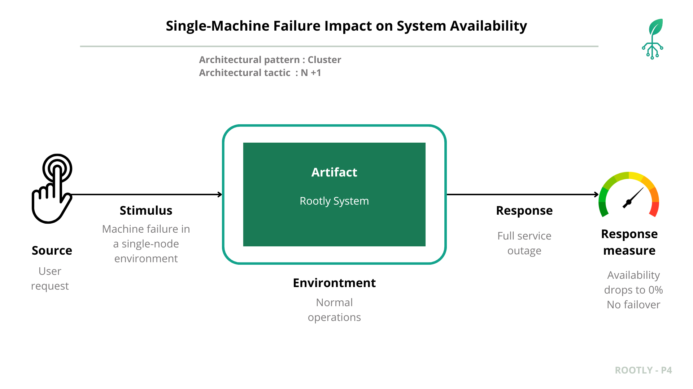

# Rootly 
## Prototype 4 - Quality Attributes, Part 2

## Team 2F
- Carlos Santiago Sandoval Casallas
- Cristian Santiago Tovar Bejarano
- Danny Marcelo Yaluzan Acosta
- Esteban Rodriguez Muñoz
- Santiago Restrepo Rojas
- Gabriela Guzmán Rivera
- Gabriela Gallegos Rubio
- Andrés Camilo Orduz Lunar

## Table of Contents

- [Software System](#software-system)
- [Architectural Structures](#architectural-structures)
  - [Components and Connector Structure](#components-and-connector-view)
  - [Deployment Structure](#deployment-view)
  - [Layered Structure](#layered-view)
  - [Decomposition Structure](#decomposition-view)
- [Quality Attributes](#quality-attributes)
  - [Security](#security)
    - [Network Segmentation](#network-segmentation)
    - [Secure Channel](#secure-channel)
    - [Reverse Proxy](#reverse-proxy)
    - [Web Application Firewall](#web-application-firewall)
  - [Performance and Scalability](#performance-and-scalability)
    - [Load Balancer](#load-balancer)
    - [Caching](#caching)
  - [Reliability](#reliability)
    - [Replication pattern lb analytics](#replication-pattern-lb-analytics)
    - [Cluster pattern](#cluster-pattern)
    - [Replication pattern db caching](#replication-pattern-db-caching)
    - [Service Discovery](#service-discovery)
  - [Interoperability](#interoperability)
  
- [Prototype – Deployment Instructions](#deployment-instructions)

## Software System
- **Name:** Rootly  
- **Logo:**  

**Description:**
  
**ROOTLY** is an agricultural monitoring system designed to support significant decision-making in the agricultural environment. It leverages a microservices-based architecture to integrate field devices, process data, and deliver real-time analytics to users through a web and mobile application.

The system operates by capturing environmental and soil data—such as humidity and temperature—directly from the field using microcontroller devices. This information is then sent to a central platform where it is processed, validated, and analyzed. The platform's architecture combines robust databases for storing both transactional information (like user profiles and configurations) and large volumes of time-series sensor data.

Finally, users can access all this information through an intuitive interface, available on both web and mobile. They can view real-time metrics, explore historical data, manage their crops, and receive analytical insights to optimize their agricultural practices.

---
## Components and Connector Structure
### Components and Connector view

### External Components (Out of System Scope)

- **Web Browser**
  - Type: External client
  - Responsibility: User interface for web applications
  - Protocols: **HTTPS**
  - Relations: Consumes `fe-web` via HTTPS

- **External Microcontroller Device**
  - Type: External IoT/embedded device
  - Responsibility: Collects and sends sensor and plant data
  - Protocols: **HTTP/REST**
  - Relations: Consumes `lb-data-ingestion` via HTTP/REST

### Internal Components 

- **Microcontroller Device**
  - Type: External IoT/embedded device
  - Responsibility: Collects and sends sensor and plant data
  - Protocols: **HTTP/REST**
  - Relations: Consumes `lb-data-ingestion` via HTTP/REST

- **WAF**
  - Type: Security Firewall / Edge Service
  - Responsibility: Protects web applications from common attacks while running.
  - Protocols: **HTTPS**
  - Relations:
    - Receives requests from browser/mobile.
    - Forwards validated traffic to `reverse proxy`

- **Reverse Proxy**
  - Type: Network Routing Component
  - Responsibility: Routes traffic to internal services, handles URL mapping and request forwarding.
  - Protocols: **HTTP**
  - Relations:
    - Receives sanitized traffic from WAF.
    - Routes requests to api-gateway and fe-web.

- **lb-data-ingestion**
  - Type: Load Balancer
  - Responsibility: Distributes incoming data ingestion requests from microcontroller devices across multiple instances of the `be-data-ingestion` service.
  - Protocols: **HTTP/REST**
  - Relations:
    - Receives data from `microcontroller-device` and `external-microcontroller-device`.
    - Routes traffic to `be-data-ingestion`.

- **Frontend Mobile (fe-mobile)**
  - Type: Mobile client application
  - Responsibility: Provides a mobile-optimized interface consuming backend APIs directly via REST.
  - Protocols: **HTTP/REST**
  - Relations: Consumes the WAF (reverse proxy) via HTTP/REST

- **fe-web**
  - Type: Web client application
  - Responsibility: Provides the user interface for the web platform; handles presentation logic, user interactions, and requests to backend services.
  - Role in connections: Consumer
  - Relations:
    - Serves the "web-browser" (HTTPS).
    - Consumes `WAF` (HTTPS).

- **api-gateway**
  - Type: Gateway / API Orchestrator
  - Responsibility: Central entry point for all clients. Routes, aggregates, and authenticates API requests to backend microservices.
  - Protocols: **HTTP/GraphQL/REST**
  - Relations:
    - Receives requests from the WAF reverse proxy.
    - Consumes services from backend modules (`lb-analytics`, `ms-user-plant-management`, `ms-authentication-and-roles`).

- **lb-analytics**
  - Type: Load Balancer
  - Responsibility: Distributes incoming requests from `api-gateway` across multiple instances of the `be-analytics` service.
  - Protocols: **HTTP/GraphQL**
  - Relations:
    - Receives requests from `api-gateway`.
    - Routes traffic to `be-analytics`.

- **ms-authentication-and-roles**
  - Type: Backend Microservice
  - Responsibility: Authentication and authorization service.
  - Relations:
    - Serves the `api-gateway` (HTTP/REST).
    - Connects to `db-authentication-and-roles` (data resource protocol).
    - Connects to `stg-authentication-and-roles` (data resource protocol).

- **ms-user-plant-management**
  - Type: Backend Microservice
  - Responsibility: Plant and user management service.
  - Relations:
    - Serves the `api-gateway` (HTTP/REST).
    - Connects to `db-user-plant-management` (data resource protocol).
    - Connects to `stg-user-plant-management` (data resource protocol).

- **be-analytics**
  - Type: Backend service
  - Responsibility: Analytics and reporting service.
  - Protocols: **HTTP/GraphQL** for flexible queries.
  - Relations:
    - Served by `lb-analytics`.
    - Consumes `db-caching` (data resource protocol).
    - Consumes `db-data-processing` (data resource protocol).

- **be-data-ingestion**
  - Type: Backend service
  - Responsibility: Receives and ingests sensor data from devices, validating and forwarding to the processing pipeline.
  - Relations:
    - Served by `lb-data-ingestion`.
    - Produces asynchronous messages to `queue-data-ingestion` (Kafka WIRE).

- **ms-data-processing**
  - Type: Backend Microservice
  - Responsibility: Transforms, aggregates, and stores data received from ingestion queues.
  - Relations:
    - Consumes data from `queue-data-ingestion` (Kafka WIRE).
    - Connects to `db-caching` (data resource protocol).
    - Produces processed results stored in `stg-data-processing` (data resource protocol).
    - Produces processed results stored in `db-data-processing` (data resource protocol).

### Internal Components (Data & Asynchronous)

- **queue-data-ingestion**
  - Type: Message Broker (Kafka)
  - Responsibility: Asynchronous event queue for decoupling ingestion and processing services.
  - Protocols: **Kafka WIRE**.
  - Relations:
    - Producer: `be-data-ingestion`.
    - Consumer: `ms-data-processing`.

- **db-caching**
  - Type: Caching Database
  - Responsibility: High-speed, volatile storage for frequently accessed data to improve read performance.
  - Protocols: **data resource protocol**
  - Relations:
    - Consumed by `be-analytics`.

- **Databases (DB)**
  - Protocols: **data resource protocol**
  - `db-authentication-and-roles`: Transactional storage for users and permissions. Consumed by `ms-authentication-and-roles`.
  - `db-user-plant-management`: Transactional storage for plants and relationships. Consumed by `ms-user-plant-management`.
  - `db-data-processing`: Storage for processed and analytical data. Consumed by `be-analytics` and `ms-data-processing`.

- **Storage (STG)**
  - Protocols: **data resource protocol**
  - `stg-authentication-and-roles`: Reference data for authentication. Consumed by `ms-authentication-and-roles`.
  - `stg-user-plant-management`: Master data and plant configurations. Consumed by `ms-user-plant-management`.
  - `stg-data-processing`: Temporary or raw storage for device data. Consumed by `ms-data-processing`.

### Architectural Styles
1. **Client–Server**  
   The browser (client) requests resources from the frontend (server) via HTTP. This ensures separation between presentation and business logic.  

2. **Microservices Architecture**  
   The backend is decomposed into a set of fine-grained, independently deployable services. Each service is responsible for a specific business capability (e.g., authentication, user management, analytics). This approach promotes scalability, resilience, and technological flexibility, as each service can be developed, deployed, and scaled independently. Communication between services is handled via well-defined APIs (REST/GraphQL) and asynchronous messaging (Kafka).

### Architectural Patterns

1.  **API Gateway Pattern**
    This pattern provides a single, unified entry point for all client requests. The `api-gateway` component acts as a reverse proxy, routing requests from the frontend clients to the appropriate backend microservice. This simplifies the client application, offloads responsibilities like authentication and SSL termination, and provides an additional layer of security.

2.  **Broker Pattern**
    This pattern decouples producers and consumers through a message broker that handles routing, delivery guarantees, retries, and dead-letter queues. It enables asynchronous communication, smooths traffic spikes with backpressure, and allows services to evolve independently without tight coupling.
In Rootly, Kafka acts as the broker: rootly-data-ingestion publishes sensor events to the queue, and rootly-data-processing consumes them for validation, transformation, and storage. The queue between these services (Kafka topics under the “queue-data-ingestion” namespace) provides at-least-once delivery and horizontal scalability.

2.  **Tiers Architecture**
    The level architecture improves communication between components by separating responsibilities into tiers (physical) and layers (logical). It also has a hierarchy, since the upper layers depend on the lower ones.The levels establish clear boundaries and responsibilities for components to collaborate with each other, facilitating communication between components. The logical layers represent the internal structure of the components and internal dependencies.
The result is predictable interactions, easier evolution, and independent scaling of responsibilities.

### Architectural Elements & Relations  

#### **External Clients & Edge Services**

- **Web Browser**
  - External actor that runs the frontend (SSR in React).
  - Consumes APIs via the security and network layers.
  - **Relation:** Connects to **WAF**.

- **Mobile App (fe-mobile)**
  - Native mobile application for on-the-go monitoring and management.
  - **Relation:** Connects to **WAF**.

- **WAF (Web Application Firewall)**
  - First security boundary protecting the system from common web exploits (SQLi, XSS, CSRF).
  - Filters, blocks, and sanitizes inbound HTTP traffic.
  - **Relation:** Forwards validated traffic to the **Reverse Proxy**.

- **Reverse Proxy**
  - Performs SSL termination, request buffering, compression, routing to frontend or backend load balancers.
  - Hides the internal network topology.
  - **Relation:** Forwards requests to **lb-frontend** and **api-gateway**, depending on routing rules.

#### **Frontend Services**

- **Frontend Web (fe-web)**
  - User interface built with React + TypeScript; displays dashboards, device states, and analytics.
  - **Relation:** Consumes services via the **WAF → API Gateway** path.

#### **Gateway & Core Logic Services**

- **API Gateway (api-gateway)**
  - Central entry point for all external clients (web and mobile). Handles **authentication**, **rate limiting**, **request routing**, and **aggregation**.
  - **Relation:** Receives traffic from **WAF** and routes requests to **ms-authentication-and-roles**, **ms-user-plant-management**, **lb-analytics**.

- **Authentication and Roles (ms-authentication-and-roles)**
  - Handles user authentication, role-based access control, and JWT token validation.
  - **Relation:** Connects to **db-authentication-and-roles** and **stg-authentication-and-roles**.

- **User and Plant Management (ms-user-plant-management)**
  - Manages user profiles, plant configurations, and device associations.
  - **Relation:** Accesses **db-user-plant-management** and **stg-user-plant-management**; requests routed via **API Gateway**.

- **Load Balancer - Analytics (lb-analytics)**
  - Distributes incoming analytics requests among multiple **be-analytics** instances to improve throughput.
  - **Relation:** Served by **API Gateway**; forwards requests to **be-analytics**.

- **Analytics (be-analytics)**
  - Performs computation of key metrics, aggregates processed data, and provides dashboards.
  - **Relation:** Served by **lb-analytics**; consumes **db-caching** and **db-data-processing** for faster query response.

- **Load Balancer - Data Ingestion (lb-data-ingestion)**
  - Distributes high-volume IoT data streams across **be-data-ingestion** instances.
  - **Relation:** Receives data from **microcontroller-device**; forwards to **be-data-ingestion**.

- **Data Ingestion (be-data-ingestion)**
  - Receives and validates raw IoT sensor data; transforms payloads and publishes them to **queue-data-ingestion**.
  - **Relation:** Served by **lb-data-ingestion**; produces messages for asynchronous processing.

- **Data Processing (ms-data-processing)**
  - Consumes messages from the queue, performs data transformation, aggregation, and persistence.
  - **Relation:** Consumes **queue-data-ingestion**; interacts with **db-caching**, **stg-data-processing**, and **db-data-processing**.

- **Load Balancer - Data Processing (lb-data-processing)**
  - Balances workloads between **ms-data-processing** instances to handle peak data transformation demand.
  - **Relation:** Balances requests and ensures stable processing throughput.

## Components description

| **Component / Service** | **Responsibilities** | **Boundaries** | **Interfaces** |
|---|---|---|---|
| **WAF (Web Application Firewall)** | Identify malicious traffic, sanitizes requests, protects surface endpoints. | First boundary between clients and internal network. | Intercepts HTTP/S; forwards accepted traffic to Reverse Proxy. |
| **Reverse Proxy** | SSL termination, routing, compression, request forwarding to load balancers and API gateway. | Sits between the WAF and fe-web and apigateway. | HTTP routing to fe-web, api-gateway. |
| **Load Balancer** | Distributes incoming client and IoT requests and analytics requests to ensure availability and scalability. | Logical boundary between clients (IoT devices) and backend services. | Uses HTTP/REST and HTTP/Graphql protocols to route traffic to the API gateway or ingestion endpoints. |
| **Frontend** | Provides the main user interface for real-time visualization of sensor data, dashboards, and management of plants and devices. | Executed as a SSR in the user’s browser; depends on the `api-gateway`. | Communicates with the `api-gateway` using REST/GraphQL and HTTP/REST . |
| **api-gateway** | Central entry point for all client interactions. Routes, aggregates, and authenticates API requests to backend microservices. | Coordinates backend communication; does not contain domain logic. | REST/GraphQL and HTTP/REST |
| **ms-authentication-and-roles** | Handles user authentication and authorization, managing JWT tokens, sessions, and role-based access control (RBAC). | Operates independently with its own database; does not directly interact with sensor or plant data. | HTTP/REST for authentication and role management. |
| **ms-user-plant-management** | Manages user–plant–device relationships, device registration, and plant configurations. | Specialized in domain entities (plants, devices); consumes user info from the authentication service. |HTTP/REST CRUD operations on plants and devices. |
| **be-analytics** | Processes and analyzes historical sensor data, providing performance metrics, trend analyses, and reports. | Has read-only access to processed data; operates without modifying primary datasets. | REST/GraphQL and HTTP/REST for analytics and reports. |
| **be-data-ingestion** | Receives sensor data from IoT microcontrollers, validates input, and forwards it to the data processing pipeline. | Dedicated entry point for IoT device communication; ensures integrity and structure of incoming data. | HTTP endpoints for ingestion; interacts with Kafka for event publishing. |
| **ms-data-processing** | Aggregates, transforms, and stores data from ingestion streams into the analytical databases. | Consumes messages from Kafka and persists structured data. | Kafka consumer KAFKA WIRE protocol; data source connector for service-to-service data delivery. |
| **Microcontroller** | Collect environmental sensor data (e.g., temperature, humidity, soil metrics) and send it periodically to the backend. | Operate at the network edge; limited resources; communicate only with the ingestion endpoint. | HTTP requests or MQTT to the ingestion service. |
| **queue-data-ingestion** | Kafka message broker enabling asynchronous communication between ingestion and processing services. | Shared middleware for decoupled data flow; ensures reliable message delivery. | Kafka topics and consumer APIs. |
| **db-authentication-and-roles** | PostgreSQL database storing user credentials, roles, and session tokens. | Private data store for authentication service. | SQL queries via ORM;  data source connector |
| **db-user-plant-management** | PostgreSQL database managing associations between users, plants, and devices. | Dedicated data store for plant and device domain logic. | SQL/ORM access; data source connector |
| **db-data-processing** | InfluxDB database storing time-series agricultural data and computed metrics. | Optimized for analytical queries and visualization. | InfluxQL/Flux queries;  data source connector|
| **db-caching** | Redis in-memory database for caching user sessions, authentication tokens, and frequently accessed queries. | Shared fast-access layer to reduce latency across backend services. | Redis key-value operations via SDK - data source connector. |
| **stg-authentication-and-roles** | MinIO storage for user profile photos and access logs. | Attached to authentication service; persistent object storage. | S3-compatible API -  data source connector. |
| **stg-data-processing** | MinIO storage for analytical data files, backups, and unstructured content. | Used by analytics and processing services. | S3-compatible API -  data source connector. |
| **stg-user-plant-management** | MinIO storage for plant images and related documents. | Attached to user-plant management domain. | S3-compatible API -  data source connector. |
---

## Layered Structure
  
### Layered view

- **Layered view  - Layers** The structure of the logic layer is shown below to avoid redundancy in the main view.
- The **Border element (WAF)** is not considered part of the tiers but acts as a **security perimeter** is like an observer.

### **Border Element**

- **Component:** Web Application Firewall (WAF)
- **Responsibility:** It protects the system's entry point by filtering and inspecting incoming HTTP traffic.
- **Capabilities:**  IP reputation filtering, rate limiting, DoS mitigation.
- **Communication flow:** Directs validated requests exclusively to Tier 1 (Forward).
- **Communication style:** HTTP/HTTPS

### **Layer Specifications**

#### **Tier 1 – Forward Layer**
- **Responsibility:** managing request routing (traffic control) and hiding the internal architecture to improve security.
- **Components:** `reverse proxy`
- **Communication style:** Synchronous HTTP/REST
- **Constraint:** Cannot access deeper tiers directly.

#### **Tier 2 – Presentation Layer**
- **Responsibility:** Provides user interfaces and manages client-side logic.
- **Components:** `fe-web`, `fe-mobile`
- **Communication style:** Synchronous HTTP/REST
- **Constraint:** Cannot access deeper tiers directly.

#### **Tier 3 – Synchronous Communication Layer**
- **Responsibility:** Manages synchronous request routing and API orchestration.
- **Components:** `api-gateway`
- **Capabilities:** Request aggregation, throttling, authentication, and routing.
- **Communication style:** Synchronous HTTP/gRPC

#### **Tier 4 – Logic Layer**
- **Responsibility:** Implements the system’s business logic and processing workflows.
- **Components:**
  - `be-authentication-and-roles`
  - `be-user-plant-management`
  - `be-analytics`
- **Capabilities:** Core computation, orchestration, and validation.
- **Communication style:** HTTP and message-based (Kafka, queues).

#### **Tier 5 – Distribution Layer**
- **Responsibility:** Balances and distributes requests between backend services to optimize performance and redundancy.
- **Components:** `lb-analytics`, `lb-data-ingestion`
- **Capabilities:** Load balancing, health checks, and failover.

#### **Tier 6 – Asynchronous Communication Layer**
- **Responsibility:** Handles event-driven communication and background processing.
  - `be-data-ingestion` (producer)
  - `be-data-processing` (consumer)
- **Components:**
 - `queue-data-ingestion`
- **Capabilities:** Asynchronous data ingestion, queue management, and event propagation.
- **Communication style:** Kafka/Event Streaming

#### **Tier 7 – Data Layer**
- **Responsibility:** Manages data persistence and storage across all domains.
- **Datastores:**
  - `db-authentication-and-roles`, `stg-authentication-and-roles`
  - `db-user-plant-management`, `stg-user-plant-management`
  - `db-data-processing`, `stg-data-processing`
  - `db-caching`
- **Capabilities:** Data durability, query optimization, and caching for improved performance.

**Logic Layer Structure (Internal)**
The diagram below illustrates the internal architecture of each microservice within the Logic Layer. To maintain a clear separation of concerns and promote modularity, each service adopts a 4-layer architecture.

1. **Layered Architecture**
   Each microservice is internally structured into four distinct layers. This pattern ensures that responsibilities are clearly segregated, making the service easier to develop, test, and maintain. The dependencies flow in one direction, from the outer layers to the inner layers.
    -   **Layer 1: Adapters:** This outermost layer is responsible for protocol-specific communication. It adapts incoming requests (e.g., from Kafka consumers or other services) and translates them into a format that the application's core can understand.
    -   **Layer 2: Controllers:** This layer acts as the entry point for API requests (e.g., HTTP REST/GraphQL). It handles request validation, parsing, and calls the appropriate business logic in the Services layer.
    -   **Layer 3: Services:** This is the core of the microservice, containing the main business logic and orchestrating application operations. It is completely independent of the delivery mechanism (e.g., HTTP).
    -   **Layer 4: Models:** This innermost layer represents the application's data structures and domain entities. It is responsible for data access and persistence logic, interacting directly with the database.

### Architectural patterns

- **7-Tier Architecture Pattern:**  
  The system is logically divided into seven layers, each serving a distinct function — from presentation and routing to computation, distribution, asynchronous messaging, and data management.
  
- **Security Perimeter (Border):**  
  The WAF acts as the first line of defense, inspecting and controlling traffic before it reaches the first tier.

## Decomposition Structure
### Decomposition View

### Purpose
Shows the hierarchical breakdown of the system into functional modules, clarifying responsibilities from high-level features down to services.

### Decomposition Hierarchy
1. **Authentication and User Management**
   - User management: Create account, update account, delete account
   - User authentication: Sign in, sign out, change password
2. **Plant and Device Administration**
   - Plant management:
     - Create plant, delete plant, update plant
     - Add plant photo, remove plant photo
     - List all plants, list plant by ID
     - List devices per plant
     - Enable monitoring, disable monitoring
     - Associate device, disassociate device
   - Device management:
     - Create device, update device, delete device
     - List all devices, list device by ID
     - List devices belonging to a user
     - Update device for a user, delete device for a user
     - Enable device, disable device
3. **Data Ingestion**
   - Sensor data reception
   - Publication to Kafka
4. **Data Processing**
   - Kafka consumption
   - Data storage
5. **Data Analytics**
   - Data processing:
     - Query historical data
     - Query averaged historical data
   - Visualization processing:
     - Perform trend analysis
   - Report generation:
     - Generate single-metric report
     - Generate multi-metric report

### Description of architectural elements and relations

| Element | Type | Description | Relations |
| --- | --- | --- | --- |
| Authentication and User Management | Module | Manages the entire user lifecycle, including account creation, authentication, credential maintenance, sign-in, sign-out, and password changes. | Interacts with every other module to validate user identity and authentication before operations proceed. |
| User Management | Submodule | Handles the creation, update, and deletion of user accounts within the system. | Triggered by administrators or user self-service registration flows. |
| User Authentication | Submodule | Manages sign-in, sign-out, and password change workflows. | Depends on the authentication layer to validate credentials and issue access tokens. |
| Plant and Device Administration | Module | Governs plant and device resources, covering configuration, monitoring, and associations between assets. | Coordinates with data ingestion and processing modules to obtain telemetry from registered devices. |
| Plant Management | Submodule | Oversees plant lifecycle operations, photo attachments, monitoring status, and device associations. | Relies on the authentication module to verify the user responsible for each plant. |
| Device Management | Submodule | Administers device lifecycle tasks and relationships with users and plants. | Communicates with the ingestion module to receive data captured by devices. |
| Data Ingestion | Module | Receives real-time sensor and device data, publishing it to the messaging system (Kafka) for downstream processing. | Provides ingested data streams to the data processing module. |
| Data Processing | Module | Consumes Kafka topics, performs transformations, cleansing, and aggregations, and persists processed outputs. | Supplies clean datasets to the analytics module for further insights. |
| Data Analytics | Module | Analyzes and visualizes processed data to generate insights, reports, and trend identifications. | Depends on the data processing module to access consolidated information. |
| Data Processing (Analytics Submodule) | Submodule | Executes statistical calculations, aggregations, and historical or averaged queries. | Feeds computed datasets to the visualization submodule. |
| Statistics Processing | Submodule | Builds trend analyses based on processed data. | Supplies the report generation submodule with analytical results. |
| Report Generation | Submodule | Produces individual metric and comparative multi-metric reports for presentation or export. | Interfaces with the system's UI/dashboard layer to deliver finished reports. |

----  
## Quality Attributes
##  Security

The security quality attribute is addressed through four key architectural patterns that protect the system at different layers and entry points. Each pattern addresses specific security concerns and is validated through comprehensive testing in the GKE/GCP cloud environment.

### Security Scenarios and Patterns

The following security scenarios have been implemented and validated in Prototype 4:

1. **[Web Application Firewall (WAF)](./web_application_firewall/README.md)**
   - **Pattern**: Web Application Firewall Pattern
   - **Purpose**: Protects web applications from common attacks (SQLi, XSS, CSRF, Layer-7 DoS) by inspecting and filtering HTTP traffic at the application layer
   - **Validation**: Achieves 83.9% blocking rate during simulated attacks, maintaining consistent protection across multiple test runs

2. **[Secure Channel](./secure_channel/README.md)**
   - **Pattern**: Secure Channel Pattern
   - **Purpose**: Ensures all external traffic is encrypted via HTTPS/TLS, preventing sensitive data exposure during network transmission
   - **Validation**: All traffic encrypted with TLS 1.3; zero readable sensitive data packets captured

3. **[Reverse Proxy](./reverse_proxy/README.md)**
   - **Pattern**: Reverse Proxy Pattern
   - **Purpose**: Routes traffic from WAF to internal services, handles SSL termination, and hides internal network topology
   - **Validation**: Traffic flows correctly through WAF → Reverse Proxy → API Gateway chain with >99% routing success rate

4. **[Network Segmentation](./network_segmentation/README.md)**
   - **Pattern**: Network Segmentation Pattern
   - **Purpose**: Isolates backend services from external access, exposing only intended public entry points (WAF, Data Ingestion LoadBalancers)
   - **Validation**: All backend services remain as ClusterIP (internal only); zero successful external connections to internal services

For detailed information about each security scenario, including quality attribute scenarios, validation steps, and results, please refer to the respective documentation in each pattern's directory.

---

##  Performance and Scalability

The performance and scalability quality attribute is addressed through two key architectural patterns that optimize system responsiveness and resource utilization under high concurrent load. Each pattern addresses specific performance concerns and is validated through comprehensive testing in the GKE/GCP cloud environment.

### Performance Scenarios and Patterns

The following performance scenarios have been implemented and validated in Prototype 4:

1. **[Load Balancer](./load_balancer/README.md)**
   - **Pattern**: Load Balancer Pattern
   - **Purpose**: Distributes incoming client requests across multiple backend instances to avoid overload, reduce latency, and improve performance under concurrent usage
   - **Validation**: Achieves 99.67% system availability, maintains stable performance across replicas, and prevents single-instance bottlenecks

2. **[Caching](./caching/README.md)**
   - **Pattern**: Cache-Aside Pattern
   - **Purpose**: Improves performance by storing frequently-used or expensive-to-compute data in a fast-access memory layer (Redis), reducing database load and accelerating repeated access
   - **Validation**: Achieves 0.00% failed request rate, significantly reduces database pressure, and maintains system stability under extreme load

For detailed information about each performance scenario, including quality attribute scenarios, validation steps, and results, please refer to the respective documentation in each pattern's directory.

---

## Reliability

### Replication pattern Reverse Proxy

This scenario describes the baseline reliability assessment for the Reverse Proxy component. The objective is to document the current system behavior when the reverse-proxy fails, establishing metrics that will later be compared against the improved system after applying the Active Redundancy architectural pattern and the Redundant Spare tactic in GCP Kubernetes cluster.

#### Artifact

The artifact under evaluation is the `reverse-proxy` component in its current baseline configuration. The `reverse-proxy` service operates in the private network and is responsible for routing validated traffic to the frontend SSR (Next.js) and API Gateway services. The `rootly-waf` service acts as an observer and entry point, responsible for terminating TLS/SSL connections, applying ModSecurity (OWASP CRS) rules for application-layer protection, enforcing rate limiting policies, and generally verifying traffic that goes directly to the single reverse-proxy instance.

**Current Network Architecture:**
- `rootly-waf`: Connected to both `rootly-public-network` and `rootly-private-network`, exposing ports 80/443 publicly
- `reverse-proxy`: Single container instance connected only to `rootly-private-network`, exposing port 443 internally

In the current baseline configuration, the reverse-proxy operates as a single instance without redundancy:
- `reverse-proxy`: Single container instance exposing port 443 internally (only in private network)
- `rootly-waf`: Container (observer) that routes traffic directly to the single reverse-proxy instance

The reverse-proxy represents a Single Point of Failure (SPOF). The reverse-proxy is critical for routing traffic to backend services. If the reverse-proxy fails, traffic cannot reach the frontend and API Gateway, even if the WAF remains operational.

#### Source

The source of the stimulus is external clients making HTTPS requests to the platform. These clients may include:
- End users accessing the web frontend through browsers
- Client applications consuming REST or GraphQL APIs

All external traffic enters the system through ports 80 (HTTP) and 443 (HTTPS), which are handled by the `rootly-waf` instance. The source generates continuous request streams that may vary from normal operational load to peak traffic conditions affecting availability.

#### Stimulus

The stimulus consists of inducing the failure of one active reverse-proxy instance. This may be triggered in several possible ways, however we will employ:

**Operational interruption**: Deliberate termination such as killing the service process, stopping the container, introducing a network partition, or shutting down the virtual machine.

Regardless of the method, the stimulus results in the single reverse-proxy instance transitioning into an unavailable state.

#### Environment

In the baseline configuration, only one `reverse-proxy` instance is available. The system has no alternative reverse-proxy backends, and therefore, all incoming traffic flows through the WAF instance to the single reverse-proxy instance. When the reverse-proxy instance becomes saturated or fails, clients experience slow responses, request timeouts, or complete unavailability. The system has no backup capacity to absorb the load.

The environment conditions include:
- System operating in production or active development
- Normal to high incoming traffic loads
- All backend services (frontend-ssr, api-gateway) functioning correctly
- Docker network operational
- Valid SSL certificates present
- No redundant reverse-proxy instances available for failover

#### Response

When the system operates without Active Redundancy, any failure or overload of the reverse-proxy instance directly results in degraded service:

**If `reverse-proxy` fails:**
- **502 Bad Gateway**: Errors when attempting to reach the reverse-proxy
- **Upstream Timeout**: Timeouts in upstream connections
- **Cascading Failures**: Traffic cannot reach backend services
- **Service Unavailability**: Frontend and API Gateway become inaccessible despite being healthy
- **Complete Traffic Block**: All requests fail to reach backend services

At the client level, increased latency, elevated error rates, and unavailability are visible. Requests may accumulate, exceed processing limits, or return 5xx errors. User sessions are lost, and the user experience is severely degraded or completely unavailable.

#### Response Measure

The metrics used to validate the scenario focus on mean time to repair and failover time during and after the induced failure. In the baseline configuration, the platform experiences significant performance degradation:

| Metric | Baseline Value (Without Redundancy) | 
|--------|--------------------------------------|
| **MTTR (Mean Time To Repair)** | High (30-60 seconds minimum) |
| **Failover Time** | High (15-30 seconds) or infinite (no automatic failover) |

Clients encounter visible downtime when the single reverse-proxy replica collapses under load or becomes unavailable. The system demonstrates no resilience to single reverse-proxy instance failures.

### Architectural Pattern: Active Redundancy (Hot Spare)

Active Redundancy is an architectural pattern in which multiple instances of the same component operate in parallel and remain fully active at all times. None of the replicas are passive or waiting to be promoted. Instead, each instance continuously processes requests, maintains synchronized internal state, and stays prepared for immediate takeover in the event of a fault in any sibling replica.

The pattern is designed to support fail-operational behavior rather than failover behavior. Because each replica is already hot and running, the system does not require activation or initialization time when a failure occurs. This drastically reduces Mean Time to Repair (MTTR) and ensures that service continuity is preserved even when a primary instance becomes unresponsive.

**Note:** This pattern will be applied in the GCP Kubernetes cluster by creating multiple replicas of the reverse-proxy component.

### Architectural Tactic: Redundant Spare (Recover from Faults → Preparation and Repair)

The Redundant Spare tactic focuses on preparing additional instances of a component so that the system can rapidly recover from faults. While the Active Redundancy pattern defines how replicas operate concurrently, the Redundant Spare tactic defines how the system anticipates failures by ensuring that additional operational capacity is already in place. The tactic emphasizes preparation and repair: preparation in the form of duplicate active reverse-proxy nodes that share identical responsibilities, and repair in the form of fast rerouting of traffic once a failure is detected.

By applying this tactic, recovery does not depend on restarting, scaling up, or reconfiguring services. The spare reverse-proxy instances are already active, synchronized, and ready to handle traffic. Therefore, when the primary reverse-proxy instance fails—whether due to overload, resource exhaustion, or simulated node termination—the spare replica immediately absorbs the remaining traffic. The tactic thus enables extremely low recovery time and stable performance during unexpected operational disruptions.

**Note:** This tactic will be implemented in the GCP Kubernetes cluster by deploying multiple reverse-proxy replicas with proper load balancing and health checks.

### Verification (Post-Implementation)

After implementing the Active Redundancy pattern and Redundant Spare tactic in the GCP Kubernetes cluster, verification tests will be conducted to validate the improvements. The baseline metrics documented in the Response Measure section will be compared against the new metrics to demonstrate the effectiveness of the pattern.

**Planned Test Scenarios (to be executed in GCP Kubernetes):**

1. **Pod Crash Simulation**: Terminate one reverse-proxy replica pod and observe failover behavior
2. **Resource Exhaustion Simulation**: Limit resources on one replica to test health check detection and traffic rerouting

**Expected Improvement Metrics (to be validated post-implementation):**
- **MTTR**: Target < 5 seconds (automatic failover via Kubernetes load balancer)
- **Failover Time**: Target < 3 seconds (health check interval + routing update)

The verification process will confirm that the Active Redundancy pattern and Redundant Spare tactic successfully eliminate the single point of failure in the reverse-proxy component and provide high availability for traffic routing to backend services.

---

### Cluster pattern

This scenario models the system operating entirely on a single machine, where all application services, the database, analytics engine, API layer, and background components share the same execution environment. During normal user activity, a machine-level fault suddenly occurs—such as an OS crash, hardware malfunction, or unexpected shutdown—causing every running component to fail simultaneously. Because the entire platform depends on a single node, the failure results in a complete service outage: all requests time out, processes terminate abruptl.

#### Source
User Request, the requests originate from end users interacting with the system during normal usage. The system is expected to respond promptly and reliably to these interactions.

#### Stimulus
Machine Failure in a Single-Node Environment, a failure occurs on the only machine hosting the entire system. This may include hardware malfunction, operating system crash, or an unexpected shutdown that disrupts all running services.

#### Environment
Normal Operations,the system is running under standard load conditions. No abnormal spikes, maintenance tasks, or external disruptions are present when the failure occurs.

#### Artifact
Entire System (Single-Machine Deployment), all components—application logic, APIs, database, frontend, background workers, and internal services—are deployed on a single physical or virtual machine. There is no redundancy or distribution of workload across multiple nodes.

#### Response
Full Service Outage, the complete system becomes unavailable. All incoming requests fail with timeouts or error responses, and users cannot access any functionality until the machine is restored.

#### Response Measure
No Failover / Availability Drops to 0%, since the system depends on a single machine, there is no automated failover or backup instance. Recovery requires manual intervention, leading to extended downtime and a temporary total loss of availability.

#### Architectural Pattern: Cluster

This pattern improves system availability by deploying multiple independent nodes that function as a unified logical system. Instead of relying on a single machine, the system is replicated or distributed across several nodes capable of sharing or splitting the workload.

When a node fails, other nodes continue operating, minimizing service disruption and preventing full system outages. The pattern focuses on eliminating the single point of failure inherent in one-machine deployments.The pattern itself does not define how node failures are detected or how traffic is redirected; those behaviors are introduced later through availability tactics such as heartbeat monitoring, node health checks, or automated failover mechanisms.

#### Architectural Tactic: N+1
This tactic ensures high availability by maintaining one additional unit of capacity beyond what the system needs to operate normally. With N active instances handling the workload and one extra instance or capacity margin as backup, the system can tolerate the failure of any single component without dropping below the required operational level. 

- This prevents single points of failure and allows the service to continue functioning even during unexpected outages.

In GKE, the N+1 tactic is naturally supported through ReplicaSets, which automatically recreate failed pods to maintain the desired number of running instances. Additionally, features like node auto-repair and node auto-provisioning ensure that if a node becomes unhealthy, the platform replaces or heals it, preserving the extra capacity needed to sustain the N+1 redundancy model.

#### Verification 

### Replication pattern for Analytics Data Sources

This scenario validates the reliability of the analytics data-access layer by applying the Active Redundancy architectural pattern and the Redundant Spare tactic. The goal is to ensure that the platform continues serving analytics metrics even if either data source—db-caching or db-data-processing—fails unexpectedly. Although these two stores are not identical replicas, both remain fully active and capable of supplying metric data. Under failure conditions, the analytics backend seamlessly routes requests to the alternate store, demonstrating fault tolerance and continuous service availability.

#### Artifact

The artifact under evaluation is the backend analytics data-access subsystem, which interacts with two active data stores: **db-caching**, containing frequently accessed or precomputed metric summaries, and **db-data-processing**, containing the primary computed dataset. Together, these sources supply metrics required by the analytics service, enabling consistent responses under normal and degraded conditions.

#### Source

The source of the stimulus is a high-volume request generator that issues continuous and concurrent metric queries to the analytics backend. This client simulates real operational behavior under peak load conditions, exercising both db-caching and db-data-processing. The workload is designed to push the system into stress conditions that reveal how each data store behaves under heavy read pressure or resource saturation.

#### Stimulus

The stimulus consists of inducing the failure of one of the active data stores—either db-caching or db-data-processing—through overload-driven fault injection. The first method involves generating an extremely high read workload that saturates CPU, memory, or I/O resources, causing the target data store to degrade, become unresponsive, or crash. The second method is a deliberate operational interruption, such as terminating the service process, introducing a network partition, or stopping the container or VM hosting the data store. Regardless of the method used, the result is that the selected data store transitions into an unavailable state while the analytics backend continues to issue read requests.

#### Environment

Under normal operating conditions, both db-caching and db-data-processing are active and fully reachable by the analytics backend. db-caching is used for fast retrieval of frequently accessed metric summaries, while db-data-processing provides the authoritative computed dataset. Both sources operate concurrently, and the backend routes read operations based on availability and data needs. In this baseline environment, no additional failover mechanisms are configured, and the system expects both stores to remain responsive during standard usage.

#### Response

When the system does not implement Active Redundancy, the failure of either store leads to user-facing degradation. If db-caching fails, analytics requests may hang or return incomplete results. If db-data-processing fails, metrics that require fresh computation become unavailable. Error rates increase, and response times rise due to failed lookups or repeated retries. When one of the active data sources (db-caching or db-data-processing) crashes, the analytics backend detects the failure, reroutes all read operations to the surviving data store, and continues serving analytics responses without stopping the service. Some queries may experience increased latency due to the loss of parallel read paths, but the system maintains availability and avoids user-visible downtime.

#### Response Measure

The metrics for evaluating this scenario include availability, recovery time, error rates, and consistency under failure. In the baseline setup, a data-source outage results in elevated 5xx errors, stalled analytics requests, and loss of metric freshness. Service availability drops noticeably as the backend cannot compensate for the missing data source.

# OJO Lo de abajo se debe revisar

Response Measure

Service Availability (%) remains above 99% during the failure window.

Failover Time: ≤ 1–2 seconds for the backend to reroute requests.

Error Rate (%): Temporary increase ≤ 5% during detection, then returns to near 0%.

Average Response Time: increases compared to normal baseline but remains within acceptable service limits.

Data Freshness: degraded when db-data-processing fails; partial metric coverage when db-caching fails.

Consistency Guarantees: system continues serving valid analytics responses from the surviving store.

#### Architectural Pattern: Active Redundancy (Hot Spare)

Active Redundancy is an architectural pattern in which multiple components operate simultaneously and remain fully active at runtime. Unlike passive failover mechanisms, active replicas do not require activation or promotion; instead, each replica is already engaged in normal operations and ready to sustain the full workload instantly if a sibling component fails.

In this system, both **db-caching** and **db-data-processing** function as active redundant data providers. Although their content differs, each store can independently supply the analytics backend with sufficient data to continue responding to client requests. When one store becomes unavailable due to node termination, network disruption, or operational failure, the other active store serves as a hot spare, enabling uninterrupted access to metric data. This pattern ensures low recovery time and continuous service availability.

#### Architectural Tactic: Redundant Spare (Preparation & Repair)

The Redundant Spare tactic ensures that alternate operational capacity is already prepared before a failure occurs. Under this tactic, additional data sources run concurrently and are fully integrated with the system. When a fault is detected, the system shifts traffic to the spare component without requiring provisioning, restarts, or reconfiguration.

In the context of this scenario, **db-caching** and **db-data-processing** operate as redundant spares for each other. If db-caching fails, the backend automatically retrieves metrics directly from db-data-processing. Conversely, if db-data-processing becomes unavailable, the backend continues serving responses based on cached metric summaries. This approach embodies the preparation-and-repair model: redundancy is prepared proactively, and recovery occurs by immediate rerouting while the failed data store undergoes repair or restoration.

#### Verification

To verify reliability, both data stores remain active during the test. A failure is induced on either db-caching or db-data-processing, and the system’s behavior is observed. The backend is expected to continue serving analytics responses through the surviving store with minimal disruption, validating the effectiveness of Active Redundancy and the Redundant Spare tactic.

### Service Discovery

The scenario presented describes the system’s behavior in response to changes in its internal topology through the application of the **Service Discovery Pattern**, a fundamental architectural pattern in distributed systems and particularly in microservices architectures. This pattern is supported by the architectural tactic **Recover from Faults → Preparation and Repair**, which aims to maintain system resilience in the presence of failures or dynamic modifications.

#### Artifact

The affected artifact is the entire system that supports internal communication between microservices. The Service Discovery component acts as an intermediary to register and resolve the available instances.

#### Source

The stimulus originates from any internal microservice that needs to invoke another service using a logical name instead of a fixed physical address. This mechanism decouples services from each other and prevents static dependencies.

#### Stimulus

The system experiences changes in its topology due to events such as:

- Autoscaling (automatic creation or removal of instances)
- Restarts of containers or services
- Occasional instance failures
- New deployments or updates

These events modify the set of available instances that must be discovered by the system.

#### Environment

The scenario occurs under normal operating conditions, where the infrastructure is expected to dynamically adapt without interrupting the functioning of the services.

#### Response

Service Discovery continuously updates and resolves the available instances to ensure internal communication.  
This involves:

- Registering new instances
- Removing failed instances
- Updating routing or addressing information
- Maintaining dynamic resolution based on logical names

Through this process, the system ensures that any microservice can locate another regardless of its current physical location or the number of replicas.

#### Response Measure

The objective of the scenario is to achieve a high service resolution rate, ensuring that most internal requests can be successfully resolved through the discovery mechanism under normal operating conditions.

#### Architectural Pattern: Service Discovery Pattern

#### Architectural Tactic: Recover from Faults > Preparation and Repair

---

## Interoperability

**Interaction Pattern (SAIP): Orchestrated exchange with tailored interfaces.** The ingestion path coordinates (`microcontroller-device` → `lb-data-ingestion`) so telemetry moves in a defined sequence, and `lb-data-ingestion` tailors the interface (translating/normalizing payloads) to preserve semantic meaning before it reaches downstream services.  
**Tactics (SAIP):**  
- **Discover Service:** Devices learn or rediscover the ingestion endpoint before sending.  
- **Orchestrate:** Edge components coordinate how requests are sequenced, validated, and forwarded through `lb-data-ingestion`.  
- **Tailor Interface:** Payloads are adjusted (units/field names) so syntactic and semantic expectations match downstream services.

The system must interoperate reliably with a cyber-physical component: a microcontroller continuously streams sensor data to `lb-data-ingestion`, where orchestration and interface tailoring enforce syntactic and semantic alignment before data is forwarded internally.

#### Artifact

**Device-to-Ingestion Contract:** REST/HTTP payload contract between the microcontroller and `lb-data-ingestion`, including schema/field expectations, version headers, authentication token, and the orchestration/tailoring steps before data enters the internal pipeline.

#### Source

**Cyber-physical microcontroller device** equipped with environmental sensors (temperature, humidity, soil metrics) sending telemetry frames every few seconds.

#### Stimulus

Continuous telemetry stream (e.g., one sample per second) plus occasional firmware updates introducing optional fields. Some frames may arrive late or duplicated; devices may need to rediscover the endpoint after network changes.

#### Environment

Normal field operation with intermittent connectivity, standard network latency, and Dockerized backend on `rootly-network`; `lb-data-ingestion` may scale horizontally, requiring devices to rediscover endpoints if addresses change.

#### Response

- **Discover service:** The device resolves or confirms the `lb-data-ingestion` endpoint before transmitting; if resolution fails, the request is rejected and logged.
- **Orchestrate:** `lb-data-ingestion` sequences and distributes requests, validating syntax/semantics before passing accepted payloads to internal consumers.
- **Tailor interface:** `lb-data-ingestion` normalizes units/field names and removes extraneous fields so downstream consumers see consistent semantics.
- Accepted exchanges are logged as successful; malformed or semantically inconsistent requests are rejected with clear HTTP responses and logged for operators.

#### Response Measure

- **Correctly processed exchanges:** ≥99% of valid telemetry frames accepted, tailored, and forwarded.  
- **Correctly rejected exchanges:** All malformed or semantically inconsistent frames are rejected and logged with device ID/version.  
- **Discovery success:** Devices reconnect and resume after endpoint changes with high success (e.g., ≥98% within the first retry window).  
- **Queue latency impact:** Added latency from `be-data-ingestion` to `queue-data-ingestion` remains within acceptable bounds during normal and retry conditions.
