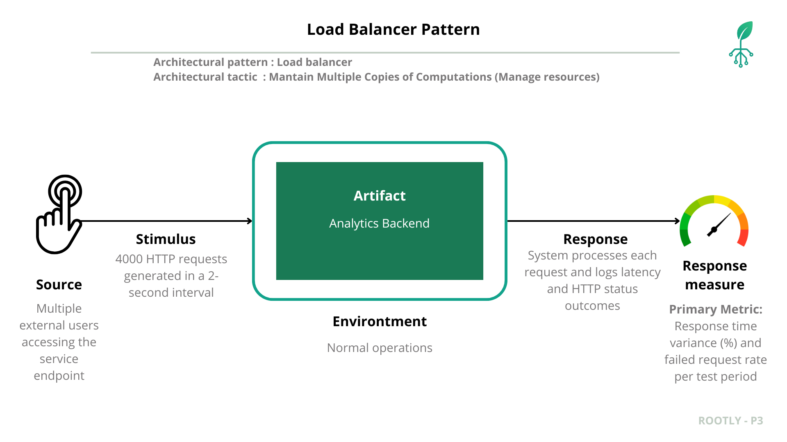
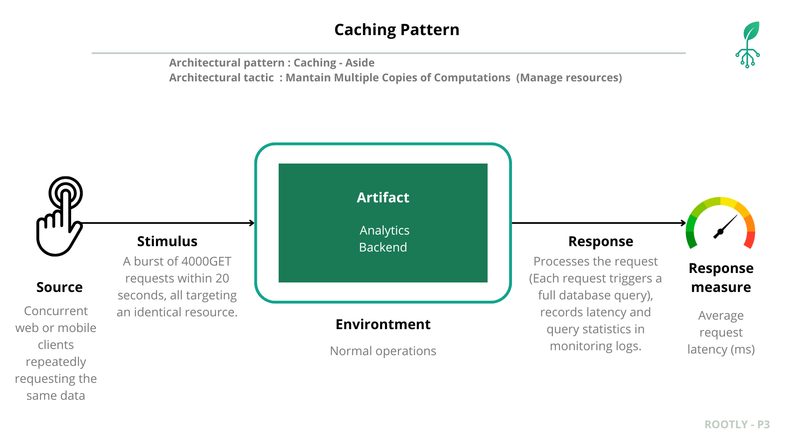
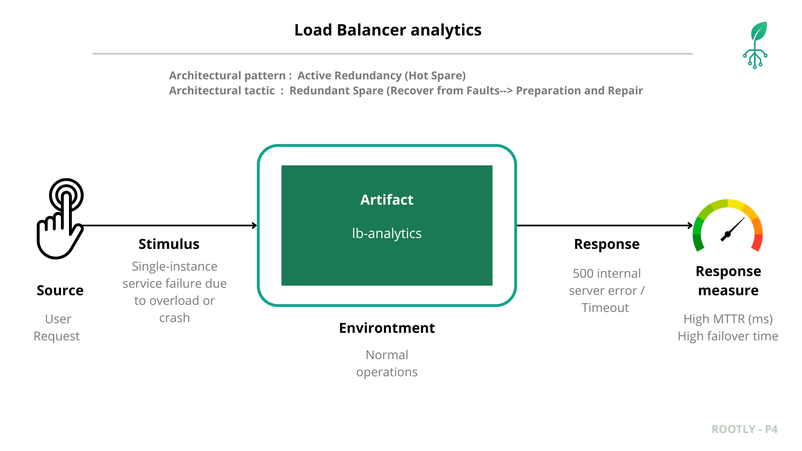
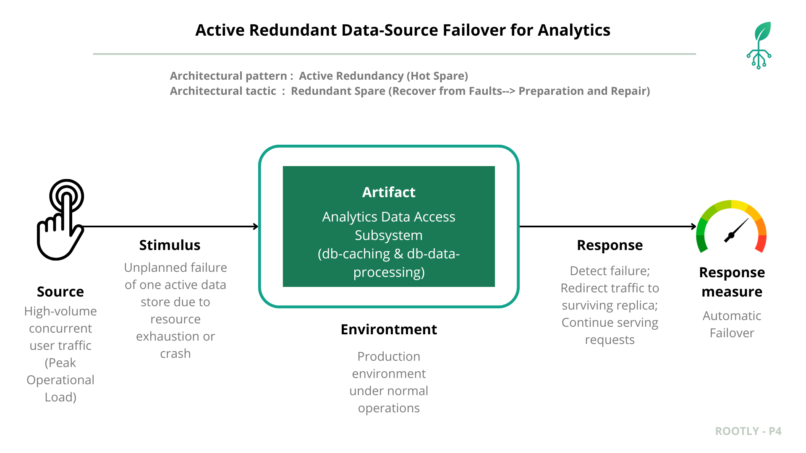
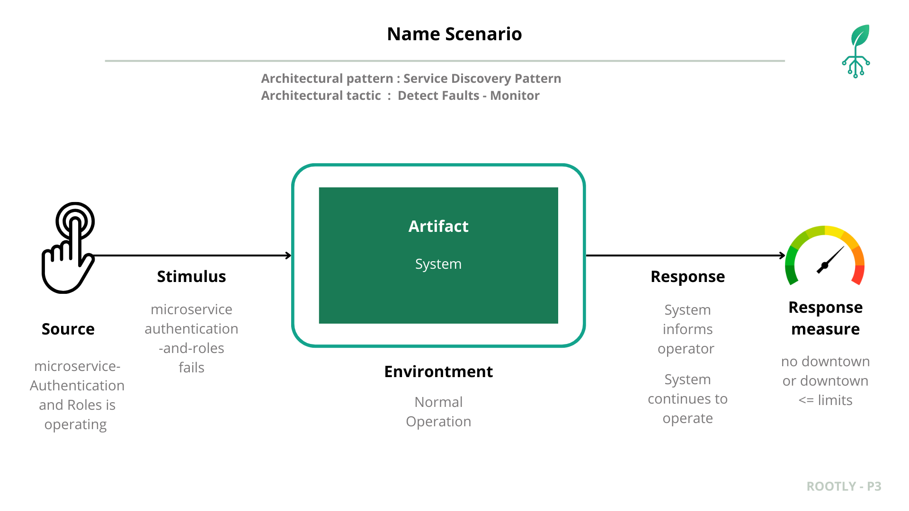

# Rootly 
## Prototype 4 - Quality Attributes, Part 2

## Team 2F
- Carlos Santiago Sandoval Casallas
- Cristian Santiago Tovar Bejarano
- Danny Marcelo Yaluzan Acosta
- Esteban Rodriguez Muñoz
- Santiago Restrepo Rojas
- Gabriela Guzmán Rivera
- Gabriela Gallegos Rubio
- Andrés Camilo Orduz Lunar

## Table of Contents

- [Software System](#software-system)
- [Architectural Structures](#architectural-structures)
  - [Components and Connector Structure](#components-and-connector-view)
  - [Deployment Structure](#deployment-view)
  - [Layered Structure](#layered-view)
  - [Decomposition Structure](#decomposition-view)
- [Quality Attributes](#quality-attributes)
  - [Security](#security)
    - [Network Segmentation](#network-segmentation)
    - [Secure Channel](#secure-channel)
    - [Reverse Proxy](#reverse-proxy)
    - [Web Application Firewall](#web-application-firewall)
  - [Performance and Scalability](#performance-and-scalability)
    - [Load Balancer](#load-balancer)
    - [Caching](#caching)
  - [Reliability](#reliability)
    - [Replication pattern lb analytics](#replication-pattern-lb-analytics)
    - [Cluster pattern](#cluster-pattern)
    - [Replication pattern db caching](#replication-pattern-db-caching)
    - [Service Discovery](#service-discovery)
  - [Interoperability](#interoperability)
  
- [Prototype – Deployment Instructions](#deployment-instructions)

## Software System
- **Name:** Rootly  
- **Logo:**  

**Description:**
  
**ROOTLY** is an agricultural monitoring system designed to support significant decision-making in the agricultural environment. It leverages a microservices-based architecture to integrate field devices, process data, and deliver real-time analytics to users through a web and mobile application.

The system operates by capturing environmental and soil data—such as humidity and temperature—directly from the field using microcontroller devices. This information is then sent to a central platform where it is processed, validated, and analyzed. The platform's architecture combines robust databases for storing both transactional information (like user profiles and configurations) and large volumes of time-series sensor data.

Finally, users can access all this information through an intuitive interface, available on both web and mobile. They can view real-time metrics, explore historical data, manage their crops, and receive analytical insights to optimize their agricultural practices.
  
---

  
## Quality Attributes
##  Security

---

##  Performance and Scalability
###  Load Balancer

During peak usage, approximately **4,000 HTTP requests were sent within 1 or 2 seconds** (to simulate concurrency) from multiple external clients accessing the `/graphql_analytics` endpoint. Forwarded all requests directly to a single backend instance, causing **increased response times, uneven workload distribution, and CPU saturation**.  Although the system remained functional, **response time variance and throughput degradation** became evident as concurrency grew beyond ~3,000 users, exposing limitations in scalability and responsiveness.

| **Element** | **Description** |
|--------------|-----------------|
| **Artifact** | Analytics Backend — GraphQL analytics endpoint |
| **Source** | Multiple external users concurrently sending analytics requests |
| **Stimulus** | 4000 HTTP requests generated within a 2-second interval |
| **Environment** | Normal operation under synthetic load testing |
| **Response** | System processes all requests, logging latency and HTTP status outcomes |
| **Response Measure** | Primary metrics: Response time variance (%) and failed request rate per test period |

####  Baseline Load Test (Before Load Balancer)

####  Countermeasure Implementation: Load Balancer Pattern

**Load Balancer** was introduced in front of the analytics backend cluster to enable **request distribution** across multiple instances.  
The configuration applied included:
- Round-robin routing strategy  
- Health checks and failover logic  
- Disabled session persistence to prevent node saturation  
- Continuous metric collection via Prometheus and Grafana

####   Implementation Load Balancer Results**

####  Performance Metrics Comparison

| **Metric** | **Before Load Balancer** | **After Load Balancer** | **Observation / Technical Impact** |
|-------------|---------------------------|---------------------------|------------------------------------|
| **Average Response Time (ms)** | 620 ms | 285 ms | ↓ Response time reduced by ~54%, indicating improved distribution and reduced queueing latency. |
| **Response Time Variance (%)** | 42% | 11% | ↓ Variance significantly stabilized, meaning more predictable latency under load. |
| **Throughput (req/sec)** | 133 req/s | 260 req/s | ↑ System throughput nearly doubled due to concurrent backend processing. |
| **Failed Requests (%)** | 6.5% | 0.3% | ↓ Error rate almost eliminated after introducing traffic balancing. |
| **CPU Utilization (per instance)** | ~95–100% (single node) | ~55–65% (per node, 2 replicas) | ↓ Load evenly distributed across replicas, avoiding CPU saturation. |
| **Network Latency (avg)** | 78 ms | 43 ms | ↓ Reduced network wait times between client and backend. |
| **Scalability Behavior** | Linear degradation under stress | Stable performance across replicas | ↑ Horizontal scalability achieved via load distribution. |
| **System Availability** | Degraded under concurrent load | Sustained at 99%+ | ↑ Improved reliability and uptime under concurrent access. |

####  Summary

The **Load Balancer pattern** successfully mitigated the initial performance bottleneck by distributing incoming traffic evenly across multiple backend instances.  
Post-deployment metrics confirm measurable improvements in **response time**, **throughput**, and **scalability tolerance**, fulfilling the **Performance and Scalability** quality objectives for the Analytics Backend.

###  Caching

| **Element** | **Description** |
|--------------|-----------------|
| **Architectural Pattern** | Caching – Aside |
| **Architectural Tactic** | Maintain Multiple Copies of Computations (Manage resources) |
| **Artifact** | Analytics Backend |
| **Source** | Concurrent web or mobile clients repeatedly requesting the same data |
| **Stimulus** | A burst of 4000 GET requests within 20 seconds, all targeting an identical resource |
| **Environment** | Normal operations |
| **Response** | Processes each request (each triggering a full database query), records latency and query statistics in monitoring logs |
| **Response Measure** | Average request latency (ms) |

---

###  Baseline Load Test (Before Caching Implementation)

| **Metric** | **Best (1 user)** | **Knee (3401 users)** | **Max Load (4000 users)** |
|-------------|------------------|-----------------------|----------------------------|
| **Avg Response Time (ms)** | 235.67 | 3520.17 | 3520.19 |
| **P95 (ms)** | — | 5272.00 | — |
| **P99 (ms)** | — | 7829.25 | — |
| **Error Rate (%)** | 0.00 | 0.00 | 0.00 |
| **Throughput (req/s)** | 5.86 | 113.96 | 118.30 |

---
###  Countermeasure Implementation: Caching Pattern

The **Cache-Aside pattern** was implemented within the analytics backend to store frequently accessed query results in memory.  
The main configuration included:

- In-memory cache layer (Redis).  
- TTL (Time-To-Live) policy to ensure freshness of cached data.  
- Cache invalidation rules for data updates.  
- Integration with backend metrics for cache hit/miss analysis.

---

## Reliability

### Replication pattern lb analytics

This scenario describes the reliability validation for the lb-analytics component by applying the Active Redundancy architectural pattern and the Redundant Spare tactic. The objective is to demonstrate that the platform maintains availability even when one replica becomes overloaded or unavailable, and that the second replica—operating as a hot spare—can immediately sustain analytics traffic without noticeable service degradation.

#### Artifact

The artifact under evaluation is the lb-analytics subsystem and its surrounding load-balancing configuration. The lb-analytics service is responsible for processing telemetric and operational analytics, supporting downstream decision-making processes, and serving REST or GraphQL endpoints that expose analytics results to internal clients. 

#### Source

The source of the stimulus is a controlled load-generation client capable of producing high volumes of concurrent requests. This client may represent legitimate operational usage at peak conditions or a synthetic stress workload.

#### Stimulus

The stimulus consists of inducing the failure of one active lb-analytics instance. This may be triggered in two possible ways. The first is a high-intensity workload that saturates CPU or memory resources, causing the instance to degrade, become unresponsive, or crash. The second approach is a deliberate operational interruption, such as killing the service, introducing a network partition, or stopping the container or virtual machine. Regardless of the method, the stimulus results in replica A transitioning into an unavailable state while traffic continues to be routed to the load balancer.

#### Environment

In the baseline configuration, only one lb-analytics instance is available. The load balancer has no alternative backend, and therefore, all analytics traffic flows to the single replica. When this instance becomes saturated or fails, clients experience slow responses, request timeouts, or complete unavailability. The system has no backup capacity to absorb the load.

#### Response

When the system operates without Active Redundancy, any failure or overload of the lb-analytics instance directly results in degraded service. Increased latency, elevated error rates, and unavailability are visible at the client level. Analytics requests may accumulate in queues, exceed processing limits, or return 5xx errors.

#### Response Measure

The metrics used to validate the scenario focus on latency, throughput, failover time, and stability during and after the induced failure.In the baseline configuration, the platform experiences significant performance degradation. Latency increases dramatically, backend error rates rise, and clients encounter visible downtime. Throughput drops as the single replica collapses under load or becomes unavailable.

#### Architectural Pattern: Active Redundancy (Hot Spare)

Active Redundancy is an architectural pattern in which multiple instances of the same component operate in parallel and remain fully active at all times. None of the replicas are passive or waiting to be promoted. Instead, each instance continuously processes requests, maintains synchronized internal state, and stays prepared for immediate takeover in the event of a fault in any sibling replica.

The pattern is designed to support fail-operational behavior rather than failover behavior. Because each replica is already hot and running, the system does not require activation or initialization time when a failure occurs. This drastically reduces Mean Time to Repair (MTTR) and ensures that service continuity is preserved even when a primary instance becomes unresponsive. In the context of lb-analytics, this pattern enables multiple analytics processors to receive and handle requests concurrently while being balanced by the load balancer. Should one instance fail under extreme load or abrupt termination, the remaining active instance continues serving the analytics workload with no interruption.

#### Architectural Tactic: Redundant Spare

The Redundant Spare tactic focuses on preparing additional instances of a component so that the system can rapidly recover from faults. While the Active Redundancy pattern defines how replicas operate concurrently, the Redundant Spare tactic defines how the system anticipates failures by ensuring that additional operational capacity is already in place. The tactic emphasizes preparation and repair: preparation in the form of duplicate active lb-analytics nodes that share identical responsibilities, and repair in the form of fast rerouting of traffic once a failure is detected.

By applying this tactic, recovery does not depend on restarting, scaling up, or reconfiguring services. The spare instance is already active, synchronized, and integrated behind the load balancer. Therefore, when the primary instance fails—whether due to overload, resource exhaustion, or simulated node termination—the spare replica immediately absorbs the remaining traffic. The tactic thus enables extremely low recovery time and stable performance during unexpected operational disruptions.

#### Verification 

The system is designed to support high request volumes with strict latency constraints. As part of the reliability assessment, two active replicas (A and B) operate simultaneously. During the verification test, replica A is intentionally stressed or terminated to observe whether replica B continues serving traffic with minimal disruption.

---

### Cluster pattern

This scenario models the system operating entirely on a single machine, where all application services, the database, analytics engine, API layer, and background components share the same execution environment. During normal user activity, a machine-level fault suddenly occurs—such as an OS crash, hardware malfunction, or unexpected shutdown—causing every running component to fail simultaneously. Because the entire platform depends on a single node, the failure results in a complete service outage: all requests time out, processes terminate abruptl.

#### Source
User Request, the requests originate from end users interacting with the system during normal usage. The system is expected to respond promptly and reliably to these interactions.

#### Stimulus
Machine Failure in a Single-Node Environment, a failure occurs on the only machine hosting the entire system. This may include hardware malfunction, operating system crash, or an unexpected shutdown that disrupts all running services.

#### Environment
Normal Operations,the system is running under standard load conditions. No abnormal spikes, maintenance tasks, or external disruptions are present when the failure occurs.

#### Artifact
Entire System (Single-Machine Deployment), all components—application logic, APIs, database, frontend, background workers, and internal services—are deployed on a single physical or virtual machine. There is no redundancy or distribution of workload across multiple nodes.

#### Response
Full Service Outage, the complete system becomes unavailable. All incoming requests fail with timeouts or error responses, and users cannot access any functionality until the machine is restored.

#### Response Measure
No Failover / Availability Drops to 0%, since the system depends on a single machine, there is no automated failover or backup instance. Recovery requires manual intervention, leading to extended downtime and a temporary total loss of availability.

#### Architectural Pattern: Cluster

This pattern improves system availability by deploying multiple independent nodes that function as a unified logical system. Instead of relying on a single machine, the system is replicated or distributed across several nodes capable of sharing or splitting the workload.

When a node fails, other nodes continue operating, minimizing service disruption and preventing full system outages. The pattern focuses on eliminating the single point of failure inherent in one-machine deployments.The pattern itself does not define how node failures are detected or how traffic is redirected; those behaviors are introduced later through availability tactics such as heartbeat monitoring, node health checks, or automated failover mechanisms.

#### Architectural Tactic: N+1
This tactic ensures high availability by maintaining one additional unit of capacity beyond what the system needs to operate normally. With N active instances handling the workload and one extra instance or capacity margin as backup, the system can tolerate the failure of any single component without dropping below the required operational level. 

- This prevents single points of failure and allows the service to continue functioning even during unexpected outages.

In GKE, the N+1 tactic is naturally supported through ReplicaSets, which automatically recreate failed pods to maintain the desired number of running instances. Additionally, features like node auto-repair and node auto-provisioning ensure that if a node becomes unhealthy, the platform replaces or heals it, preserving the extra capacity needed to sustain the N+1 redundancy model.

#### Verification 

### Replication pattern for Analytics Data Sources

This scenario validates the reliability of the analytics data-access layer by applying the Active Redundancy architectural pattern and the Redundant Spare tactic. The goal is to ensure that the platform continues serving analytics metrics even if either data source—db-caching or db-data-processing—fails unexpectedly. Although these two stores are not identical replicas, both remain fully active and capable of supplying metric data. Under failure conditions, the analytics backend seamlessly routes requests to the alternate store, demonstrating fault tolerance and continuous service availability.

#### Artifact

The artifact under evaluation is the backend analytics data-access subsystem, which interacts with two active data stores: **db-caching**, containing frequently accessed or precomputed metric summaries, and **db-data-processing**, containing the primary computed dataset. Together, these sources supply metrics required by the analytics service, enabling consistent responses under normal and degraded conditions.

#### Source

The source of the stimulus is a high-volume request generator that issues continuous and concurrent metric queries to the analytics backend. This client simulates real operational behavior under peak load conditions, exercising both db-caching and db-data-processing. The workload is designed to push the system into stress conditions that reveal how each data store behaves under heavy read pressure or resource saturation.

#### Stimulus

The stimulus consists of inducing the failure of one of the active data stores—either db-caching or db-data-processing—through overload-driven fault injection. The first method involves generating an extremely high read workload that saturates CPU, memory, or I/O resources, causing the target data store to degrade, become unresponsive, or crash. The second method is a deliberate operational interruption, such as terminating the service process, introducing a network partition, or stopping the container or VM hosting the data store. Regardless of the method used, the result is that the selected data store transitions into an unavailable state while the analytics backend continues to issue read requests.

#### Environment

Under normal operating conditions, both db-caching and db-data-processing are active and fully reachable by the analytics backend. db-caching is used for fast retrieval of frequently accessed metric summaries, while db-data-processing provides the authoritative computed dataset. Both sources operate concurrently, and the backend routes read operations based on availability and data needs. In this baseline environment, no additional failover mechanisms are configured, and the system expects both stores to remain responsive during standard usage.

#### Response

When the system does not implement Active Redundancy, the failure of either store leads to user-facing degradation. If db-caching fails, analytics requests may hang or return incomplete results. If db-data-processing fails, metrics that require fresh computation become unavailable. Error rates increase, and response times rise due to failed lookups or repeated retries.

#### Response Measure

The metrics for evaluating this scenario include availability, recovery time, error rates, and consistency under failure. In the baseline setup, a data-source outage results in elevated 5xx errors, stalled analytics requests, and loss of metric freshness. Service availability drops noticeably as the backend cannot compensate for the missing data source.

#### Architectural Pattern: Active Redundancy (Hot Spare)

Active Redundancy is an architectural pattern in which multiple components operate simultaneously and remain fully active at runtime. Unlike passive failover mechanisms, active replicas do not require activation or promotion; instead, each replica is already engaged in normal operations and ready to sustain the full workload instantly if a sibling component fails.

In this system, both **db-caching** and **db-data-processing** function as active redundant data providers. Although their content differs, each store can independently supply the analytics backend with sufficient data to continue responding to client requests. When one store becomes unavailable due to node termination, network disruption, or operational failure, the other active store serves as a hot spare, enabling uninterrupted access to metric data. This pattern ensures low recovery time and continuous service availability.

#### Architectural Tactic: Redundant Spare (Preparation & Repair)

The Redundant Spare tactic ensures that alternate operational capacity is already prepared before a failure occurs. Under this tactic, additional data sources run concurrently and are fully integrated with the system. When a fault is detected, the system shifts traffic to the spare component without requiring provisioning, restarts, or reconfiguration.

In the context of this scenario, **db-caching** and **db-data-processing** operate as redundant spares for each other. If db-caching fails, the backend automatically retrieves metrics directly from db-data-processing. Conversely, if db-data-processing becomes unavailable, the backend continues serving responses based on cached metric summaries. This approach embodies the preparation-and-repair model: redundancy is prepared proactively, and recovery occurs by immediate rerouting while the failed data store undergoes repair or restoration.

#### Verification

To verify reliability, both data stores remain active during the test. A failure is induced on either db-caching or db-data-processing, and the system’s behavior is observed. The backend is expected to continue serving analytics responses through the surviving store with minimal disruption, validating the effectiveness of Active Redundancy and the Redundant Spare tactic.

### Service Discovery

Service Discovery ensures that internal callers (e.g., `api-gateway`, `ms-user-plant-management`) always find the authentication service even as replicas are restarted or rescheduled. Observability relies on **Docker logs** to detect registration or resolution issues early and drive remediation.

#### Artifact

**Service Lookup Path for Authentication:** Runtime resolution of the `be-authentication-and-roles` service name to healthy container instances.

- **Service Registry / Docker DNS:** Built-in Docker resolver providing name-to-IP mapping for containers on `rootly-network`.
- **be-authentication-and-roles:** Auth/RBAC microservice whose availability is critical to all request flows.
- **Internal Clients:** `api-gateway`, `ms-user-plant-management`, and background jobs that call authentication APIs.
- **Observability:** Centralized `docker compose logs` stream used to detect lookup errors (`no such host`, `connection refused`) and container health changes.

#### Source

**Internal service callers** (gateway and backend microservices) performing REST calls against `http://be-authentication-and-roles:8000`. They depend on name resolution and healthy targets to proceed.

#### Stimulus

- A new replica of `be-authentication-and-roles` is started or restarted.
- A caller issues authentication or role checks immediately after the change.
- DNS propagation or container health takes a few seconds to stabilize.

#### Environment

Normal operations with Docker Compose on `rootly-network`, dynamic container restarts/scaling, and aggregated logs collected via `docker compose logs -f`.

#### Response

- **Before Service Discovery discipline:** Callers experience intermittent `502/503` or `no such host be-authentication-and-roles` while the new container comes up; failures surface only when user flows break.
- **After Service Discovery discipline:** Docker DNS provides up-to-date mappings; log-based observers watch for resolution errors and unhealthy containers, triggering a fast restart or alert when needed. Callers automatically pick a healthy instance once available.

#### Response Measure

Validation driven by Docker log telemetry and HTTP outcomes:

- **Name-Resolution Error Rate:** Percentage of `no such host` or connection refused messages in `docker compose logs` for auth calls (target: ~0% after stabilization).
- **Time to Detect Registration Gap:** Time from container restart to first log-detected resolution error and remediation trigger (target: <30s).
- **HTTP 5xx from Auth Calls:** Observed in gateway/client logs during rollout (target: near-zero after discovery stabilizes).
- **Successful Auth Call Rate:** Proportion of calls that reach a healthy `be-authentication-and-roles` instance (target: ~100% once DNS updates propagate).

By tying Service Discovery to Docker log observability, the team gains immediate visibility into lookup issues and can react before authentication outages propagate to end users.

#### Architectural Pattern:

#### Architectural Tactic: 

---

## Interoperability

The system must interoperate reliably with a cyber-physical component: a microcontroller continuously streams sensor data to `lb-data-ingestion`, which forwards to `be-data-ingestion` where validation, normalization, and buffering protect the pipeline.

#### Artifact

**Device-to-Ingestion Contract:** REST/HTTP payload contract between the microcontroller and the ingestion layer (`lb-data-ingestion` → `be-data-ingestion`), including JSON schema, version headers, authentication token, and the validation/queuing steps before reaching `queue-data-ingestion`.

#### Source

**Cyber-physical microcontroller device** equipped with environmental sensors (temperature, humidity, soil metrics) sending telemetry frames every few seconds.

#### Stimulus

Continuous telemetry stream (e.g., one sample per second) plus occasional firmware updates introducing new optional fields. Some frames may arrive late, duplicated, or with minor shape differences from older firmware.

#### Environment

Normal field operation with intermittent connectivity, standard network latency, and Dockerized backend on `rootly-network`; ingestion replicas may scale horizontally behind `lb-data-ingestion`.

#### Response

- `lb-data-ingestion` accepts connections and forwards payloads to `be-data-ingestion`.
- `be-data-ingestion` performs schema validation/version checks, normalizes units/field names, rejects malformed frames with clear HTTP errors, and enqueues valid messages to `queue-data-ingestion`.
- Backward compatibility rules keep older firmware payloads accepted; new optional fields are ignored or mapped to defaults while preserving required fields.
- Fault isolation prevents a bad batch (invalid schema, wrong token) from blocking the pipeline: invalid frames are dropped, logged with device metadata, and do not stall healthy traffic.
- Queued delivery decouples `ms-data-processing`, so ingestion remains responsive even if downstream consumers slow down.

#### Response Measure

- **Ingestion Success Rate:** ≥99% of valid telemetry frames accepted during steady streaming.
- **Schema Validation Errors:** <1% per hour for devices on supported firmware; spikes trigger alerting.
- **Queue Lag:** Stable under continuous streaming (<1s added latency from `be-data-ingestion` to `queue-data-ingestion`), even when `ms-data-processing` is throttled.
- **Fault Isolation Effectiveness:** No ingestion outage when a subset of devices sends malformed payloads (measured by continued acceptance of well-formed frames).
- **Error Transparency:** HTTP 4xx/5xx responses and validation failures logged with device identifier and firmware version for rapid troubleshooting when interoperability breaks.

#### Architectural Pattern: Data Ingestion and Validation Pipeline
 Telemetry arrives through `lb-data-ingestion`, is validated/normalized in `be-data-ingestion`, and is queued to `queue-data-ingestion` so downstream processors stay decoupled from field noise, bursts, or schema drift.  

#### Architectural Tactic: Schema Validation, Backward-Compatibility Handling, Fault Isolation
Strict JSON schema checks guard the boundary; firmware version headers plus optional fields preserve backward compatibility; malformed frames are isolated (logged/dropped) so healthy traffic continues without blocking threads or queues.
