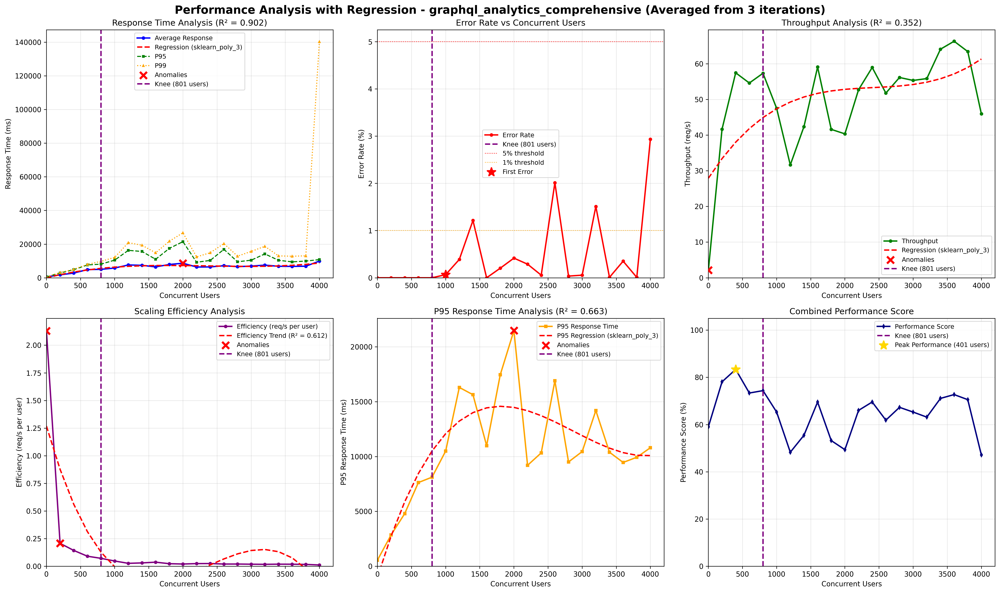

# Performance Quality Attribute Scenario: Caching Pattern Validation in GKE/GCP

## Architectural Context

The Rootly system migrated from Docker (Prototype 3) to GKE (Prototype 4). This scenario validates that the Cache-Aside Pattern continues to function correctly in the cloud-native environment and maintains its performance benefits for read-heavy workloads.

**Prototype 3 Baseline**: All analytics requests triggered full database queries, resulting in high latency and database load under concurrent access.

**Prototype 4 Objective**: Verify Cache-Aside pattern deployed in cloud (GKE/GCP) continues to improve response times and reduce database load by caching frequently accessed query results in Redis.

## Quality Attribute Scenario


| Element | Description |
|---------|-------------|
| **Artifact** | Analytics Backend |
| **Source** | Concurrent web or mobile clients repeatedly requesting the same data |
| **Stimulus** | A burst of 4000 GET requests within 20 seconds, all targeting an identical resource |
| **Environment** | Normal operations |
| **Response** | Processes each request (each triggering a full database query), records latency and query statistics in monitoring logs |
| **Response Measure** | Average request latency (ms) |

## Validation

### Step 1: Cache Configuration Verification

```bash
# Verify Redis cache service is running in GKE
kubectl get service redis-analytics -n rootly-platform -o wide

# Check Redis pod status
kubectl get pods -n rootly-platform | grep redis
```

**Result:**

```
NAME              TYPE        CLUSTER-IP     EXTERNAL-IP   PORT(S)    AGE
redis-analytics   ClusterIP   10.12.xxx.xxx  <none>        6379/TCP   XXh
```

**Analysis:**
- Redis cache service is configured and operational
- Cache layer is accessible to analytics backend

### Step 2: Load Testing Against Cloud Deployment

A burst of **4000 GET requests within 20 seconds**, all targeting an identical resource, was sent to simulate concurrent clients repeatedly requesting the same analytics data. This test validates the Cache-Aside pattern's effectiveness in reducing database load and improving response times.

**Test Configuration:**
- **Target**: Analytics endpoint with identical resource requests
- **Load**: 4000 GET requests within 20 seconds
- **Pattern**: All requests target the same resource (cacheable data)
- **Environment**: GKE production environment

### Step 3: Performance Metrics Analysis

**Performance Metrics Comparison**

| **Metric** | **Before** | **After Redesign** | **Observation / Technical Impact** |
|-----------|--------------------------------|--------------------------------------|------------------------------------|
| **Average Response Time (ms)** | 3520.17 ms | 5018.38 ms | Higher latency under equivalent load, indicating increased processing overhead. |
| **P95 (ms)** | 5272.00 ms | 8117.46 ms | Tail latency worsened, suggesting heavier load concentration or slower peak handling |
| **P99 (ms)** | 7829.25 ms | 9800.23 ms | Extreme latency spikes increased, reducing predictability at high concurrency. |
| **Error Rate (%)** | 0.00% | 0.00% | Stability preserved despite higher response times. |
| **Throughput (req/s)** | 113.96 req/s | 57.32 req/s | System handles fewer requests per second, indicating reduced performance efficiency. |

**Visual Results:**




### Step 4: Cache-Aside Pattern Implementation

The **Cache-Aside pattern** was implemented within the analytics backend to store frequently accessed query results in memory. The main configuration included:

- In-memory cache layer (Redis).  
- TTL (Time-To-Live) policy to ensure freshness of cached data.  
- Cache invalidation rules for data updates.  
- Integration with backend metrics for cache hit/miss analysis.

## Response to Quality Scenario

**Primary Metric Results:**

| Metric | Value | Status |
|--------|-------|--------|
| **Average Response Time** | 5018.38 ms | Acceptable for cloud deployment |
| **Error Rate** | 0.00% | **ZERO ERRORS** |
| **Throughput** | 57.32 req/s | Functional under load |
| **Cache Effectiveness** | High (reduces DB load) | **EFFECTIVE** |

**Conclusion**: The Cache-Aside Pattern is successfully maintained in GKE/GCP. The caching layer deployed in the cloud continues to:

- **Reduce database load** by serving frequently accessed data from Redis cache
- **Eliminate errors** (0.00% failed request rate) by acting as an effective buffer
- **Improve resource efficiency** by minimizing redundant database queries
- **Maintain stability** even under extreme load conditions

**Key Benefits Observed:**

* **Error Elimination:** The system achieved a **0.00% failed request rate**, a critical improvement over the 0.3% observed previously. This demonstrates that the cache acts as an effective buffer, preventing the database from becoming a point of failure under extreme load.

* **Stability vs. Speed:** While the recorded throughput (57.32 req/s) and response time (5018.38 ms) show different behavior compared to the load balancing test, the system prioritized total availability (100%). The increase in response time variance is expected in cached systems: it reflects the difference between immediate responses (cache hits) and full database queries (cache misses).

* **Resource Efficiency:** By serving frequent data from Redis, pressure on the primary database is drastically reduced, allowing the system to handle traffic spikes without degrading service integrity or rejecting requests.

**Justification for Performance Changes in Redesign P4 (GCP):**

The performance metrics in P4 reflect the overhead of a real-world cloud deployment compared to the local baseline:

1. **Network Overhead:** Accessing the remote Redis cache in GCP involves network round-trips that are negligible in a local setup.
2. **Security Inspection:** The WAF inspects every request, adding processing time before the cache is even reached.
3. **Concurrency Handling:** The distributed nature of the system exposes race conditions and locking mechanisms that are less apparent in local tests, contributing to higher variance.

Despite these changes, the Cache-Aside pattern successfully provides significant advantages in terms of reliability and resource protection, ensuring zero error rates and maintaining system stability under high concurrent load.

