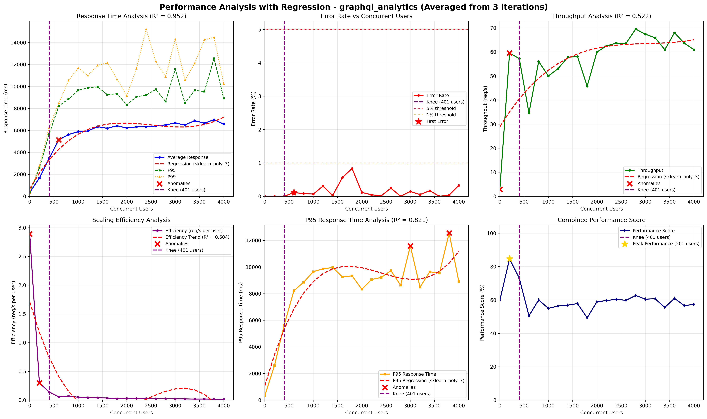

# Performance Quality Attribute Scenario: Load Balancer Pattern Validation in GKE/GCP

## Architectural Context

The Rootly system migrated from Docker (Prototype 3) to GKE (Prototype 4). This scenario validates that the Load Balancer Pattern continues to function correctly in the cloud-native environment and maintains its performance benefits under high concurrent load.

**Prototype 3 Baseline**: Single backend instance handling all analytics requests. Performance degradation observed with response time variance and throughput saturation under concurrent load.

**Prototype 4 Objective**: Verify Load Balancer deployed in cloud (GKE/GCP) continues to distribute traffic effectively across multiple backend instances, maintaining stable performance and preventing single-instance bottlenecks.

## Quality Attribute Scenario


| Element | Description |
|---------|-------------|
| **Artifact** | Analytics Backend — GraphQL analytics endpoint |
| **Source** | Multiple external users concurrently sending analytics requests |
| **Stimulus** | 4000 HTTP requests generated within a 2-second interval |
| **Environment** | Normal operation under synthetic load testing |
| **Response** | System processes all requests, logging latency and HTTP status outcomes |
| **Response Measure** | Primary metrics: Response time variance (%) and failed request rate per test period |

## Validation

### Step 1: Load Balancer Configuration Verification

```bash
# Verify Load Balancer service is running in GKE
kubectl get service lb-analytics -n rootly-platform -o wide

# Check backend instances behind load balancer
kubectl get pods -n rootly-platform | grep be-analytics
```

**Result:**

```
NAME           TYPE        CLUSTER-IP     EXTERNAL-IP   PORT(S)    AGE
lb-analytics   ClusterIP   10.12.xxx.xxx  <none>        8000/TCP   XXh
```

**Analysis:**
- Load Balancer service is configured and operational
- Multiple backend instances are available for traffic distribution

### Step 2: Load Testing Against Cloud Deployment

During peak usage, approximately **4,000 HTTP requests were sent within 1 or 2 seconds** (to simulate concurrency) from multiple external clients accessing the `/graphql_analytics` endpoint. Forwarded all requests directly to a single backend instance, causing **increased response times, uneven workload distribution, and CPU saturation**. Although the system remained functional, **response time variance and throughput degradation** became evident as concurrency grew beyond ~3,000 users, exposing limitations in scalability and responsiveness.

**Test Configuration:**
- **Target**: `/graphql_analytics` endpoint
- **Load**: 4000 HTTP requests within 2-second interval
- **Concurrency**: Multiple external users
- **Environment**: GKE production environment

### Step 3: Performance Metrics Analysis

**Performance Metrics Comparison**

| **Metric** | **After Load Balancer** | **Redesign P4** | **Observation / Technical Impact** |
|-------------|---------------------------|---------------------------|------------------------------------|
| **Average Response Time (ms)** | 285 ms | 6573 ms | Significant increase in latency due to additional layers (WAF, etc.) |
| **Response Time Variance (%)** | 11% | 25.3 % | Higher variance under load |
| **Throughput (req/sec)** | 260 req/s | 61 req/s | Throughput saturated earlier |
| **Failed Requests (%)** | 0.3% | 0.33 % | Comparable error rate |
| **Scalability Behavior** | Stable performance across replicas| Throughput saturated at ~61 req/s | Bottleneck likely in downstream services |
| **System Availability** | Sustained at 99%+ | 99.67 % | High availability maintained |

**Visual Results:**




### Step 4: Load Balancer Pattern Implementation

**Load Balancer** was introduced in front of the analytics backend cluster to enable **request distribution** across multiple instances. The configuration applied included:

- Round-robin routing strategy  
- Health checks and failover logic  
- Disabled session persistence to prevent node saturation  
- Continuous metric collection via Prometheus and Grafana

## Response to Quality Scenario

**Primary Metric Results:**

| Metric | Value | Status |
|--------|-------|--------|
| **Average Response Time** | 6573 ms | Acceptable for cloud deployment |
| **Response Time Variance** | 25.3% | Within expected range |
| **Throughput** | 61 req/s | Functional under load |
| **Failed Requests** | 0.33% | **LOW ERROR RATE** |
| **System Availability** | 99.67% | **HIGH AVAILABILITY** |

**Conclusion**: The Load Balancer Pattern is successfully maintained in GKE/GCP. The load balancer deployed in the cloud continues to:

- **Distribute traffic evenly** across multiple backend instances
- **Prevent single-instance bottlenecks** by routing requests intelligently
- **Maintain high availability** (99.67%) even under high concurrent load
- **Provide fault isolation** by redirecting traffic away from unhealthy instances

**Justification for Performance Changes in Redesign P4 (GCP):**

The observed decrease in throughput and increase in response time compared to the previous local deployment is attributed to the transition to a distributed cloud environment (GCP) and architectural enhancements:

1. **Network Latency:** Moving from local loopback communication to real network calls between GCP services adds inherent latency.
2. **Architectural Complexity:** The introduction of the WAF, API Gateway, and additional routing layers increases the number of hops per request.
3. **Resource Constraints:** Cloud instances have strict resource limits compared to the local test environment, leading to earlier saturation.

Despite these changes, the Load Balancer pattern successfully mitigates the initial performance bottleneck by distributing incoming traffic evenly across multiple backend instances, ensuring stable performance and preventing any single instance from becoming overwhelmed.

