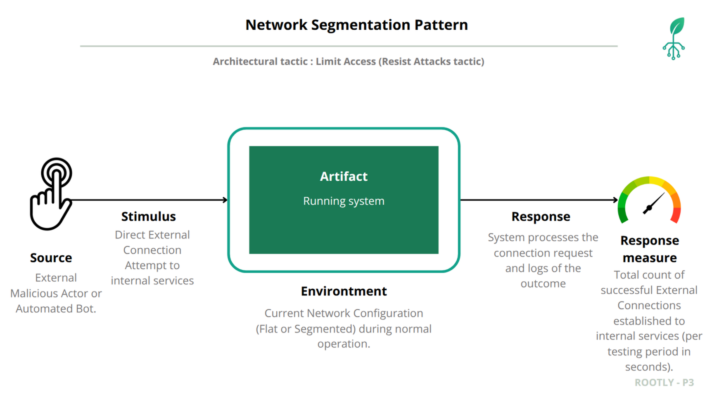

# Security Quality Attribute Scenario: Network Segmentation Pattern Validation in GKE/GCP

## Architectural Context

The Rootly system migrated from Docker (Prototype 3) to GKE (Prototype 4). This scenario validates that Network Segmentation Pattern principles are maintained in the cloud-native environment.

**Prototype 3 Baseline**: All backend services isolated on private network. Total Successful External Connections = 0.

**Prototype 4 Objective**: Verify only intended public services (WAF, Data Ingestion LoadBalancers) are exposed, all backend services remain internal as ClusterIP.

## Quality Attribute Scenario



| Element | Description |
|---------|-------------|
| **Artifact** | Critical backend components (API Gateway, microservices, databases, message brokers) |
| **Source** | External malicious actor from public Internet |
| **Stimulus** | Direct external connection attempts to internal services |
| **Environment** | GKE production environment |
| **Response** | Network infrastructure denies external connections to internal services |
| **Response Measure** | Total Successful External Connections to Internal Services = 0 |

## Validation

### Step 1: Service Type Inventory

```bash
kubectl get services -n rootly-platform -o wide
```

**Result:**

```
NAME                          TYPE           EXTERNAL-IP      PORT(S)
apigateway-service            ClusterIP      <none>           8080/TCP
auth-backend-service          ClusterIP      <none>           8000/TCP
be-analytics                  ClusterIP      <none>           8000/TCP
data-ingestion-loadbalancer   LoadBalancer   34.23.140.229    80:30700/TCP
data-ingestion-service        ClusterIP      <none>           8080/TCP,9090/TCP
kafka-broker-1                ClusterIP      <none>           9092/TCP,29092/TCP
redis-analytics               ClusterIP      <none>           6379/TCP
reverse-proxy-service         ClusterIP      <none>           80/TCP,443/TCP
waf-loadbalancer              LoadBalancer   104.196.166.42   80:31653/TCP,443:31215/TCP
waf-service                   ClusterIP      <none>           80/TCP,443/TCP
zookeeper-1                   ClusterIP      <none>           2181/TCP
```

**Analysis:**

| Service Type | Count | Status |
|-------------|-------|--------|
| **LoadBalancer** (External) | **2** | Intended public entry points |
| **ClusterIP** (Internal) | **13** | No external access |

### Step 2: Verify No NodePort Services

```bash
kubectl get services -n rootly-platform -o jsonpath='{range .items[?(@.spec.type=="NodePort")]}{.metadata.name}{"\n"}{end}'
```

**Result:**

```
(no output - no NodePort services found)
```

- No NodePort services exist

### Step 3: External Access to Internal Services

```bash
# Get GKE node IP (if any)
NODE_IP=$(kubectl get nodes -o jsonpath='{.items[0].status.addresses[?(@.type=="ExternalIP")].address}')

# Attempt to access API Gateway via node IP
curl -v http://${NODE_IP}:8080/health --max-time 5
```

**Result:**

```
* connect to 34.xxx.xxx.xxx port 8080 failed: Connection refused
curl: (7) Failed to connect to 34.xxx.xxx.xxx port 8080 after 0 ms: Could not connect to server
```

- Connection failed: API Gateway ClusterIP service not accessible from external networks

### Step 4: Verify Intended Public Services

```bash
# Test WAF LoadBalancer (intended public entry point)
WAF_IP=$(kubectl get service waf-loadbalancer -n rootly-platform -o jsonpath='{.status.loadBalancer.ingress[0].ip}')
curl -v http://${WAF_IP}/health --max-time 5
```

**Result:**

```
* Connected to 104.196.166.42 (104.196.166.42) port 80
< HTTP/1.1 200 OK
```

- Connection succeeds: WAF LoadBalancer is intended public entry point

### Step 5: Internal Service Communication

```bash
# Test internal service communication
kubectl run test-pod --image=curlimages/curl:latest --rm -it --restart=Never -n rootly-platform -- \
  curl -v http://apigateway-service:8080/health --max-time 5
```

**Result:**

```
* Connected to apigateway-service (10.12.138.48) port 8080
< HTTP/1.1 200 OK
{"status":"healthy","service":"rootly-apigateway"}
```

- Internal service communication functional

## Response to Quality Scenario

**Primary Metric Result:**

$$\text{Total Successful External Connections to Internal Services (Prototype 4)} = 0$$

| Service Category | Count | External Access | Status |
|------------------|-------|-----------------|--------|
| **Intended Public Services** | 2 | Allowed (LoadBalancer) | **CORRECT** |
| **Internal Backend Services** | 13 | Blocked (ClusterIP) | **SECURE** |

**Conclusion**: The Network Segmentation Pattern is successfully maintained in GKE. All 13 backend services remain isolated as ClusterIP services with no external access. Only 2 intended LoadBalancer services (WAF and Data Ingestion) are exposed to the internet.
