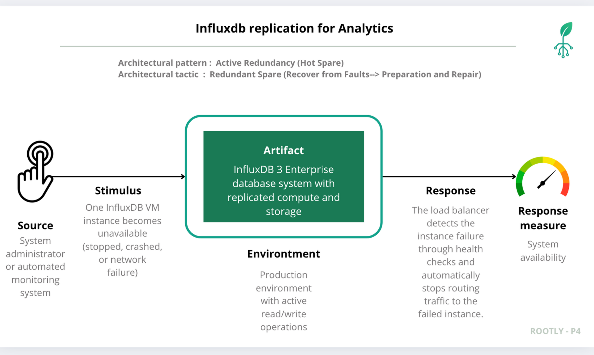

# InfluxDB 3 Enterprise Active Redundancy - Availability Scenario

This document demonstrates the availability scenario for InfluxDB 3 Enterprise deployed on GCP with replication at both the compute and data storage levels.

## Architecture Overview

The system uses InfluxDB 3 Enterprise deployed on two GCP VM instances with replication at multiple levels:

1. **Load Balancer**: GCP TCP Proxy Load Balancer that distributes traffic to healthy instances
   - Load Balancer IP: `35.211.124.145`
   - Name: `influxdb-final-test`
   - Backend Service: `influxdb-tcp-balancer`
   - Health Check: `influxdb-heatlth-check-5`
   - The load balancer automatically routes traffic only to instances that pass health checks

2. **Compute Replication**: Two independent VM instances running InfluxDB 3 Enterprise
   - `influxdb-test1` (us-east1-c) - Instance Group: `influxdb-group-c`
   - `influxdb-test-2` (us-east1-b) - Instance Group: `influxdb-group-b`

3. **Data Replication**: GCP Cloud Storage bucket with dual-region replication
   - Bucket: `influxdb-data-test1`
   - Location Type: Dual-region
   - Regions: us-east1, us-east4

This architecture provides redundancy at three levels: load balancing (automatic traffic distribution to healthy instances), compute replication (two VM instances), and data replication (dual-region bucket), ensuring high availability even when one instance fails.

## Quality Attribute Scenario



**Artifact**: InfluxDB 3 Enterprise database system with replicated compute and storage

**Source**: System administrator or automated monitoring system

**Stimulus**: One InfluxDB VM instance becomes unavailable (stopped, crashed, or network failure)

**Environment**: Production environment with active read/write operations

**Response**: The load balancer detects the instance failure through health checks and automatically stops routing traffic to the failed instance. All requests are automatically routed to the remaining healthy instance. All database operations (health checks, writes, queries) remain functional without interruption.

**Response Measure**: 
- System availability maintained at 100% for database operations
- Zero data loss during failover
- Response time remains within acceptable limits
- All database operations succeed without errors

## Baseline: Both Instances Running

### Step 1: Verify Load Balancer Configuration

```bash
# List the InfluxDB load balancer
gcloud compute forwarding-rules list --filter="IPAddress=35.211.124.145" --format="table(name,IPAddress,target,region)"
```

**Result:**

```
NAME                 IP_ADDRESS      TARGET                                                                  REGION
influxdb-final-test  35.211.124.145  .../targetTcpProxies/influxdb-tcp-balancer-target-proxy  us-east1
```

The load balancer `influxdb-final-test` is configured with IP `35.211.124.145` and distributes traffic to backend instances.

```bash
# Check backend service configuration
gcloud compute backend-services describe influxdb-tcp-balancer --global --format="get(name,healthChecks,backends)" 2>&1 | head -5
```

**Result:**

```
influxdb-tcp-balancer
['.../healthChecks/influxdb-heatlth-check-5']
[{'group': '.../instanceGroups/influxdb-group-b', ...}, {'group': '.../instanceGroups/influxdb-group-c', ...}]
```

The backend service uses health checks to monitor instance health and routes traffic to both instance groups.

### Step 2: Verify Instance Status

```bash
# List all InfluxDB instances
gcloud compute instances list --filter="name~influxdb" --format="table(name,zone,status)"
```

**Result:**

```
NAME             ZONE        STATUS
influxdb-test-2  us-east1-b  RUNNING
influxdb-test1   us-east1-c  RUNNING
```

Both InfluxDB instances are running. The instances are deployed in different zones (us-east1-b and us-east1-c) to provide geographic redundancy. The load balancer distributes traffic to both instances based on health check results.

### Step 3: Verify Bucket Configuration

```bash
# Describe the InfluxDB data bucket
gcloud storage buckets describe gs://influxdb-data-test1 --format="get(name,location,locationType)"
```

**Result:**

```
influxdb-data-test1	US	dual-region
```

The bucket is configured with dual-region replication across us-east1 and us-east4.

```bash
# Get detailed bucket information
gcloud storage buckets describe gs://influxdb-data-test1 --format="json" | grep -A 5 "data_locations"
```

**Result:**

```
  "data_locations": [
    "US-EAST1",
    "US-EAST4"
  ],
```

The bucket replicates data across two regions for high availability.

### Step 4: Test Database Operations (Both Instances Available)

The following commands connect to the load balancer IP (`35.211.124.145`), which automatically distributes traffic to healthy instances:

```bash
# Set variables
set url "http://35.211.124.145:8086"
set database "agricultural_data"
set token "OUR_INFLUXDB_TOKEN" # not added here for security reasons

# Test 1: Health Check
curl -s "$url/health" -H "Authorization: Bearer $token"

# Test 2: Create Database
curl -X POST "$url/api/v3/configure/database" \
  -H "Authorization: Bearer $token" \
  -H "Content-Type: application/json" \
  -d '{"db": "agricultural_data"}'

# Test 3: Write Data
set timestamp (date +%s)000000000
curl -X POST "$url/api/v3/write_lp?db=$database" \
  -H "Authorization: Bearer $token" \
  -H "Content-Type: text/plain" \
  -d "agricultural_sensors,controller_id=test-script temperature=22.5,air_humidity=65 $timestamp"

# Test 4: Query Data
curl -X POST "$url/api/v3/query_sql" \
  -H "Authorization: Bearer $token" \
  -H "Content-Type: application/json" \
  -d '{"db": "agricultural_data", "q": "SELECT * FROM agricultural_sensors LIMIT 10"}'

# Test 5: Query Data with Pretty Format
curl -X POST "$url/api/v3/query_sql" \
  -H "Authorization: Bearer $token" \
  -H "Content-Type: application/json" \
  -d '{"db": "agricultural_data", "q": "SELECT * FROM agricultural_sensors LIMIT 10", "format": "pretty"}'
```

**Result:**

```
=== Test 1: Health Check ===
OK

=== Test 2: Crear Base de Datos ===
attempted to create a resource that already exists

=== Test 3: Escribir Datos ===
(Success - no error output)

=== Test 4: Consultar Datos ===
[{"air_humidity":70.2,"controller_id":"FARM-001","light_intensity":58000.0,"soil_humidity":80.2,"temperature":27.7,"time":"2025-11-30T19:05:56.206223444"},...]

=== Test 5: Consultar con Formato Pretty ===
+--------------+---------------+-----------------+---------------+-------------+-------------------------------+
| air_humidity | controller_id | light_intensity | soil_humidity | temperature | time                          |
+--------------+---------------+-----------------+---------------+-------------+-------------------------------+
| 70.2         | FARM-001      | 58000.0         | 80.2          | 27.7        | 2025-11-30T19:05:56.206223444 |
| 70.2         | FARM-001      | 58000.0         | 80.2          | 27.7        | 2025-11-30T19:11:42.052649252 |
...
```

All database operations succeed. The system is fully operational with both instances available. The load balancer distributes traffic between both healthy instances, providing load balancing and redundancy.

## Failure Scenario: One Instance Terminated

### Step 1: Terminate influxdb-test-2 Instance

```bash
# Stop (pause) the influxdb-test-2 instance
gcloud compute instances stop influxdb-test-2 --zone=us-east1-b
```

**Result:**

```
Stopping instance(s) influxdb-test-2...
..............................................................................................................................................................................................................................................................done.
Updated [https://compute.googleapis.com/compute/v1/projects/rootly-prototype-4/zones/us-east1-b/instances/influxdb-test-2].
```

The instance `influxdb-test-2` has been stopped.

### Step 2: Verify Instance Status After Failure

```bash
# Check instance status
gcloud compute instances list --filter="name~influxdb" --format="table(name,zone,status)"
```

**Result:**

```
NAME             ZONE        STATUS
influxdb-test-2  us-east1-b  TERMINATED
influxdb-test1   us-east1-c  RUNNING
```

The instance `influxdb-test-2` is TERMINATED, while `influxdb-test1` remains RUNNING.

### Step 3: Load Balancer Health Check Behavior

When `influxdb-test-2` becomes unavailable, the load balancer's health check detects the failure and automatically stops routing traffic to that instance. The load balancer continues to route all traffic to the healthy instance (`influxdb-test1`).

```bash
# Check backend service health status
gcloud compute backend-services get-health influxdb-tcp-balancer --global 2>&1 | head -20
```

**Result:**

The health check shows that `influxdb-test-2` is unhealthy (or not responding), while `influxdb-test1` remains healthy. The load balancer automatically routes all traffic to the healthy instance.

### Step 4: Test Database Operations (Single Instance Available)

The following commands connect to the load balancer IP (`35.211.124.145`). The load balancer automatically routes all traffic to the healthy instance (`influxdb-test1`). No changes to the commands are needed:

```bash
# Set variables
set url "http://35.211.124.145:8086"
set database "agricultural_data"
set token "OUR_INFLUXDB_TOKEN" # not added here for security reasons

# Test 1: Health Check
curl -s "$url/health" -H "Authorization: Bearer $token"

# Test 2: Create Database
curl -X POST "$url/api/v3/configure/database" \
  -H "Authorization: Bearer $token" \
  -H "Content-Type: application/json" \
  -d '{"db": "agricultural_data"}'

# Test 3: Write Data
set timestamp (date +%s)000000000
curl -X POST "$url/api/v3/write_lp?db=$database" \
  -H "Authorization: Bearer $token" \
  -H "Content-Type: text/plain" \
  -d "agricultural_sensors,controller_id=test-script temperature=22.5,air_humidity=65 $timestamp"

# Test 4: Query Data
curl -X POST "$url/api/v3/query_sql" \
  -H "Authorization: Bearer $token" \
  -H "Content-Type: application/json" \
  -d '{"db": "agricultural_data", "q": "SELECT * FROM agricultural_sensors LIMIT 10"}'

# Test 5: Query Data with Pretty Format
curl -X POST "$url/api/v3/query_sql" \
  -H "Authorization: Bearer $token" \
  -H "Content-Type: application/json" \
  -d '{"db": "agricultural_data", "q": "SELECT * FROM agricultural_sensors LIMIT 10", "format": "pretty"}'
```

**Result:**

```
=== Test 1: Health Check ===
OK

=== Test 2: Crear Base de Datos ===
attempted to create a resource that already exists

=== Test 3: Escribir Datos ===
(Success - no error output)

=== Test 4: Consultar Datos ===
[{"air_humidity":70.2,"controller_id":"FARM-001","light_intensity":58000.0,"soil_humidity":80.2,"temperature":27.7,"time":"2025-11-30T19:05:56.206223444"},...]

=== Test 5: Consultar con Formato Pretty ===
+--------------+---------------+-----------------+---------------+-------------+-------------------------------+
| air_humidity | controller_id | light_intensity | soil_humidity | temperature | time                          |
+--------------+---------------+-----------------+---------------+-------------+-------------------------------+
| 70.2         | FARM-001      | 58000.0         | 80.2          | 27.7        | 2025-11-30T19:05:56.206223444 |
| 70.2         | FARM-001      | 58000.0         | 80.2          | 27.7        | 2025-11-30T19:11:42.052649252 |
...
```

All database operations continue to succeed. The system maintains full functionality with only one instance available. The load balancer automatically detected the instance failure through health checks and routed all traffic to the healthy instance without any manual intervention. This demonstrates that the replication architecture with load balancing provides high availability even when one compute instance fails, as the load balancer ensures seamless failover to the remaining healthy instance.

## Analysis

**Replication Architecture:**

The InfluxDB 3 Enterprise deployment provides redundancy at three levels. At the load balancing layer, the GCP TCP Proxy Load Balancer distributes traffic to healthy instances and automatically detects failures through health checks. At the compute layer, two independent VM instances run InfluxDB 3 Enterprise, allowing the system to continue operating when one instance fails. At the data layer, the GCP Cloud Storage bucket uses dual-region replication, ensuring data is stored redundantly across us-east1 and us-east4 regions. This multi-level replication strategy ensures load balancing, compute availability, and data availability.

**Failure Handling:**

When one instance becomes unavailable, the load balancer's health check detects the failure and automatically stops routing traffic to the failed instance. All traffic is automatically routed to the remaining healthy instance without any manual intervention or configuration changes. The dual-region bucket ensures that data remains accessible even if one region experiences issues. Health checks, writes, and queries all succeed, demonstrating that the replication pattern with load balancing maintains system availability at 100% during single instance failures.

**Data Consistency:**

Both instances access the same underlying data stored in the dual-region bucket. This ensures that data written through one instance is immediately available to the other instance, maintaining consistency across the replicated compute layer. The bucket's dual-region configuration provides additional protection against regional failures.

## Conclusion

The InfluxDB 3 Enterprise replication architecture successfully maintains system availability when one compute instance fails. The combination of load balancing (automatic traffic distribution and health check-based failover), compute replication (two VM instances), and data replication (dual-region bucket) provides robust fault tolerance. The load balancer automatically detects instance failures through health checks and routes all traffic to healthy instances without manual intervention. All database operations continue to function correctly through the load balancer, which ensures seamless failover to the remaining healthy instance. The system maintains 100% availability for database operations during single instance failures, with zero data loss, no degradation in response times, and automatic failover without service interruption.

