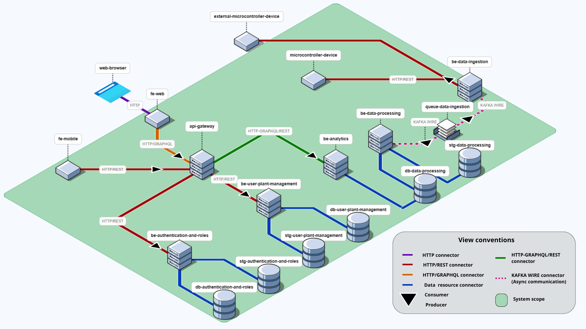
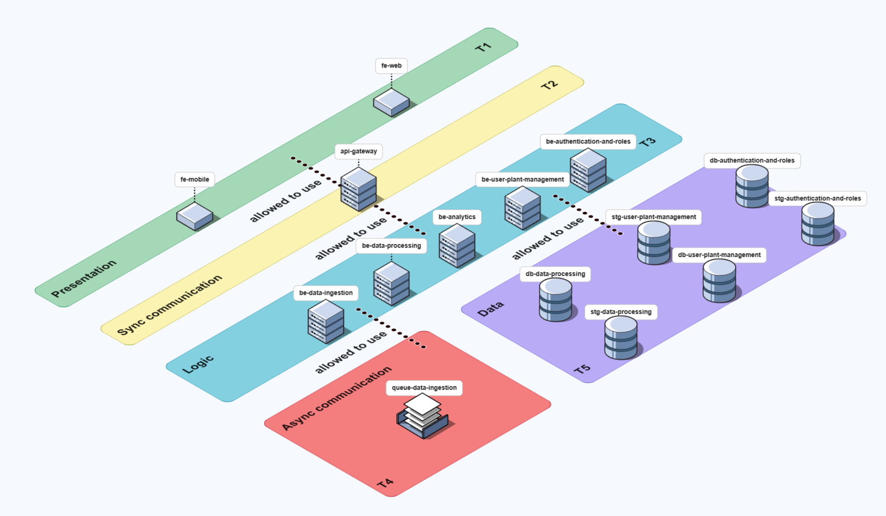
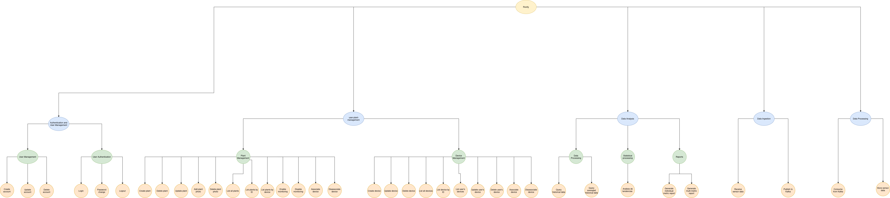

# Rootly 
## Prototype 2

### Organization link:
https://github.com/swarch-2f-rootly


## Team 2F
- Carlos Santiago Sandoval Casallas  
- Cristian Santiago Tovar Bejarano  
- Danny Marcelo Yaluzan Acosta  
- Esteban Rodriguez Muñoz  
- Santiago Restrepo Rojas  
- Gabriela Guzmán Rivera  
- Gabriela Gallegos Rubio  
- Andrés Camilo Orduz Lunar  

---

## Software System
- **Name:** Rootly  
- **Logo:**  


- **Description:**  
**ROOTLY** is an agricultural monitoring system designed to support significant decision-making in the agricultural environment through data and analysis, using a service-oriented distributed architecture that integrates field devices and different services.

At the **physical layer**, sensors and microcontrollers capture environmental and soil data—such as humidity and temperature, among others—and transmit them to the central platform.

At the persistence layer, the architecture combines relational databases (PostgreSQL) for transactional information (users, configurations, profiles) with specialized NoSQL storage (InfluxDB) for time-series sensor data.

At the service layer, independent logical components process and validate the information, applying business rules and exposing REST/GraphQL interfaces for consumption by other modules.

Finally, at the presentation layer, a decoupled frontend (SOFEA) allows users to access reports with relevant metrics, visualize analytics, and manage their crop configurations in real time.

---

# Architectural Structures

## Components and Connector view

  


### External Components (Out of System Scope)
- **Web Browser**
  - Type: External client
  - Responsibility: User interface for web applications
  - Protocols: HTTP
  - Relations: Consumes `FrontEnd` via HTTP
- **Microcontroller Device**
  - Type: External IoT/embedded device
  - Responsibility: Collects and sends sensor and plant data
  - Protocols: HTTP/REST
  - Relations: Consumes `BackEnd Data-management` via HTTP/REST

### Frontend
- **Frontend Service**  
  - Type: Web client application
  - Responsibility: Unified user interface and presentation management
  - Role in connections: Consumer
  - Relations:
    - Consumes `BackEnd Authentication-and-roles` (HTTP/REST)
    - Consumes `BackEnd User-plant-management` (HTTP/REST)
    - Consumes `BackEnd Analytics` (HTTP/GraphQL)

### Backend Services
1. **be-autentication-and-roles**  
  - Type: Authentication and authorization service
  - Responsibility: Manages users, credentials, and access control
  - Relations:
    - Serves the `FrontEnd` (HTTP/REST)
    - Connects to `DB Authentication-and-roles`
    - Connects to `STG Authentication-and-roles`

2. **be-user-plant-management**  
  - Type: Plant and user management service
  - Responsibility: Administers user–plant relationships and master data
  - Relations:
    - Serves the `FrontEnd` (HTTP/REST)
    - Connects to `DB User-plant-management`
    - Connects to `STG User-plant-management`

3. **be-analytics**  
  - Type: Analytics and reporting service
  - Responsibility: Analytical processing and insight generation
  - Protocols: HTTP/GraphQL for flexible queries
  - Relations:
    - Serves the `FrontEnd` (HTTP/GraphQL)
    - Connects to `DB Data-management`

4. **be-data-management**  
  - Type: Data management service
  - Responsibility: Ingests and manages data from IoT devices
  - Relations:
    - Is fed by the `Microcontroller Device` (HTTP/REST)
    - Connects to `STG Data-management`

### IoT Devices
- **microcontroller-device**  
  - Capture field data such as soil humidity and temperature.  
  - Send measurements to the Data Collection Service via **REST API calls**.  

### Data Components
- **Databases (DB)**
  - `DB Authentication-and-roles`: Transactional storage for users and permissions
  - `DB User-plant-management`: Transactional storage for plants and relationships
  - `DB Data-management`: Storage for processed and analytical data
- **Storage (STG)**
  - `STG Authentication-and-roles`: Reference data for authentication
  - `STG User-plant-management`: Master data and plant configurations
  - `STG Data-management`: Temporary or raw storage for device data

---

### Architectural Styles
1. **Client–Server**  
   The browser (client) requests resources from the frontend (server) via HTTP. This ensures separation between presentation and business logic.  

2. **SOFEA (Service-Oriented Front-End Architecture)**  
   The frontend is a decoupled layer that consumes only services exposed via REST/GraphQL, which facilitates scalability and backend reuse by different clients.  

---

### Architectural Elements & Relations


#### **Web Browser**
- External actor that runs the frontend (SPA in React).  
- Consumes REST/GraphQL APIs with JWT authentication.  
- Serves as the user interface between client and system.  

#### **Frontend (rootly-frontend)**
- User interface built with React + TypeScript.  
- Displays agricultural metrics and real-time dashboards.  
- Communicates only with backend services.  

#### **Backend Services**
- **Authentication and Roles (be-autentication-and-roles):** Handles login, roles, and JWT tokens.  
- **User and Plant Management (be-user-plant-management):** Manages users, plants, and microcontrollers.  
- **Analytics (be-analytics):** Processes data, generates metrics, and analytical reports.  
- **Data Management (be-data-management):** Ingests and validates data from IoT devices, storing it in InfluxDB.  

#### **microcontroller-device**
- ESP8266 microcontrollers with environmental sensors.  
- Capture humidity, temperature, etc., and send data to the backend via HTTP POST.  

#### **Databases and Storage**
- **PostgreSQL:** SQL storage of users, roles, plants and physical devices.  
- **InfluxDB:** Time-series storage of agricultural data (port 8086).  
- **MinIO:** Distributed storage for profiles, plant images, and backups.  

### Frontend and Backend Services


| Component / Service                        | Port(s) | Responsibilities                                                                                                    | Boundaries                                                                                   | Interfaces                                                                 |
|--------------------------------------------|---------|--------------------------------------------------------------------------------------------------------------------|----------------------------------------------------------------------------------------------|----------------------------------------------------------------------------|
| **Frontend**             | 3000    | Provides main user interface, real-time visualization of sensor data, dashboards, and plant/device management.     | SPA executed in the browser, depends entirely on backend APIs.    | communicates via REST/GraphQL APIs. |
| **be-autentication-and-roles**         | 8001    | User authentication (login/logout), role-based access control (RBAC), JWT token management, user lifecycle.        | Independent service with dedicated database; does not access sensor/plant data directly. | REST APIs for auth and roles. |
| **be-user-plant-management**        | 8003    | Manages plants, user-device associations, microcontroller lifecycle, enabling/disabling devices.                    | Specialized in domain entities (plants, devices); relies on auth service for user information. | REST APIs for CRUD on devices/plants. |
| **be-analytics**                      | 8000    | Processes and analyzes sensor data, computes agricultural metrics, trend analysis. | Read-only access to sensor data; no modification of primary records; specialized in analytics.| REST/GraphQL APIs for reports and trends. |
| **be-data-management**                | 8002    | Ingests sensor data from IoT devices, validates/normalizes, stores in InfluxDB and MinIO Data Lake.                 | Single entry point for IoT data; ensures data integrity; does not perform advanced analytics. | HTTP endpoints for ingestion. |

### Databases and Storage

| Component / Service                   | Port(s)   | Description |
|---------------------------------------|-----------|-------------|
| **db-autentication-and-roles**        | 5432      | `authentication_and_roles_db` with users, roles, permissions, sessions, and tokens |
| **db-user-plant-management**          | 5433      | `user_plant_management` with user–plant–device associations |
| **db-data-management**                | 8086      | `agricultural_data` database with processed measurements and historical metrics |
| **stg-autentication-and-roles**       | 9002–9003 | Storage for profile photos |
| **stg-data-management**               | 9000–9001 | Data files, backups, unstructured content |
| **stg-user-plant-management**         | 9004–9005 | Storage for plant images |


---


## Deployment View


Description of architectural elements, relations, and deployment patterns is conveyed in the referenced diagram.

## Layered view  - Tiers
  

** **Layered view  - Layers** The structure of the logic layer is shown below to avoid redundancy in the main view. In general, each component follows the same structure.


### 1. Overview
- Architectural pattern: Layered architecture with hybrid communication
- Strict layering with clear responsibility boundaries and both synchronous and asynchronous communication styles

### 2. Layer Specifications
- **Layer T1 – Presentation Layer**
  - Responsibility: Renders user interfaces and handles client-side logic
  - Components: Mobile frontend (iOS/Android), Web frontend (browsers)
  - Allowed dependencies: Only `T2` (synchronous communication)
  - Communication style: Synchronous HTTP/REST APIs
  - Constraint: Cannot bypass `T2` to reach lower layers
- **Layer T2 – Synchronous Communication Layer**
  - Responsibility: API gateway, request routing, and synchronous facade
  - Capabilities: Request validation, authentication, rate limiting, throttling, routing, composition, and protocol translation
  - Allowed dependencies: Only `T3`
  - Communication style: Synchronous (HTTP/gRPC)
  - Pattern: API Gateway routing pattern
- **Layer T3 – Logic Layer**
  - Responsibility: Core business logic and application functionality
  - Synchronous services (request/response):
    - `Authentication and Roles BE`
    - `User Plant Management BE`
    - `Analytics BE`
  - Asynchronous services (producer/consumer with queues):
    - `Data Ingestion BE` (producer): Receives and validates incoming data streams
    - `Data Processing BE` (consumer): Processes queued data asynchronously
- **Layer T4 – Asynchronous Communication Layer**
  - Responsibility: Message queues and decoupling
  - Component: `Queue Data Ingestion` as the messaging broker for the ingestion pipeline
  - Capabilities: Reliable delivery, decoupling ingestion from processing, buffering during load peaks
  - Allowed dependencies: `T5` accessed by consuming services
  - Pattern: Message Queue pattern
  - Potential technologies: RabbitMQ, Kafka, or similar brokers
- **Layer T5 – Data Layer**
  - Responsibility: Data persistence and storage management
  - Datastores:
    - `Authentication and Roles DB` and `STG Authentication and Roles`
    - `User Plant Management DB` and `STG User Plant Management`
    - `DB Data Processing` and `STG Data Processing`
  - Dependencies: No outbound dependencies; upper layers perform read/write operations here

## Decomposition View
  

### Purpose
Shows the hierarchical breakdown of the system into functional modules, clarifying responsibilities from high-level features down to services.

### Decomposition Hierarchy
1. **Authentication and User Management**
   - User management: Create account, update account, delete account
   - User authentication: Sign in, sign out, change password
2. **Plant and Device Administration**
   - Plant management:
     - Create plant, delete plant, update plant
     - Add plant photo, remove plant photo
     - List all plants, list plant by ID
     - List devices per plant
     - Enable monitoring, disable monitoring
     - Associate device, disassociate device
   - Device management:
     - Create device, update device, delete device
     - List all devices, list device by ID
     - List devices belonging to a user
     - Update device for a user, delete device for a user
     - Enable device, disable device
3. **Data Ingestion**
   - Sensor data reception
   - Publication to Kafka
4. **Data Processing**
   - Kafka consumption
   - Data storage
5. **Data Analytics**
   - Data processing:
     - Query historical data
     - Query averaged historical data
   - Visualization processing:
     - Perform trend analysis
   - Report generation:
     - Generate single-metric report
     - Generate multi-metric report

### Module Summaries

| Element | Type | Description | Relations |
| --- | --- | --- | --- |
| Authentication and User Management | Module | Manages the entire user lifecycle, including account creation, authentication, credential maintenance, sign-in, sign-out, and password changes. | Interacts with every other module to validate user identity and authentication before operations proceed. |
| User Management | Submodule | Handles the creation, update, and deletion of user accounts within the system. | Triggered by administrators or user self-service registration flows. |
| User Authentication | Submodule | Manages sign-in, sign-out, and password change workflows. | Depends on the authentication layer to validate credentials and issue access tokens. |
| Plant and Device Administration | Module | Governs plant and device resources, covering configuration, monitoring, and associations between assets. | Coordinates with data ingestion and processing modules to obtain telemetry from registered devices. |
| Plant Management | Submodule | Oversees plant lifecycle operations, photo attachments, monitoring status, and device associations. | Relies on the authentication module to verify the user responsible for each plant. |
| Device Management | Submodule | Administers device lifecycle tasks and relationships with users and plants. | Communicates with the ingestion module to receive data captured by devices. |
| Data Ingestion | Module | Receives real-time sensor and device data, publishing it to the messaging system (Kafka) for downstream processing. | Provides ingested data streams to the data processing module. |
| Data Processing | Module | Consumes Kafka topics, performs transformations, cleansing, and aggregations, and persists processed outputs. | Supplies clean datasets to the analytics module for further insights. |
| Data Analytics | Module | Analyzes and visualizes processed data to generate insights, reports, and trend identifications. | Depends on the data processing module to access consolidated information. |
| Data Processing (Analytics Submodule) | Submodule | Executes statistical calculations, aggregations, and historical or averaged queries. | Feeds computed datasets to the visualization submodule. |
| Statistics Processing | Submodule | Builds trend analyses based on processed data. | Supplies the report generation submodule with analytical results. |
| Report Generation | Submodule | Produces individual metric and comparative multi-metric reports for presentation or export. | Interfaces with the system's UI/dashboard layer to deliver finished reports. |


---

## Prototype – Deployment Instructions

### Requirements
- [Docker](https://docs.docker.com/get-docker/)  
- [Docker Compose](https://docs.docker.com/compose/install/)  
- [Git](https://git-scm.com/downloads)  
- Command-line console  

1. **Clone the repository** (if not already done)
```bash
git clone https://github.com/swarch-2f-rootly/rootly-frontend.git
git clone https://github.com/swarch-2f-rootly/rootly-analytics-backend.git
git clone https://github.com/swarch-2f-rootly/rootly-deploy.git
git clone https://github.com/swarch-2f-rootly/rootly-user-plant-management-backend.git
git clone https://github.com/swarch-2f-rootly/rootly-authentication-and-roles-backend.git
git clone https://github.com/swarch-2f-rootly/rootly-data-management-backend.git
git clone https://github.com/swarch-2f-rootly/rootly-microcontroller.git
```


2. **Navigate to deployment directory**
   ```bash
   cd rootly-deploy
   ```

3. **Run start script**
   ```bash
   ./start.sh
   ```

4. **Check service health**
   ```bash
   docker-compose ps
   ```

## Service Endpoints

Once started, the services will be available at:

- **be-analytics**: http://localhost:8000
  - API Documentation: http://localhost:8000/docs
  - Health Check: http://localhost:8000/health

- **be-autentication-and-roles**: http://localhost:8001
  - API Documentation: http://localhost:8001/docs
  - Health Check: http://localhost:8001/health

- **be-data-management**: http://localhost:8002
  - Health Check: http://localhost:8002/health

- **be-user-plant-management**: http://localhost:8003
  - API Documentation: http://localhost:8003/docs
  - Health Check: http://localhost:8003/health

- **db-data-management**: http://localhost:8086
  - Admin UI: Access via web browser
  - Credentials: admin / admin123

- **stg-data-management**: http://localhost:9000
  - Console: http://localhost:9001
  - Credentials: admin / admin123

- **stg-autentication-and-roles**: http://localhost:9002
  - Console: http://localhost:9003
  - Credentials: admin / admin123

- **stg-user-plant-management**: http://localhost:9004
  - Console: http://localhost:9005
  - Credentials: admin / admin123

- **db-autentication-and-roles**: localhost:5432
  - Database: authentication_and_roles_db
  - User: admin
  - Password: admin123

- **db-user-plant-management**: localhost:5433
  - Database: user_plant_management
  - User: admin
  - Password: admin123

## Development Commands

### View logs
```bash
# All services
docker-compose logs -f

# Specific service
docker-compose logs -f be-analytics 
```

### Restart a service
```bash
docker-compose restart be-analytics 
```

### Rebuild and restart
```bash
docker-compose up --build -d be-analytics 
```

### Stop all services
```bash
docker-compose down
```

### Clean up (removes volumes)
```bash
docker-compose down -v
```

## Configuration

### Environment Variables

All configuration is handled through the `.env` files.

### Networking

All services communicate through the `rootly-network` Docker network:
- Services can reach each other by container name
- External access through published ports only

### Volumes

Persistent data is stored in named volumes.

##  Additional Resources

- [InfluxDB Documentation](https://docs.influxdata.com/influxdb/)
- [MinIO Documentation](https://min.io/docs/minio/linux/index.html)
- [FastAPI Documentation](https://fastapi.tiangolo.com/)
- [Docker Compose Documentation](https://docs.docker.com/compose/)
